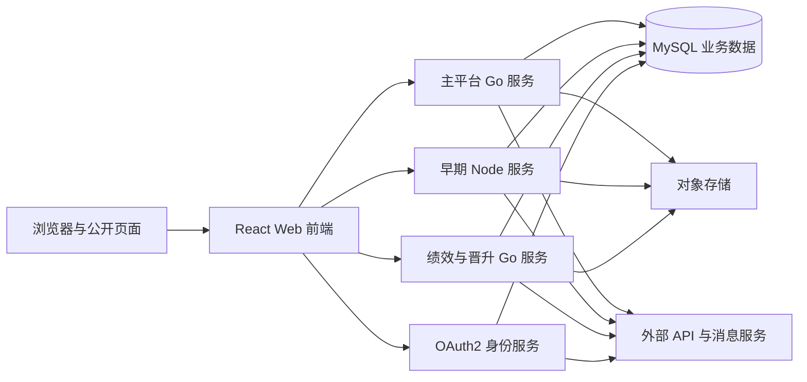

> **第一版验收快照**：`c98089ea66bfece63221`  
> 本报告来自同一份 WCP 工作树静态快照。CodeGraph 只用于导航，正文事实以当前源码复核为准。  
> 本轮一次性准备产品/工程 Overview 与六个代表功能：CodeGraph 冷准备 5.618 秒，暖准备 0.377 秒；完全源码冷准备 3.707 秒。  
> 当前 Git-aware 候选文件 2,007 个；CodeGraph 覆盖 1,639 / 1,726 个可分析源码文件（94.96%）。

## 1. 系统目的、范围与源码快照

WCP 是一个覆盖员工协作、项目交付、工时、请假与费用、客户计费、绩效、晋升和招聘的多仓库业务系统；当前工作区由一个 React 前端、三个业务后端和一个 OAuth2 身份服务组成。`推断`

**源码边界。** 本次快照包含五个独立 Git 根目录。它们都位于 `master` 分支，且读取时都存在未提交改动，因此报告描述的是各仓库当前工作树，而不是仅描述提交对象。`事实`

| 运行职责 | Git 根目录 | 当前提交 |
|---|---|---|
| 身份认证 | wcp-auth | 76e958d51b802c0a0619d11f21984fcf6ea6c895 |
| 早期工时与共享数据服务 | wcp-service | efb884f05f16e2fa5d11180e4c00f18d8495ab28 |
| 主平台服务 | wcp-service-v2 | 51cb436a98d142c8cc268b5d269945d36f6c6698 |
| Web 前端 | wcp-ui | 895dad43f968238cde1387cf7f68293a2d20166b |
| 绩效与晋升服务 | wcp_review_service | 272bbe725fe84d15973fff50b606184c88743fe6 |

**分析方式。** CodeGraph 用于定位文件、符号、引用、调用和路由候选；当图中没有文件、关系未解析、路由缺少组合语义或需要确认权限和业务规则时，Excavator 读取受限源码窗口。源码窗口是语义结论的最终依据。`事实`

**未执行范围。** 本次没有安装目标项目依赖、编译或启动服务、执行数据库迁移、运行目标测试、连接数据库、读取线上配置或访问任何第三方服务。`.env` 中的值没有进入报告。`事实`

**静态边界。** 注册的路由和任务表示代码中存在入口，不表示生产环境启用或被调用；共享表名表示服务具有相同数据形状，不足以证明生产实例完全相同；未发现调用、校验或重试，只表示在当前审阅范围内没有建立它。`事实`

## 2. 仓库与运行单元

五个 Git 根目录对应五个主要运行单元，但仓库边界与业务边界并不完全一致：早期服务和主平台服务都包含人员、项目、请假和假期相关实现。`事实`

| 运行单元 | 入口 | 当前职责 | 伴随进程或脚本 |
|---|---|---|---|
| Web 前端 | `src/main.tsx` | 路由、页面、状态、表单、API 客户端、公开页和客户空间 | Vite 开发服务器与多环境构建命令 |
| 主平台服务 | `main.go` | 人员、项目、客户、申请、请假、报销、计费、招聘、政策、通知及多数新业务 | 初始化流程可分别运行 HTTP 服务与任务；内部 cron 任务 |
| 早期工时服务 | `bin/www` / `app.js` | 工时、Jira、旧请假与假期入口、报表、开放接口、部分共享数据维护 | 启动前执行 Sequelize migration；独立计划任务；LDAP 导出脚本 |
| 绩效与晋升服务 | `main.go` | 绩效周期、评价记录、客户评价和晋升 | cron、邮件及对象存储调用 |
| 身份认证服务 | `main.go` | OAuth2 授权、令牌签发和刷新、Google 登录、用户信息、同意与激活 | Swagger 入口和健康检查 |

**独立运行能力。** 每个后端都有自己的进程入口和 HTTP 路由注册。前端通过多个 API 基址连接后端。当前源码没有观察到四个后端之间的直接 HTTP 客户端调用；它们的间接关系主要来自前端组合以及相同业务表或模型。`事实`

**后台工作。** 早期服务把计划任务与 HTTP 应用放在同一仓库；主平台初始化函数接受是否运行服务器、是否运行任务等参数，说明服务器和任务可在同一代码库中按启动方式组合。`事实`

**仓库与业务重叠。** 工时写入仍主要位于早期服务，而主平台读取工时用于账单和项目管理；请假和假期在两个服务中均有路由、服务和模型；绩效服务读取员工、项目和工时相关数据。`事实`

## 3. 技术栈与构建方式

工作区同时维护一套现代 React/TypeScript 前端、一套 Node.js/Express 旧服务和三套 Go/Gin 服务。`事实`

| 根目录 | 语言与框架 | 数据访问 | 构建和版本线索 |
|---|---|---|---|
| wcp-ui | TypeScript、React 18、Vite、React Router、Redux、Axios | 通过 HTTP API，不直接访问数据库 | `tsc --noEmit` 后执行 Vite；存在 development/test/production 三种构建模式 |
| wcp-service | JavaScript、Node.js、Express 4 | Sequelize 5、MySQL | package 版本 1.8.2；Dockerfile 基于 Node 10 Alpine；启动脚本先迁移再运行服务 |
| wcp-service-v2 | Go 1.22、Gin、GORM | GORM、MySQL | Makefile 和 Go module；同时包含 HTTP、任务和第三方客户端 |
| wcp_review_service | Go 1.16、Gin、GORM | GORM、MySQL | 独立 module、Swagger、cron、AWS SDK |
| wcp-auth | Go 1.16、Gin、GORM、Casbin、JWT | GORM、MySQL | 独立 module、OAuth2 路由和 Swagger |

**前端依赖。** 当前清单同时包含 React Bootstrap、antd、ahooks、React Hook Form、Redux、ECharts、D3、Quill、PWA 插件和多种表单控件。README 声明 antd 与 ahooks 已废弃，但依赖仍存在。`事实`

**后端依赖。** Go 服务使用 Gin 作为 HTTP 框架，GORM 访问数据库，并按职责引入 AWS、Slack、Google API、cron、JWT 或 Casbin。Node 服务使用 Express、Sequelize、Passport、LDAP/JWT、AWS SDK、Google API、邮件、文件上传和 node-schedule。`事实`

**版本含义。** 这些版本来自源码清单和容器声明，只能说明当前仓库声明；生产环境实际运行的镜像、Node/Go 版本和依赖锁定状态不可得。`不可得`

## 4. 运行时拓扑与通信

工作区的主要同步通信模型是浏览器前端分别调用四个后端；后端之间未观察到直接 HTTP 调用，但多个服务通过相同数据模型形成数据层耦合。`事实`

**前端基址。** 前端代码声明 `appRunnerApi`、`authApi`、`performanceReviewMainApi` 和 `mainApi` 等 API 客户端基址。前三类可以从调用与路由形状对应到主平台、身份和绩效服务；`mainApi` 的全部运行时路由分配仍依赖环境配置。`事实` + `不可得`

**同步 API。** UI 通过 Axios 发出 JSON、表单和文件相关请求。后端以 Gin 或 Express 提供 REST 风格入口，部分仓库生成 Swagger。身份服务还实现 OAuth2 授权码、令牌刷新和元数据端点。`事实`

**共享数据库。** 四个后端都有 MySQL/GORM 或 MySQL/Sequelize 配置和数据模型。相同员工、项目、项目成员、工时、请假、额度和审批类模型跨仓库出现。配置值未读取，因此生产是否完全共用一个 schema 或实例不可得。`事实` + `不可得`

**异步交接。** 当前未观察到独立消息队列。异步行为主要由 cron、应用内 goroutine/Promise、邮件、Slack、推送、对象存储和定时同步组成。`事实`

## 5. 接口与入口点

CodeGraph 记录了 926 个路由候选：Web 前端 422 个，主平台 299 个，早期服务 105 个，绩效服务 86 个，身份服务 14 个。它们是静态注册候选，不是线上请求数。`事实`

**页面入口。** 前端入口覆盖个人事务、管理后台、审批、公开分享、客户空间、登录和候选人相关页面。React 路由存在嵌套和相对路径；CodeGraph 当前没有完整的 route-parent 边，因此完整 URL 需要读取路由声明确认。`事实`

**服务端入口。** 三套 Go 服务通过 Gin 注册路由；早期 Node 服务在 Express app 中挂载 worklogs、projects、leave、holiday、report、Jira、Slack、MCP 等 router。Gin group 和 Express mount 的前缀不一定包含在 CodeGraph route node 名称中。`事实`

**非页面入口。** 工作区还包括 OAuth2 回调与标准端点、公开分享链接、客户空间登录、Slack command/interaction、开放接口令牌、Swagger、健康检查、导出下载、上传签名和计划任务。`事实`

**处理函数解析。** CodeGraph 中部分 route 节点有到 function/method 的引用或调用边，但关系没有统一区分 handler、middleware 和 handler 内部调用。产品事实中需要 handler 或完整路径时，Excavator 通过源码窗口确认，而不是取第一个候选。`事实`

**未解析入口。** 数据库有 76,313 条 unresolved references。这个数字包含全项目各种引用，不能直接等同于未解析路由；它说明名称和动态关系较多，单靠图无法证明所有入口的最终处理函数。`事实`

## 6. 代码组织与调用结构

四个后端都采用“入口/路由 → 处理函数 → 服务或资源层 → 数据访问/第三方客户端”的主方向，但具体组织方式不同。`事实`

**主平台。** `internal/handlers` 按业务域分目录，例如 employee、clientProj、leave、holiday、application、reimbursement、management、resourcepool、policy、notification 和 worklog。集中路由文件把 URL 注册到各域 router；服务文件内同时包含业务验证、GORM 查询、通知和第三方调用。`事实`

**绩效服务。** 代码分为 review、employee、admin_main、promotion 和第三方基础设施等区域，resource/router/service 组合较多。绩效权限判断分散在资源处理函数中。`事实`

**早期服务。** Express router 文件直接承载较多业务逻辑，公共 service/util 模块提供角色、审批、邮件、Jira、AWS 和计划任务。路由函数经常同时执行验证、Sequelize 查询和响应拼装。`事实`

**前端。** 页面按 leave、worklog、billing、employee、project、review、promotion 等业务目录组织；`src/api` 和各页面 service 封装请求；Redux、hooks 和通用组件提供跨页面状态与交互。`事实`

**图结构限制。** 当前 feature expansion 只沿 calls、references、instantiates、implements 和 extends 等关系扩展，避免 `contains/imports` 把通用库带入每个功能。动态 dispatch、SQL 构造、React 配置对象和跨文件 router alias 仍可能使调用链中止。`事实`

**高连接区域。** 员工、项目成员、工时、请假和计费代码被多个功能引用；通用响应、数据库和认证 helper 也具有高连接度。高连接只表示静态关系多，不等同于生产热点。`事实`

## 7. 数据模型、存储与文件

后端源码共同指向 MySQL：三套 Go 服务使用 GORM，早期 Node 服务使用 Sequelize；多个仓库声明相同或相近的业务表和模型。`事实`

**模型边界。** 主平台模型覆盖员工、客户、项目、项目成员、请假、假期额度、申请、报销、账单、发票、招聘、政策和通知。早期服务仍维护员工、项目、成员、工时、请假、假期和审批模型。绩效服务拥有评价、周期、晋升等模型，同时读取人员和项目关联数据。`事实`

**共享写入。** 新旧服务均有请假、假期额度、审批、项目成员或员工相关写入路径；工时主要由早期服务写，主平台读取工时进行项目管理和计费。由此可确认代码层存在多写入方，不能仅从仓库名认定单一数据所有者。`事实`

**事务与快照。** Go 服务使用 GORM transaction 线索；账单确认和作废路径有确认日志、操作日志和快照类记录。并非所有跨表和外部调用都能从 CodeGraph 恢复完整事务边界。`事实`

**文件路径。** 三个业务后端都含 S3 客户端或 AWS SDK；附件、头像、简历、政策文件、缩略图和导出文件通过上传、预签名或下载流程处理。Node 服务使用 Multer/Multer-S3，Go 服务封装对象存储客户端。`事实`

**缓存。** 早期 Node 服务声明内存缓存包；绩效服务包含 HTTP ETag/cache 代码。生产中是否存在 Redis、CDN 或网关缓存不可得。`事实` + `不可得`

**敏感字段。** 源码模型包含个人联系方式、银行信息、候选人信息、费率、账单和评价数据。报告只描述字段类别，不输出任何真实业务值。`事实`

## 8. 身份、认证与授权

身份服务实现 OAuth2 授权码、令牌签发与刷新、Google 登录、用户信息和授权同意；业务服务在请求中间件和处理函数中消费身份与角色。`事实`

**令牌和身份类型。** 主平台定义 Employee、Client、Candidate、Customer 和 ForgotPassword 等令牌类型；角色定义包括普通员工、管理员、项目管理、HR、绩效管理员、客户、销售、费率、办公室、开票和系统管理员。`事实`

**旧认证路径。** 早期 Node 服务仍声明 Passport JWT 和 LDAP 认证依赖，README 描述内部 LDAP 开发方式。Web 前端当前还配置独立的 OAuth2 身份 API，因此工作区包含旧身份依赖与独立身份服务并存的代码。`事实`

**授权位置。** Gin/Express route middleware 提供登录、令牌或局部角色检查；对象级权限大量位于 service/resource 函数，例如本人、管理员、项目负责人、主评人和评估负责人判断。不存在一份覆盖所有功能的集中权限矩阵。`事实`

**公开入口。** OAuth2 标准端点、候选人或客户分享、客户空间登录、评价邀请和部分文档/健康入口具有不同的认证边界。是否由网关增加额外保护不可得。`不可得`

**当前权限问题。** 绩效记录读取路径的一条复合条件，在“是否为主评人”项上与同仓库其他等价条件的取反方向不同；该表达式可使某些非相关登录用户不进入拒绝分支。`事实` + `推断`

## 9. 外部集成与失败路径

外部集成分布在各业务仓库内部，没有观察到统一的 integration gateway。`事实`

| 产品或能力 | 当前客户端位置 | 应用层失败表现 |
|---|---|---|
| Google 身份 | 身份服务和前端 OAuth 客户端 | 授权或令牌流程返回错误 |
| Jira | 早期服务与主平台工时代码 | 请求错误向调用路径传播或由接口返回 |
| 招聘系统 | 主平台招聘同步任务 | 同步记录日志或返回错误；远端地址来自配置 |
| AWS S3 | 三个业务后端 | 上传、下载、签名或对象操作返回错误 |
| AWS SES / SMTP | 三个后端邮件封装 | 同步错误向上返回；部分异步发送结果未被完整保留 |
| Slack | 早期服务和主平台任务/通知 | 不同调用点分别记录日志或忽略结果 |
| 腾讯 TPNS | 主平台通知模块 | SDK/HTTP 错误由通知路径处理 |
| OpenAI | 主平台候选人和 AI 工具代码 | 返回错误或将异步任务标记为失败 |
| Google Sheets / Maps | 主平台提案和支撑模块 | 导入或查询步骤返回错误 |
| 汇率网页 | 主平台支撑代码 | 解析或请求失败导致当次汇率不可得 |

**超时与重试。** 部分 HTTP 客户端和 SDK 可能带默认超时，但当前源码中没有一套跨集成统一的重试、退避、断路器或持久化 outbox。应用层可见的行为包括直接返回、记录日志和不等待异步结果。依赖库、网关或云服务是否重试不可得。`验证`

**部分成功。** 邮件、Slack、推送或缩略图等副作用有时在主要数据库操作之后触发；副作用失败是否回滚主业务取决于具体调用点。CodeGraph 无法自动证明所有事务与外部调用的相对顺序。`事实`

**敏感传输。** 候选人资料、附件、地址、业务通知、报价和评价内容可能传给第三方。生产合同、地区、加密和保留策略不在源码可见范围。`事实` + `不可得`

## 10. 配置、任务、部署与可观测性

配置主要来自环境变量、YAML/Node config、命令行启动参数和前端构建 mode；本报告只记录键名和来源，不读取敏感值。`事实`

**配置来源。** 早期 Node 服务使用 dotenv、node-config 和环境样例；Go 服务包含配置 YAML 与环境覆盖；前端通过 Vite mode 和 API 基址构建不同环境包。数据库、OAuth、LDAP、AWS、邮件、Slack、Google、OpenAI 和招聘系统地址都依赖配置。`事实`

**后台任务。** 早期服务注册请假邮件、请假完结、次年额度、周工时和绩效通知等任务。主平台和绩效服务使用 cron 库，主平台初始化允许单独控制 server/task。源码能确认注册，不能确认生产调度频率、leader election 或重复执行保护。`事实` + `不可得`

**容器与部署线索。** 早期服务有 Node 10 Alpine Dockerfile 和本地 LDAP docker-compose。当前快照没有一套覆盖五个仓库的统一部署清单；主平台和 Go 服务的生产镜像、编排和网关规则不可得。`事实` + `不可得`

**健康与文档。** 后端包含 `/health` 或类似健康入口及 Swagger 生成物。静态健康入口通常证明进程可应答，不足以证明数据库和所有第三方依赖健康。`事实`

**日志与追踪。** Go 服务使用 zap 或应用 logger，Node 使用 morgan/debug 和业务日志。代码中存在操作日志表和请求日志线索；没有观察到统一 tracing、metrics SDK 或跨服务 correlation contract。基础设施层是否提供这些能力不可得。`事实` + `不可得`

**CI。** 目标 WCP 快照中各仓库是否通过外部 CI 平台构建，不能仅从当前文件集合完整确认。Excavator 自身另有 GitHub Actions，但它不属于 WCP 运行时。`不可得`

## 11. 测试、文档与当前技术问题

当前源码中可以观察到测试文件，但分布不均：简单文件名检索在主平台发现 9 个、身份服务 1 个、绩效服务 1 个；早期服务和前端没有命中同一检索模式。这个结果是文件线索，不是测试覆盖率。`事实`

**文档状态。** 绩效和早期服务有 README；前端 README 同时包含 Vite 与 Create React App 时代的说明，并宣告仍在依赖清单中的库已废弃；主平台和身份仓库根目录未找到 README。三个后端有 Swagger 生成物。`事实`

**显式未完成或废弃。** 前端存在临时关闭的个人信息编辑流程和 deprecated 组件；早期服务有标为未使用的路由注释；绩效/晋升代码包含待实现操作或临时函数。代码存在不等于入口可达，需按具体路径判断。`事实`

**共享写入与规则分歧。** 新旧服务均实现请假、假期、审批、项目成员或用户相关写入；在家办公 24 小时边界分别使用 `>=` 和 `>`。这是代码层已经存在的跨仓库规则差异。`事实`

**安全与权限问题。** 主平台源码包含固定 AES 密钥；绩效服务存在取反方向不一致的对象级授权表达式。密钥值不在报告中展示。`事实`

**依赖年代差异。** 早期服务 Dockerfile 声明 Node 10，前端使用当前 React/Vite 清单，三个 Go 服务分别声明 Go 1.16 或 Go 1.22；工作区同时维护多代运行时和库版本。`事实`

## 12. 覆盖与未决信息

Excavator 在 2,007 个 Git-aware 候选文件中识别出 1,726 个可分析源码文件；CodeGraph 索引了其中 1,639 个，覆盖率为 94.96%（1,639/1,726）。`事实`

**图覆盖。** 数据库包含 1,668 个文件、22,951 个节点、51,391 条边、926 个路由候选和 76,313 条未解析引用。未解析引用包括普通符号和动态关系，不能直接等同于缺失接口。`事实`

**源码回退。** 组合准备阶段执行 17 次图查询，建立一次共享项目 Context，以及“请假管理”和“工时管理”两个可复用 feature scope。两种受众共享同一范围；源窗口按快照、路径和行号缓存。额外确认权限、密钥和规则边界后，本 run 记录 33 个新源码窗口并复用 36 次缓存窗口。`事实`

**上下文预算。** 最终共享 Context 约 104 KB，每个功能范围约 106–109 KB，每个报告专属提示不到 4 KB。准备耗时约 0.44 秒，明显低于 3 分钟预算。`事实`

**分析不足。** 当前 CodeGraph 路由缺少可靠 parent/mount、handler-role 和 middleware-role；动态 SQL、反射、配置驱动路由、第三方依赖内部行为以及运行时生成地址可能不完整。`事实`

**仍不可回答。** 生产镜像和环境变量、网关映射、数据库实例关系、真实调用量、任务成功率、消息送达率、对象存储策略、外部服务 SLA、线上性能、测试通过率、实际数据质量和组织责任人都需要运行时或基础设施信息。`不可得`

### 本轮源码核对路径

- `wcp-ui/package.json`
- `wcp-service/package.json`
- `wcp-service/Dockerfile`
- `wcp-service-v2/go.mod`
- `wcp_review_service/go.mod`
- `wcp-auth/go.mod`
- `wcp-service-v2/internal/handlers/handlers.go`
- `wcp-service/app.js:93-107`
- `wcp-auth/internal/handlers/handler.go:18-47`
- `wcp-service-v2/internal/model/billing.go`
- `wcp-service-v2/internal/cmon/util.go:36-121`
- `wcp_review_service/internal/review/employee/employee_resource.go:82-103`
