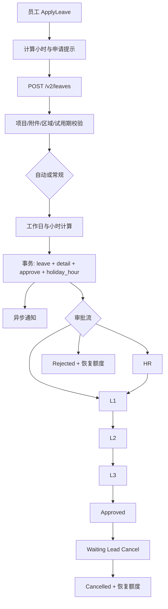
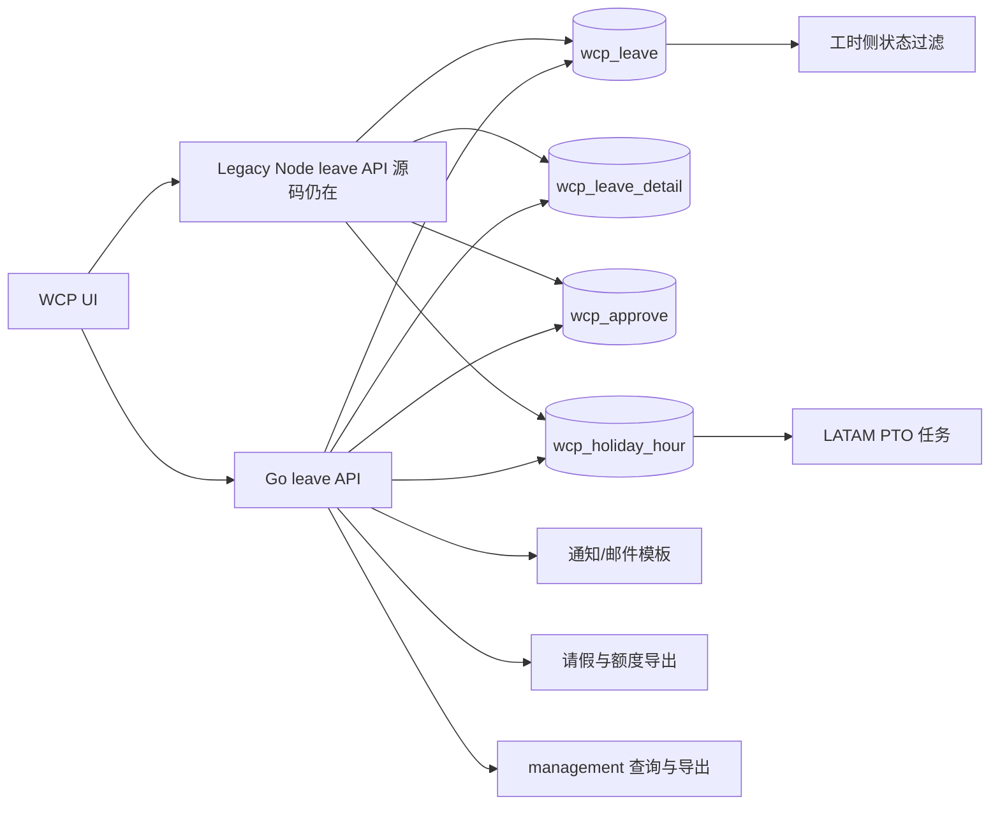

> **第一版验收快照**：`c98089ea66bfece63221`  
> 本报告来自同一份 WCP 工作树静态快照。CodeGraph 只用于导航，正文事实以当前源码复核为准。  
> 本轮一次性准备产品/工程 Overview 与六个代表功能：CodeGraph 冷准备 5.618 秒，暖准备 0.377 秒；完全源码冷准备 3.707 秒。  
> 当前 Git-aware 候选文件 2,007 个；CodeGraph 覆盖 1,639 / 1,726 个可分析源码文件（94.96%）。

## 1. 能力职责与技术边界

请假管理覆盖员工提交、管理者审批或拒绝、员工取消或申请撤销、假期额度消费与恢复、请假与额度导出、请假通知以及周期性额度任务。 `事实`

| 参与部分 | 当前可验证职责 | 包含范围 | 证据等级 |
|---|---|---|---|
| wcp-ui | 个人与管理界面 | 个人列表/详情/创建；管理列表/详情/余额；审批、拒绝、取消、导出 | `事实` |
| wcp-service-v2 | 当前 Go 主实现 | 14 个请假接口、4 个额度接口、额度任务、通知、导出和共享数据读取 | `事实` |
| wcp-service | 旧 Node 实现 | 旧请假 CRUD/审批/取消/报表、邮件任务、完结任务、次年额度初始化 | `事实` |
| 相邻能力 | 只记录已建立连接 | 工时读取请假；管理导出连接请假；绩效与认证仓库未作为请假核心实现展开 | `事实` |

- 本次 feature scope 含 320 个图节点、268 条关系和 150 个未解析引用；源码证据经补充后达到 121 个窗口。 `事实`
- 工作区由 5 个 Git 根组成，扫描候选文件为 2,007 个；CodeGraph 覆盖 1,639/1,726 个可分析源码文件，即 94.96%。 `事实`
- 报告描述的是当前 dirty 工作区快照，而不是各仓库提交点的干净状态。 `事实`
- 静态审阅未启动服务、未连接数据库、未发送邮件，也未确认生产流量。 `不可得`

## 2. 入口与调用方

| 入口类别 | 当前可验证入口 | 调用/处理位置 | 证据等级 |
|---|---|---|---|
| 个人页面 | `/my/leave`、`/my/leave/list/:id`、`/my/leave/apply` | PersonalOutlet 路由到列表、详情和 ApplyLeave | `事实` |
| 管理页面 | 管理列表、详情、余额 | ApprovalOutlet 使用 manage/history 权限包裹路由 | `事实` |
| 前端动作 | 创建、批准、拒绝、直接取消、批准后撤销申请 | leave-service 与 LeaveApprovalActions 绑定动作 | `事实` |
| 当前请假 API | POST/GET/PUT/DELETE `/v2/leaves...` | Gin 路由解析到 Creation、Demand、Approve、Reject 等 | `事实` |
| 当前额度 API | GET/PUT `/v2/holidayhour...` | 查询、更新、变更日志、导出 | `事实` |
| 旧请假 API | 类型、状态、创建、本人列表、详情、审批、拒绝、取消、管理列表、simple、sick 查询 | Express `routes/leave.js` | `事实` |
| 旧报表 API | 在职请假报表、离职员工请假报表 | Express `routes/report.js` | `事实` |
| 周期入口 | 请假邮件、请假完结、次年额度初始化 | 旧 scheduleService | `事实` |
| LATAM 周期入口 | 月度 PTO 计提 | Go LatAmPTOAccrual 任务 | `事实` |

| 方法与完整路径 | 处理函数 | 当前职责 | 证据等级 |
|---|---|---|---|
| POST `/v2/leaves` | Creation | 创建请假申请 | `事实` |
| GET `/v2/leaves/:leave_id` | Demand | 读取请假详情 | `事实` |
| POST `/v2/leaves/:leave_id` | Approve | 批准当前审批节点 | `事实` |
| PUT `/v2/leaves/:leave_id` | Reject | 拒绝当前审批节点 | `事实` |
| GET `/v2/leaves/between` | Between | 按日期区间读取请假 | `事实` |
| GET `/v2/leaves` | Pagination | 管理端分页与筛选 | `事实` |
| GET `/v2/leaves/me` | OwnPagination | 当前用户分页列表 | `事实` |
| POST `/v2/leaves/:leave_id/application` | DeletionApplication | 提交批准后撤销申请 | `事实` |
| DELETE `/v2/leaves/:leave_id` | Deletion | 直接取消允许状态的请假 | `事实` |
| GET `/v2/leaves/me/simple` | SimpleForLogTime | 向工时侧提供简化区间 | `事实` |
| GET `/v2/leaves/export` | Export | 导出请假数据 | `事实` |
| GET `/v2/leaves/:leave_id/approve-prompt` | ApproveLeavePrompt | 返回审批提示 | `事实` |
| GET `/v2/leaves/apply-prompt` | ApplyLeavePrompt | 返回申请提示 | `事实` |
| GET `/v2/leaves/remain-fully-paid-sick` | GetUserRemainFullySickLeave | 查询全薪病假剩余 | `事实` |
| GET `/v2/holidayhour` | GetHolidayHour | 查询年度假期额度 | `事实` |
| PUT `/v2/holidayhour/:id` | UpdateHolidayHour | 人工更新假期额度 | `事实` |
| GET `/v2/holidayhour/changes` | GetHolidayHourChangeLog | 查询额度变更日志 | `事实` |
| GET `/v2/holidayhour/export` | ExportHolidayHour | 导出假期额度 | `事实` |

- 前端当前调用 `/v2/leaves` 和 `/v2/holidayhour`；旧服务接口仍在源码注册，但本次工作区内没有观察到前端对旧请假路由的直接调用。 `验证`
- 工作区外调用方无法由静态仓库枚举；注册接口可能被网关、脚本或其他未纳入工作区的客户端调用。 `不可得`

## 3. 主执行路径

- 创建主路径已验证为：前端构造请求 → 认证路由 → 项目/附件/区域/试用期校验 → 自动或常规时长计算 → 事务写入请假、明细、审批与额度 → 异步通知。 `事实`
- 审批主路径已验证为：管理端动作 → 当前审批记录与审批人校验 → HR/L1/L2/L3 链推进 → 创建下一审批记录或把请假改为已批准。 `事实`
- 拒绝路径在服务事务中更新审批记录和请假状态，并进入额度恢复分支。 `事实`
- 撤销路径分成未批准记录的直接取消，以及已批准记录先申请撤销、再由主管处理的路径。 `事实`

- 额度路径已验证为：跨年分配或当前年选择 → 按日生成 LeaveDetail → 增加对应 token → 取消/拒绝时按明细或 comments 反向恢复。 `事实`
- 事务提交后的邮件执行使用 goroutine；邮件结果不参与数据库事务返回值。 `事实`

## 4. 业务规则、状态与一致性

| 类型/编码 | 服务端消费与审批特征 | 前端或入口限制 | 证据等级 |
|---|---|---|---|
| PTO / 1 | `mixConsume` 可按年度顺序消费；普通 L1→L2→L3 | 按地区配置决定上一年额度过期月份 | `事实` |
| BTO / 2 | 仅当前年度；普通审批流 | 必须 8 小时且单日；LATAM 办公室禁用；试用期禁用 | `事实` |
| UTO / 3 | 当前年度消费；在 IgnoreMap 中不因额度为零而停止 | 普通审批流 | `事实` |
| Special / 4 | 与 PTO 一样使用混合年度消费 | 旧服务在仍有 PTO 时拒绝 Special | `事实` |
| Sick / 5 | 当前年度消费；IgnoreMap 允许超出配置余额；计算全薪剩余 | 附件必填；自动申请超过 8 小时检查医生证明字段 | `事实` |
| Maternity / 6 | 当前年度消费；先 HR 再管理链 | 附件必填；前端显示一次性使用提示 | `事实` |
| Paternity / 7 | 当前年度消费；先 HR 再管理链 | 前端提示一次性使用并清空剩余小时 | `事实` |
| Marriage / 8 | 当前年度消费；先 HR 再管理链 | 附件必填；前端提示一次性使用 | `事实` |
| Funeral / 9 | 当前年度消费；先 HR 再管理链 | 前端提示一次性使用；当前 Creation 附件硬校验未列入 Funeral | `事实` |
| Prenatal / 10 | 当前年度消费；先 HR 再管理链 | 附件必填；必须 8 小时且单日 | `事实` |

| 请假状态/编码 | 当前含义 | 分组行为 | 证据等级 |
|---|---|---|---|
| 1 | 等待 L1 | 管理筛选归入 in_progress | `事实` |
| 2 | 等待 L2 | 管理筛选归入 in_progress | `事实` |
| 3 | 等待 L3 | 管理筛选归入 in_progress | `事实` |
| 4 | 已批准 | 可进入批准后撤销申请 | `事实` |
| 5 | 已拒绝 | 终止审批并恢复额度 | `事实` |
| 6 | 已完成 | 旧定时任务会标记结束的已批准请假 | `事实` |
| 7 | 已取消 | 直接取消或撤销批准后到达 | `事实` |
| 8 | 等待 HR | 管理筛选归入 in_progress | `事实` |
| 9 | 等待主管处理撤销 | 独立显示 Waiting For Cancel | `事实` |

| 规则类别 | 当前规则 | 实现位置特征 | 证据等级 |
|---|---|---|---|
| 项目 | 项目必须存在，Presale/EOR 项目拒绝请假 | 服务端硬校验 | `事实` |
| 附件 | Sick、Maternity、Prenatal、Marriage 无附件时报错 | 服务端硬校验 | `事实` |
| 日期范围 | Between 查询 head 不能晚于 tail，绝对年份差不能超过 1 | 服务端查询校验 | `事实` |
| 分页 | 管理列表和本人列表默认 page=1、size=10 | 路由默认值 | `事实` |
| 消息长度 | 前端把申请消息最大长度设为 240 | 客户端校验 | `事实` |
| 同日重复 | 服务端返回同日已批准/完成/待撤销明细，前端显示确认提示后仍可继续 | 提示而非硬拒绝 | `事实` |
| 额度不足 | 非 IgnoreMap 类型在可用小时不足时返回 Not enough holiday | 自动与常规分支均检查 | `事实` |
| 跨年消费 | PTO/Special 按配置过期月决定消费上一年或当前年 | 逐日分配后按年份排序消费 | `事实` |
| 一次性类型 | Maternity/Paternity/Marriage/Funeral/Prenatal 进入 HR 前置链 | 服务端审批链 | `事实` |
| LATAM PTO | Deel 每月 4 小时、上限 96、提醒阈值 80；全职每月 10 小时、上限 240、提醒阈值 166 | 常量与任务 | `事实` |
| LATAM 办公室 | Bogota=4、Medellin=5、Rio=10、Mexico City=11 | 固定办公室列表 | `事实` |
| 计提幂等 | 任务按周期与变更日志判断是否已计提 | 重复执行保护 | `事实` |
| 旧服务差异 | 旧实现让 UTO、Maternity、Paternity、Marriage、Funeral 跳过 pre-check，UTO/Sick 跳过余额检查 | 旧 Node 规则 | `事实` |
| 旧 BTO 差异 | 旧实现限制试用期并把 BTO 限在生日月或下一月 | 旧 Node 规则 | `事实` |

## 5. 认证、授权与数据范围

| 角色/调用者 | 动作 | 当前可验证授权或范围 | 证据等级 |
|---|---|---|---|
| 所有 v2 请假调用 | 全部路由 | 路由组统一挂 Authentication；注释仍写 TODO gRPC authorization | `事实` |
| 申请人 | 创建 | 用户 ID 从 JWT claims 获取，不能在请求体指定他人 | `事实` |
| 申请人 | 本人列表 | OwnPagination 强制以当前 JWT 用户过滤 | `事实` |
| 申请人 | 详情 | 普通用户只能读取本人记录；管理员、HR、项目管理进入扩展范围 | `事实` |
| 当前审批人 | 批准/拒绝 | 服务读取待处理审批记录并比较 approver_id 与当前用户 | `事实` |
| 申请人 | 直接取消/撤销申请 | 服务校验 leave.user_id 与当前用户，并按状态选择路径 | `事实` |
| 管理列表调用者 | 列表 | Pagination 读取角色、办公室、项目、用户、状态和时间等筛选 | `事实` |
| 前端管理路由 | 列表/详情/余额 | manage、history 等权限在 UI 路由层控制可见性 | `事实` |
| 旧服务普通员工 | 详情与取消 | 旧路由比较 req.user.user_id 与 leave.user_id | `事实` |
| 旧服务管理角色 | 审批/列表 | Express 中间件与 service 角色判断共同控制 | `事实` |

- 源码中没有统一的“本人/本项目/本办公室/全公司”权限矩阵；权限逻辑分散在 UI 权限、路由认证和服务内条件中。 `验证`

## 6. 数据模型与存储

| 实体/表 | 当前 Go 模型的关键字段 | 旧 Node 模型可见差异 | 证据等级 |
|---|---|---|---|
| wcp_leave | user/project/type、start/end、hours、messages、cancel_reason、status、comments、category、created_at | 旧模型没有 category、created_at 等当前字段 | `事实` |
| wcp_leave_detail | leave_id、date、head、tail、hours、holiday_source | 旧模型只有 leave_id、date、hours | `事实` |
| wcp_approve | leave_id、approver_id、description、approve_flow、status、is_send_mail | 旧模型同样声明主要字段，但 status 类型为 BOOLEAN | `事实` |
| wcp_holiday_hour | 10 类额度及对应 token、year、user、status | 旧模型缺 prenatal_leave 与 prenatal_leave_token | `事实` |
| wcp_holiday_hour_change_log | 用户、年份、类型、增减值、描述等变更信息 | 旧仓库有独立变更日志模型与迁移 | `事实` |
| upload file | 业务类型、业务 ID、key 等关联字段 | 旧服务通过 AWS 工具读取上传链接 | `事实` |

| 存储动作 | 事务/写入范围 | 其他读取方 | 证据等级 |
|---|---|---|---|
| 创建 | 单个 GORM 事务写 leave、leave_detail、approve、holiday_hour | 通知在事务外异步执行 | `事实` |
| 审批/拒绝 | 服务事务更新审批记录与请假状态；拒绝还恢复额度 | 前端读取详情和当前动作 | `事实` |
| 取消/撤销 | 恢复 holiday token、写状态与审批记录 | 通知模板读取申请人与审批人信息 | `事实` |
| 管理与导出 | management 查询连接 leave/leave_detail | 管理报表和账单相关逻辑读取请假小时 | `事实` |
| 工时 | worklog 服务按请假状态筛选记录 | 用于工时侧时间处理 | `事实` |
| 旧服务 | Sequelize 与原生 SQL 读写相同 leave/approve/holiday 表 | 与 Go 服务形成共享存储边界 | `事实` |

## 7. 文件、消息与外部集成

| 副作用/集成 | 触发点 | 传输的数据类别 | 证据等级 |
|---|---|---|---|
| 附件上传 | 创建前由前端上传并把对象 key 放入 attachment 数组 | 医疗/婚姻/产检等证明文件 key | `事实` |
| 附件记录 | 服务模型以业务类型、业务 ID 和 key 关联上传文件 | 文件元数据与请假记录关联 | `事实` |
| 申请通知 | 创建/审批链构建通知组件并异步执行 | 申请人、审批人、项目、日期、小时、原因等 | `事实` |
| 撤销通知 | 撤销申请与撤销批准使用独立 HTML 模板 | 请假日期、人员、原因和审批信息 | `事实` |
| 请假导出 | GET `/v2/leaves/export` 根据筛选生成 Excel 下载 | 员工、办公室、类型、状态、日期、小时等 | `事实` |
| 额度导出 | GET `/v2/holidayhour/export` | 年度各类额度、token 和人员信息 | `事实` |
| 管理导出 | management export 连接 leave/detail | 项目月度或管理表中的请假小时 | `事实` |
| 旧报表 | 旧服务提供在职与离职员工请假报表 | 人员、请假记录、额度相关字段 | `事实` |
| 旧邮件任务 | 定时扫描未发送审批邮件并调用邮件服务 | 审批状态、申请信息和收件人 | `事实` |

- 源码能确认文件 key、模板、导出字段和通知调用，但不能确认对象存储中的实际文件、邮件供应商投递结果或收件人是否收到。 `不可得`

## 8. 错误、事务与恢复行为

| 失败类别 | 当前行为 | 事务/部分成功边界 | 证据等级 |
|---|---|---|---|
| 请求绑定失败 | JSON、URI 或 query 绑定错误直接返回 | 尚未进入业务事务 | `事实` |
| 项目不存在 | 返回 NoProj 业务错误 | 创建未开始 | `事实` |
| 项目类型不支持 | Presale/EOR 返回 400 业务错误 | 创建未开始 | `事实` |
| 附件缺失 | 四类附件必填假期返回 InvalidParam | 创建未开始 | `事实` |
| 额度不足 | 非 IgnoreMap 类型返回 Not enough holiday | 事务未写入或回滚 | `事实` |
| 额度记录缺失 | 消费时返回 Unknown Holiday | 事务回滚 | `事实` |
| 审批人不匹配 | 批准/拒绝服务拒绝非当前审批人 | 状态不更新 | `事实` |
| 取消状态不允许 | 服务按状态拒绝错误的取消或撤销路径 | 状态和额度保持原状 | `事实` |
| 创建持久化失败 | leave/detail/approve/holiday 任一步错误使 GORM 事务返回 | 核心写入回滚 | `事实` |
| 审批/拒绝持久化失败 | 事务函数返回错误 | 状态和额度更新回滚 | `事实` |
| 异步通知失败 | goroutine 不参与 HTTP 主事务返回 | 数据库可能已成功而通知失败 | `事实` |
| 任务失败 | LATAM 任务的 executeAt 返回错误并记录 | 是否由调度器重试未在该任务中声明 | `事实` |

## 9. 配置、开关与后台工作

| 配置/任务 | 当前值或规则 | 运行条件 | 证据等级 |
|---|---|---|---|
| PTO 过期配置 | 按 location 配置决定 PTO/Special 使用上一年或当前年 | 申请计算时读取 | `事实` |
| LATAM 办公室 | 4、5、10、11 | 任务与 BTO 限制使用固定列表 | `事实` |
| Deel PTO | 每月 4、上限 96、阈值 80 | LATAM Deel 员工 | `事实` |
| 全职 PTO | 每月 10、上限 240、阈值 166 | LATAM 全职员工 | `事实` |
| 计提除数 | 30 | 按在职天数折算早期计提 | `事实` |
| LATAM 月度任务 | GetSpec/ShouldRegister/ShouldRun/Run | 注册后按任务条件执行 | `事实` |
| 旧请假邮件 | Check-Mail | 周期触发 sendEmail | `事实` |
| 旧请假完结 | Check-Leave-Done | 周期触发 markLeaveDone | `事实` |
| 次年额度初始化 | Create-Next-Year-Holiday-Hour | 指定日历时间调用 initNextYearHoliday | `事实` |
| 多实例协调 | 当前证据未显示分布式锁或 leader 选举 | 任务代码本身无跨实例协调声明 | `验证` |

## 10. 依赖与关联变更范围

- 请假功能跨越 UI、当前 Go 服务和旧 Node 服务；两套后端通过共享请假、明细、审批和额度表连接，而不是互相调用。 `事实`
- 管理模块直接连接请假与请假明细，用于管理查询和导出。 `事实`
- 工时模块读取请假状态并过滤被拒绝或取消的记录。 `事实`
- 假期额度变更同时影响申请可用性、撤销恢复、HR 余额管理和 LATAM 计提任务。 `事实`

- 当前前端可见调用集中在 Go `/v2` 路径；旧 Node 接口是否仍有工作区外调用者不能由本仓库静态分析确认。 `不可得`
- 共享表的实际并发写入频率、锁冲突和线上数据一致性不能由静态源码确认。 `不可得`

## 11. 测试、文档与当前实现问题

| 检查项 | 当前结果 | 覆盖边界 | 证据等级 |
|---|---|---|---|
| LATAM 计提测试 | 存在 accrual_test，覆盖月度计提、上限、重复周期等路径 | 额度后台任务 | `事实` |
| LATAM 提醒测试 | 存在 alert_test，覆盖提醒阈值相关行为 | 额度提醒 | `事实` |
| 核心申请/审批/取消测试 | 对 29 个当前/旧/UI 请假文件做精确测试声明搜索，零命中且未截断 | 不含 LATAM 任务目录 | `验证` |
| API 文档路径 | 取消 Godoc 写 `/leave/...`，实际注册为 `/leaves/...` | 两个取消入口 | `事实` |
| 授权文档状态 | 路由注释仍写 TODO gRPC authorization | 整个 v2 leave group | `事实` |
| 旧实现 TODO | 旧创建前检查和原始 SQL 枚举转换处有 TODO | 旧 Node 路径 | `事实` |
| 调试输出 | 当前计算分支保留 fmt.Println，旧列表保留 console.log | 申请计算与旧管理列表 | `事实` |
| L2→L3 经理选择 | Level2 检查下一层时再次取 level 2 | 审批链 | `事实` |
| L3 审批记录 | Level3 创建记录时也先取 level 2 经理，但通知查询 level 3 | 审批链 | `事实` |
| 旧新规则并存 | 旧 Node 与 Go 对预检查、模型字段、任务和入口各有独立实现 | 共享存储 | `事实` |

8. **拉美 PTO 测试断言与生产常量不一致。** `internal/constant/latam_pto.go` 定义全职提醒阈值为 166，`internal/tasks/latam_pto/alert_test.go` 使用 200。尝试运行 `go test ./internal/tasks/latam_pto` 时，当前隔离环境需要下载 Go 1.23.10 toolchain，因网络不可用未执行成功；这是测试环境阻塞，不是测试通过。 `事实` + `不可得`

## 12. 覆盖与静态审阅不可回答的问题

| 覆盖指标 | 当前结果 | 含义 | 证据等级 |
|---|---|---|---|
| Git 工作区 | 5 个根、2,007 个候选文件 | 报告绑定 dirty snapshot | `事实` |
| CodeGraph | 1,639/1,726，94.96% | 未索引文件按需源码回退 | `事实` |
| 功能图 | 320 节点、268 关系、150 未解析引用 | 用于导航，不单独作为最终事实 | `事实` |
| 源码证据 | 121 个窗口、283,229 个字符 | 包含当前、旧服务、UI、任务、测试和连接模块 | `事实` |
| 源码搜索 | 8 次搜索、586 个候选文件 | 含路由、模型、配置、TODO、测试和调试输出 | `事实` |
| 调查项 | 29/29 已处置 | 28 found、1 cannot-determine | `事实` |
| Trace | 5 条已验证、26 个步骤 | 覆盖创建、决策、撤销、额度、连接范围 | `事实` |

- 生产中实际启用的是 Go、Node 还是二者组合，静态工作区无法确认。 `不可得`
- 实际审批组织数据是否会触发 Level2/Level3 经理选择分歧，静态源码无法确认。 `不可得`
- 邮件投递成功率、后台任务是否单实例运行、请求延迟、数据库锁等待和真实数据量均不可由本次静态审阅得出。 `不可得`

### 本轮源码核对路径

- `wcp-service-v2/internal/handlers/handlers.go`
- `wcp-service-v2/internal/constant/leave.go`
- `wcp-service-v2/internal/constant/holiday.go`
- `wcp-service-v2/internal/handlers/leave/router.go`
- `wcp-service-v2/internal/handlers/leave/service.go`
- `wcp-service-v2/internal/handlers/leave/brdg_abst.go`
- `wcp-service-v2/internal/handlers/leave/brdg_impl.go`
- `wcp-service-v2/internal/handlers/leaveHistory/service.go`
- `wcp-service-v2/internal/model/leave.go`
- `wcp-service-v2/internal/tasks/latam_pto/accrual_test.go`
- `wcp-service/routes/leave.js`
- `wcp-ui/src/pages/leave`
