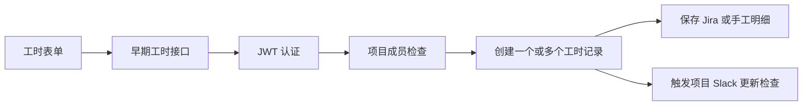
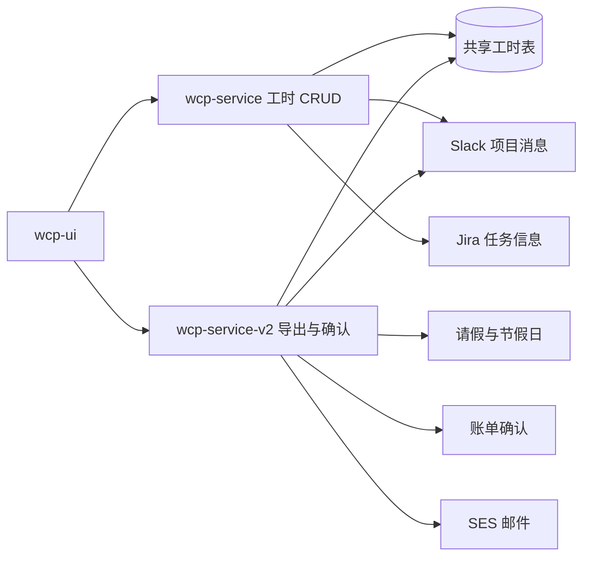

> **第一版验收快照**：`c98089ea66bfece63221`  
> 本报告来自同一份 WCP 工作树静态快照。CodeGraph 只用于导航，正文事实以当前源码复核为准。  
> 本轮一次性准备产品/工程 Overview 与六个代表功能：CodeGraph 冷准备 5.618 秒，暖准备 0.377 秒；完全源码冷准备 3.707 秒。  
> 当前 Git-aware 候选文件 2,007 个；CodeGraph 覆盖 1,639 / 1,726 个可分析源码文件（94.96%）。

## 1. 功能职责与技术边界

工时功能由 React 前端、早期 Node/Express 服务和主平台 Go/Gin 服务共同实现。当前写入和个人 CRUD 主要位于早期服务；主平台负责工时聚合、导出、缺失提醒、项目月度确认以及工时到计费数据的物化。`事实`

**前端边界。** `wcp-ui` 的工作日志页面提供日历、周/月视图、项目工时审阅、日报和编辑表单。`worklogApi.ts` 通过 `mainApi` 调用早期工时接口，通过 `appRunnerApi` 调用导出等主平台接口。`事实`

**写入边界。** `wcp-service/routes/worklogs.js` 提供范围创建、本人查询、更新、补丁更新、单条和范围软删除、项目/管理员查询；`routes/v2/worklog.js` 提供带 Jira 与手工明细的单条创建或更新。`事实`

**读取与确认边界。** `wcp-service-v2` 直接读取工时表和明细表，构建项目月度分布，将请假、其他项目投入、节假日和成员信息合并后保存 `BillingSnapshot`，并在事务中生成确认记录和账单。`事实`

**功能外依赖。** 项目成员关系决定写入资格；员工和角色提供权限；Jira 提供任务说明；Slack/SES 用于提醒；请假与节假日进入月度分布；账单模块消费确认数据。`事实`

**Scope。** CodeGraph 定位到 180 个节点、282 条关系和 103 个文件；150 条 unresolved references 和多服务边界触发了源码回退。`事实`

## 2. 入口与调用方

**前端写入调用。** `addWorklog`、`editWorklog`、`deleteWorklog`、`deleteWorklogRange`、`addOrEditWorklogV2` 都指向 `mainApi` 下的早期服务风格路径。个人查询、项目查询、存在性检查和日报也使用同一基址。`事实`

**主平台调用。** 工时导出使用 `appRunnerApi` 的管理接口；工时令牌管理也使用该基址。团队月度确认页面调用主平台的 management/timesheet 接口，这些调用位于 `timesheetApi.ts` 和项目团队页面。`事实`

**服务端入口。** 早期服务至少包含以下形状：

- `POST /worklogs`：按日期范围创建；
- `POST /v2/worklogs/single`：单条创建或更新；
- `GET /worklogs/me/worklogs`：本人列表；
- `PUT|PATCH /worklogs`：更新；
- `DELETE /worklogs/:id` 和 `DELETE /worklogs`：单条或范围软删除；
- `GET /worklogs`、`GET /worklogs/project/:project_id`：管理和项目查看；
- existence、remaining-hour、simple-worklogs 和日报相关入口。`事实`

**主平台入口。** management handler 注册项目月度工时读取、负责人确认、忽略、导出和账单后续入口；工时 handler 还提供区间读取能力。CodeGraph 的路由节点可能缺少 Gin group 前缀，因此本报告只把其路径作为注册候选，具体完整地址由源码 group 关系决定。`事实`

**外部调用方。** 当前工作区能证明前端调用上述接口，也存在 MCP/助手令牌路径；工作区之外是否有其他客户端不可得。`不可得`

## 3. 主要执行路径

### 个人范围创建

范围创建把起止日期、项目、国家和小时数交给 service 层，成员检查通过后批量写入。新版单条路径先校验 Jira/说明数组及 JSON schema，再按是否有记录编号选择创建或更新。`事实`

### 修改与删除

更新和单条删除先按编号读取记录，再比较 `user_id` 与当前 JWT 用户；改变日期时还会清理同项目同日期的软删除记录。区间删除不逐条检查所有者，而是先检查当前用户的项目成员关系，再按项目和日期范围软删除。`事实`

### 月度确认

月度读取使用并发任务建立 worklog map 和 role map，按天汇总主项目工时、其他项目工时与请假，最后把完整成员数组序列化为快照。确认请求携带快照 UUID。`事实`

## 4. 业务规则、状态与一致性

**写入规则。** 两个早期写入入口都要求 JWT、整数项目编号、十位日期和浮点小时数；范围创建与新版单条路径检查项目成员。新版路径要求 Jira 或手工说明至少一项，并执行 JSON Schema 校验。`事实`

**前端规则。** 表单要求结束日期不早于开始日期，小时数为 0.5 的倍数，输入范围 0.5–24。后端入口没有等价的步进和上限声明。`事实`

**记录状态。** 工时主表使用 `deleted_at` 软删除；明细表还有 `status` 和 `is_deleted`。没有观察到个人工时的 draft/submitted/approved 状态。`事实`

**月度状态。** 月度确认不改变原始工时状态，而是保存快照、生成 `Billing`、`BillingConfirmedEmployee` 和 `BillingConfirmedLog`。重复确认检查把 leader-ignore、leader-confirmed、sales-confirmed 和 invalidated-copy 视为已占用状态。`事实`

**一致性边界。** 确认路径以快照为输入，并在事务中锁定项目记录；个人工时写入路径不读取 `Billing` 或快照状态。实时工时和已经保存的快照因此是可独立变化的数据集合。`事实` + `推断`

**模型差异。** Sequelize 的 `spent` 是 `INTEGER`，GORM 的 `Spent` 是 `float64`，前端明确允许 0.5。这是同一表在不同读取者中的类型描述差异。`事实`

## 5. 认证、授权与数据范围

**认证。** 早期工时 CRUD 路由统一挂载 Passport JWT。主平台从 Gin Context 中读取自定义访问声明。`事实`

**写权限。** 创建和区间删除依赖项目成员检查；单条更新和删除依赖记录所有者检查。新版单条更新将当前用户编号传入 service 层，但本次没有展开 service 内全部重复所有者判断。`事实`

**本人读范围。** `/me/worklogs` 与 `/me/simple-worklogs` 以当前 JWT 用户作为查询主体。后者的项目成员检查代码被注释，实际范围由 service 查询实现决定。`事实`

**团队读范围。** 管理查询允许管理员读取全部，项目管理角色读取自己负责的项目集合；指定项目查询允许管理员或项目 leader。`事实`

**确认权限。** 主平台 `HasConfirmLogPermission` 先检查项目 leader，再检查 `ProjectTimeSheetReviewer` 关系。该权限与早期服务的 admin/project-management 读权限不是同一套角色判断。`事实`

**令牌路径。** 工作区存在 MCP token 创建、再生成和删除入口，以及开放式工时/项目接口。令牌 scope、过期和所有可调用方法未在本报告范围内完整审阅。`不可得`

## 6. 数据模型与存储

**主表。** `wcp_worklog` 包含项目、用户、日期、小时数、内容和删除标记。早期服务使用 Sequelize，主平台使用 GORM 直接读取同一表。`事实`

**内容明细。** `wcp_worklog_content_detail` 记录内容类型、Jira key、Jira summary、手工内容、状态和删除标记。主平台的 `LogFullInfo.Logs()` 将主表内容和明细拼成文本。`事实`

**聚合投影。** 主平台定义 `LogInSheet`、`WorkLogMonthlyInSheet`、`WorkLogByMonth` 等只读投影，并在 `SheetExporter` 中构建按项目、员工和日期组织的 map。`事实`

**确认存储。** `BillingSnapshot` 保存 JSON 快照；`BillingConfirmedEmployee` 保存员工类型、工时、请假、费率、角色、级别等；`BillingConfirmedLog` 保存每日工时、成本、请假和日志文本。`事实`

**文件导出。** 前端导出调用主平台 management sheet endpoint，响应包含 `file_uri`。生成文件位于什么存储后端和保留多久，需要继续追踪 exporter 与文件服务；本报告只确认返回文件地址。`事实` + `不可得`

**跨服务存储。** 工时表由早期服务写、主平台读，绩效代码也有相关读取路径；服务之间没有通过工时 API 完成这些内部读取，而是共享数据库。`事实`

## 7. 文件、消息与外部集成

**Jira。** 新版单条工时接受 Jira key、summary、content 和 status，前端在项目启用 Jira integration 时显示任务选择器。工时数据保存的是任务快照字段，不只是 Jira ID。`事实`

**Slack。** 个人创建、更新和删除调用 `notifiySlackWithCheck`；早期服务还从数据库读取按时区的 cronjob，触发项目工时 Slack 更新。主平台另有负责人确认提醒，直接使用 Slack API。`事实`

**邮件。** 主平台为员工和 leader 构建未填工时邮件，模板包含缺失日期和 WCP 链接。邮件通过项目自己的 SES abstraction 发送。`事实`

**导出文件。** 工时导出由主平台生成并返回 URI；导出请求可选择项目、日期范围、是否包含请假和附加字段。`事实`

**项目动态与日报。** 前端工时 API 同时调用日报读取/编辑和项目 feed 写入，这些能力与工时页面相邻，但其内部模型与工时主表不是同一数据结构。`事实`

**故障处理。** Slack 主平台任务记录 API 错误后继续；缺失工时邮件 executor 将错误向上返回。早期 `notifiySlackWithCheck` 的完整失败处理未在本轮展开。`事实` + `不可得`

## 8. 错误、事务与恢复行为

**HTTP 校验。** Express validator 负责类型和日期长度，JSON Schema 负责新版 payload 结构。业务错误区分 forbidden、not-found、content-length 和 parameter-error。`事实`

**个人写入原子性。** 路由调用 service 层进行写入，然后单独触发 Slack 更新检查。service 是否对主表与多条 detail 使用同一数据库事务，需要继续打开 `worklogServices.js` 的全部写入实现；本报告未将其认定为原子。`不可得`

**软删除恢复。** 单条和范围删除写软删除字段；改变记录日期时会先清理目标日期下之前软删除的同项目记录。是否提供用户可见的恢复接口未找到。`事实` + `验证`

**确认事务。** 月度确认先读取快照和权限，随后进入 GORM transaction；事务对项目行加 `FOR UPDATE` 等价锁，重查快照、计费类型和已确认数量，再写账单及确认数据。错误使事务返回。`事实`

**过期处理。** 快照 UUID 查不到时返回“数据已过期，请刷新”；项目计费类型发生变化时也拒绝旧请求。`事实`

**通知恢复。** Slack 失败在主平台 reminder 中只写日志；邮件 executor 返回错误。SDK、队列或基础设施重试不可见。`不可得`

## 9. 配置、开关与后台任务

| 任务或配置 | 所在服务 | 当前代码行为 |
|---|---|---|
| 工作日志 Slack 更新时间 | 早期 Node 服务 | 读取 `SEND_WORKLOG_SLACK_TIME`，旧函数按中国/洛杉矶时间判断 |
| 项目工时更新 cron | 早期 Node 服务 | 从数据库 cronjob 与 timezone 表动态注册 |
| 周工时提醒 | 早期 Node 服务 | 周四/周五每小时检查，周五当地 17:00 发送 |
| 周提醒关闭开关 | 早期 Node 服务 | 直接判断 `IS_CLOSE_WEEK_WORKLOG_REMINDER` 字符串真值 |
| 未填工时邮件 | 主平台 Go 服务 | 员工和 leader 使用独立 SES 模板 |
| 负责人确认提醒 | 主平台 Go 服务 | 非 debug 注册；每小时检查，当地 10:00 且非节假日发送 Slack |
| Web 域名 | 主平台 | 拼接工时日历和团队确认页面链接 |

**任务注册方式。** 早期服务使用 `node-schedule`，一部分 spec 写在代码里，一部分来自数据库；主平台任务实现 `GetSpec/ShouldRegister/ShouldRun/Run` 形状。`事实`

**配置可见性。** 源码能看到配置键和默认分支，但不能看到生产值、当前注册的数据库 cron 行或运行时 debug 状态。`不可得`

**开关类型问题。** Node 代码没有把环境变量解析为布尔值；任何非空文本都会满足 `if (isClosed)`。`事实`

## 10. 依赖与变更关联范围

**直接代码依赖。** 前端工时页面依赖 `worklogApi`、`timesheetApi`、HTTP client、日期库和表单组件；早期路由依赖 user/project/worklog services、Passport、validator、moment；主平台确认依赖 employee/project/leave/billing models、SheetExporter、GORM transaction 和权限 helper。`事实`

**数据依赖。** 月度确认读取员工、项目、项目成员、职位、工时、工时明细、请假、节假日、办公室时区和工时审阅人配置，并写快照、账单和确认表。`事实`

**变更关联。** 修改工时字段或精度会关联两套 ORM 模型、前端 DTO 和输入控件、日报、导出、月度 distribution、账单确认、绩效读取和提醒判断。修改权限会关联早期角色判断、项目 leader 和主平台 reviewer 配置。`事实`

**跨服务调用。** 后端之间在该功能中没有观察到 HTTP 调用；主要耦合通过共享数据库和前端分别调用两个服务形成。`事实`

## 11. 测试、文档与当前实现问题

**测试。** 按常见 `*.test.*`、`*.spec.*` 和 Go `_test.go` 文件名检索，本次没有在 `wcp-service` 或 `wcp-ui` 中找到直接覆盖工时写入和表单规则的测试文件。该结论只覆盖当前快照与命名模式。`验证`

**文档。** 早期服务 README 把仓库描述为 Worklog Service API，路由内保留 api-doc 注释。主平台没有根级 README；工时到计费的跨服务边界主要只能从源码还原。`事实`

**当前实现问题。** `事实` + `推断`

1. UI 的 0.5–24 小时限制没有在两个写入接口重复执行，直接 API 调用可产生 UI 不会提交的值。
2. Sequelize 将 `spent` 声明为整数，GORM 使用浮点数，UI 允许半小时，同一列的类型认知不一致。
3. `description_section.length > 60000` 比较的是数组条目数量，不是说明文本长度。
4. 周提醒开关使用环境变量字符串真值，文本“false”仍被解释为关闭。
5. `routes/v2/worklog.js` 顶部保留明确标记未使用的 Slack 函数，并同时存在被注释的旧同步说明和当前 cron 路径。
6. CRUD 和月度确认分属不同服务，并直接共享工时表；确认使用快照，而 CRUD 不检查账单状态。
7. `/me/simple-worklogs` 的项目成员检查被注释，实际数据范围依赖 service 查询。

**问题边界。** 上述内容描述当前源码的差异和可执行形状，不说明线上是否已被外部网关、数据库约束或调用方限制。`事实`

## 12. 覆盖与不可回答的问题

**图范围。** 工时 feature scope 包含 180 个候选节点、282 条已选关系、103 个文件和 150 条 unresolved references。初始文件集含少量由泛词和图扩展带入的认证、请假与通用组件，写作时只使用经源码确认的工时边界。`事实`

**源码回退。** 本轮为工时新增了 15 个受限源码窗口，覆盖 CRUD、单条 schema、UI 规则、API 映射、两套模型、确认权限、月度快照/事务、早期调度、未填日志邮件和负责人 Slack 提醒。产品版与工程版共用这些窗口，没有为第二受众重复读取。`事实`

**工作区覆盖。** CodeGraph 覆盖 94.96%（1,639/1,726）的可分析源码文件；未覆盖文件、未解析边和语义判断均允许直接读取源码。`事实`

**不可回答。** `不可得`

- `mainApi`、`appRunnerApi` 在生产环境的实际网关映射和路由重写。
- 数据库对工时唯一性、数值类型和软删除的实际 DDL 约束是否与 ORM 一致。
- `worklogServices.js` 每个多表写入分支是否全部使用事务。
- 生产 cronjob 表内容、任务启用状态和通知投递成功率。
- 工作区外客户端和 MCP 用户的真实调用情况。
- 已确认账单与后续工时更改之间的实际运营处理。
- 运行时数据量、查询性能、慢查询和锁等待。

**快照一致性。** 五个仓库均为 `master` 且带未提交改动；报告反映压缩包中的工作区内容，不等同于任一远端提交的干净状态。`事实`

### 本轮源码核对路径

- `wcp-service/routes/worklogs.js`
- `wcp-service/routes/v2/worklog.js`
- `wcp-service/services/worklogServices.js`
- `wcp-service/models/worklog.js`
- `wcp-service/models/worklogContentDetail.js`
- `wcp-service-v2/internal/model/worklog.go`
- `wcp-service-v2/internal/handlers/management/billing.go`
- `wcp-service-v2/internal/handlers/management/permission.go`
- `wcp-service-v2/internal/tasks/confirm_log/notifier.go`
- `wcp-ui/src/pages/worklog/components/LogTimeForm.tsx`
- `wcp-ui/src/api/worklogApi.ts`
- `wcp-service/common/scheduleService.js`
