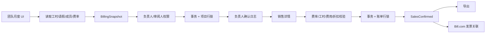
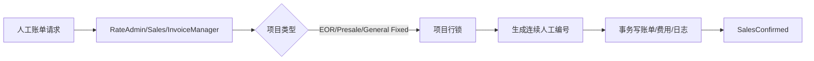
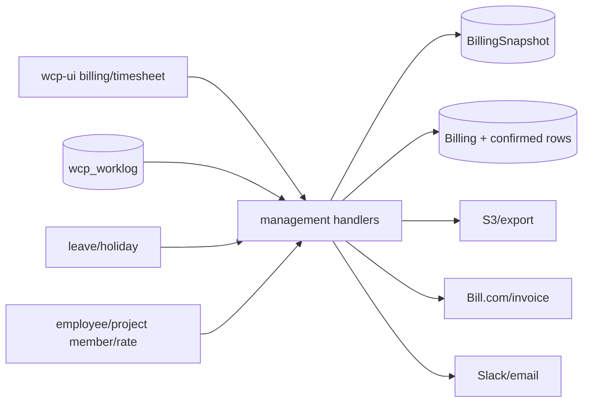

> **第一版验收快照**：`c98089ea66bfece63221`  
> 本报告来自同一份 WCP 工作树静态快照。CodeGraph 只用于导航，正文事实以当前源码复核为准。  
> 本轮一次性准备产品/工程 Overview 与六个代表功能：CodeGraph 冷准备 5.618 秒，暖准备 0.377 秒；完全源码冷准备 3.707 秒。  
> 当前 Git-aware 候选文件 2,007 个；CodeGraph 覆盖 1,639 / 1,726 个可分析源码文件（94.96%）。

## 1. 功能职责与技术边界

账单能力主要位于 `wcp-service-v2` 的 `internal/handlers/management` 和 `internal/model/billing.go`，前端位于 `wcp-ui/src/pages/billing` 及项目团队月度确认页面。上游依赖早期工时服务写入的 `wcp_worklog` 数据、主平台请假与项目成员模型；下游连接导出文件、Bill.com 发票、邮件与经营分析。`事实`

| 范围 | 当前实现 |
|---|---|
| HTTP runtime | Go/Gin 主平台 `/v2/billing` |
| UI | React/Vite 账单、确认、导出和分析页面 |
| 持久化 | GORM/MySQL；快照、账单、确认员工、确认日志、发票、费率、费用和操作日志 |
| 外部依赖 | 文件存储、邮件、Slack、Bill.com、汇率来源 |
| 上游 | 工时、请假、员工、项目成员、职位和费率 |
| 排除 | 个人工时 CRUD 与请假审批内部实现，仅追踪它们进入账单的数据 |

本轮 feature 图边界为 500 个节点、1,388 条边和 284 个文件，包含通用 management 噪声；语义结论只使用已核对的 billing、permission、model、router 和前端文件。`事实`

## 2. 入口与调用方

`handlers.go:227-260` 在认证 group `/v2/billing` 下注册列表、负责人确认/忽略/作废、销售费率/成员类型/确认、导出、重建、发票关联/解除、付款方式、dashboard、analytics、EOR analytics、现金股权查询、人工账单、费用和标题更新。`事实`

| 入口组 | 代表路径 | 主要调用方 |
|---|---|---|
| 负责人 | `/leader/confirm-log`、`/leader/billing-detail`、`/leader/ignore-log` | 项目团队月度页面 |
| 销售 | `/sales/rate`、`/sales/confirm-billing`、`/sales/billing-detail/:id` | 销售账单页面 |
| 导出 | `/:id/export`、`/export`、`/regenerate` | 管理导出 UI |
| 发票 | `/:id/link-invoice`、`/:id/unlink-invoice`、`/invoice/:id/payment-type` | 发票管理 UI |
| 分析 | `/dashboard`、`/analytics`、`/eor-analytics` | 经营看板 |
| 人工与费用 | `/manual`、`/other-expenses`、`/client-cover-expenses` | 费率/发票/办公室角色 |

工作区内主要调用方是前端；Bill.com、导出下载和邮件可能还有工作区外系统或用户。`不可得`

## 3. 主要执行路径

销售确认在事务内重读账单状态，验证员工、费率、工时、其他费用、折扣、账单类型和现金/股权组成，保存确认员工与费用，并写操作日志。`事实`

## 4. 业务规则、状态与一致性

### 状态与类型

| 类别 | 值 |
|---|---|
| BillingStatus | LeaderConfirmed、SalesConfirmed、LeaderInvalidated、SalesInvalidated、LeaderIgnore、HRInvalidated、CopyAfterInvalidated |
| InvoiceStatus | WorklogUnconfirmed、Unconfirmed、Confirmed、Unsent、Sent、PartialPayment、Paid、Invalidated、NeedReConfirm |
| PaymentType | Cash、CashUSDC、CashEquity |
| DiscountType | Percentage、Number |
| OperateType | LeaderConfirm、LeaderInvalidate、LeaderIgnore、SalesConfirm、SalesInvalidate、HRExport、Link/Unlink Invoice、ManualCreate |

### 关键约束

- 销售确认要求员工数组非空、费用在 0..999999.99、comment 不超过 500。`事实`
- 账单状态必须是负责人已确认或作废副本。`事实`
- T&M 账单区分 flat/actual 等分支，员工小时和费率必须可计算；人工 invoice amount 必须大于 0。`事实`
- 折扣必须是百分比或固定金额；固定折扣不能大于月度成本。`事实`
- 事务内对 Billing 或 Project 使用 row lock，并在写入前重新检查状态。`事实`
- BillingSnapshot 与实时上游数据独立；确认后记录保留当时的小时、请假、费率和日志文本。`事实`

## 5. 认证、授权与数据范围

路由 group 统一使用 `auth.Authentication()`。`management/permission.go` 进一步定义：

| 操作 | 当前授权 |
|---|---|
| 工时确认 | Project leader 或 ProjectTimeSheetReviewer |
| 写费率/销售确认 | RateAdmin 或 Sales |
| 查看账单 | HR、RateAdmin、Sales、InvoiceManager |
| 作废账单 | HR、RateAdmin、Sales |
| 人工账单 | RateAdmin、Sales、InvoiceManager |
| 客户承担费用完整访问 | OfficeManagement、Admin、SysAdmin、RateAdmin；其余按管理项目过滤 |
| 发票解除/付款方式 | 处理函数额外要求 InvoiceManager |

角色检查、项目对象范围和记录状态共同决定访问结果；没有单一 ACL 表覆盖全部操作。`事实`

## 6. 数据模型与存储

| 实体 | 关键字段/关系 | 写入者 | 读取者 |
|---|---|---|---|
| BillingSnapshot | UUID、ProjectID、YearMonth、Data JSON | 团队月度分布 | 负责人确认 |
| Billing | ProjectID、SnapshotID、YearMonth、Status、BillingType、Title、Discount、ManualNumber | 确认、人工账单、作废 | 列表、详情、导出、发票 |
| BillingConfirmedEmployee | User、类型、小时、请假、费率、角色/级别 | 销售确认 | 账单详情、导出 |
| BillingConfirmedLog | 日期、小时、请假、成本、日志 | 销售确认 | 明细和导出 |
| BillingInvoice | 外部 ID、编号、客户、金额、状态、日期、付款类型和已付金额 | 发票关联/同步 | 发票页面和分析 |
| ProjectEmployeeRate | 项目员工费率与生效数据 | 销售/费率管理 | 账单计算 |
| OperateLog | 操作类型和操作者 | 各状态动作 | 审计/追溯 |

工时表由 Node 服务主要写入、Go 主平台直接读取；账单不是通过工时 HTTP API取得上游数据，而是共享数据库读取和快照。`事实`

## 7. 文件、消息与外部集成

| 副作用/集成 | 当前路径 | 数据类型 | 失败边界 |
|---|---|---|---|
| 账单导出 | management export | 工时、请假、费率、费用和账单 | 生成/存储失败返回错误 |
| Bill.com 发票 | link/unlink invoice | 发票 ID、客户、金额和状态 | 外部验证失败则不关联 |
| Slack 提醒 | confirm_log task | 项目、月份、负责人链接 | 发送失败记录日志 |
| 邮件 | 发票解除、账单通知 | 项目和账单状态 | 部分在事务后异步发送 |
| 汇率 | support/exchange 路径 | 公开汇率 | 请求/解析失败导致当次值不可用 |
| Analytics | dashboard/EOR analytics | 聚合金额与项目数据 | 查询错误返回 |

不得从静态代码推断生产 Bill.com、邮件和 Slack 成功率。`不可得`

## 8. 错误、事务与恢复行为

- 参数和业务错误使用项目自定义 error wrapper 返回。`事实`
- 负责人确认和销售确认在事务中锁记录并重查快照/状态。`事实`
- 快照过期、项目计费类型变化、成员资料缺失、重复确认、折扣非法或金额非正都会中止。`事实`
- 发票解除使用事务清除链接和发票记录；邮件在提交后异步发送，形成数据成功/通知失败的部分成功边界。`事实`
- 作废产生状态变化或副本，而非删除历史。`事实`
- 外部 Bill.com 和文件服务重试策略没有在应用层形成统一合同。`验证`

## 9. 配置、开关与后台任务

配置包括数据库、Web 域名、Slack、邮件、对象存储、Bill.com、汇率来源和运行模式。值未读取。`事实`

负责人确认提醒以小时级任务检查当地 10:00、节假日和未确认项目。缺失工时邮件是相邻任务。没有观察到跨实例 leader election 或持久化 outbox 的统一实现。`不可得`

## 10. 依赖与变更关联范围

账单字段或状态与工时精度、请假分配、项目计费类型、员工费率、导出、发票和分析页面相连。这里描述源码连接，不预测任何变更必然造成故障。`事实`

## 11. 测试、文档与当前实现问题

1. 快照与实时工时可以独立变化。`事实`
2. BillingStatus 与 InvoiceStatus 构成两个相互关联的状态机，分支数量较多。`事实`
3. 人工账单直接创建为 SalesConfirmed，旅程不同于普通月度账单。`事实`
4. 部分外部通知在事务之后异步执行，结果不与数据库原子绑定。`事实`
5. 核心实现集中在大型 `billing.go`，同时承载多个子域。`事实`
6. 工作区未定位覆盖完整负责人确认—销售确认—发票—付款—作废旅程的自动化测试集合。`验证`
7. 实际数据库 DDL、外部发票沙箱测试和线上并发结果不可得。`不可得`

仅陈述当前实现问题。

## 12. 覆盖与不可回答的问题

- Feature graph：500 nodes、1,388 edges、284 files、150 unresolved candidates。
- 本轮共享准备：44 graph queries、211 source windows、360,661 source characters；13 报告共用同一 snapshot。
- CodeGraph 全局源码覆盖：1,639 / 1,726（94.96%）。
- 暖准备：0 graph queries、0 source reads、0 source characters。

不可回答：生产金额、流量、查询性能、锁等待、Bill.com 状态、汇率质量、任务成功率和真实人工操作频率。

### 源码核对

- `wcp-service-v2/internal/handlers/handlers.go:227-260`
- `wcp-service-v2/internal/model/billing.go:10-180`
- `wcp-service-v2/internal/handlers/management/permission.go:45-125`
- `wcp-service-v2/internal/handlers/management/billing.go:1428-1640`
- `wcp-service-v2/internal/handlers/management/billing.go:3000-3185`
