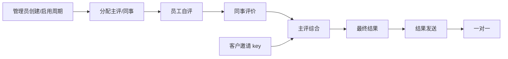
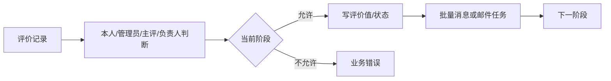
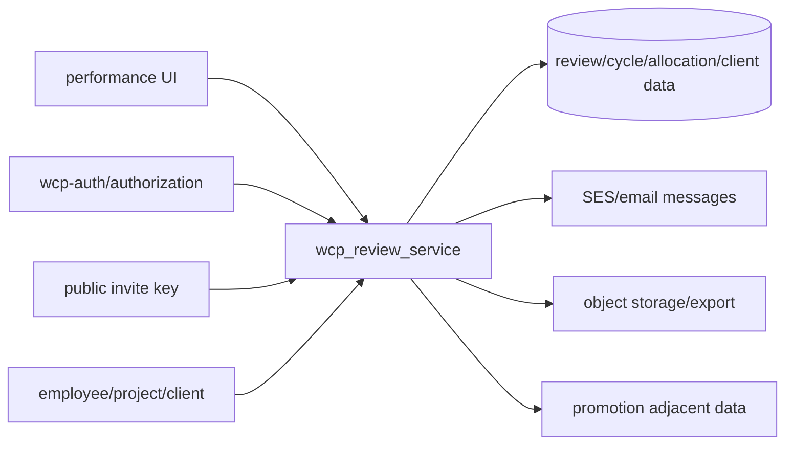

> **第一版验收快照**：`c98089ea66bfece63221`  
> 本报告来自同一份 WCP 工作树静态快照。CodeGraph 只用于导航，正文事实以当前源码复核为准。  
> 本轮一次性准备产品/工程 Overview 与六个代表功能：CodeGraph 冷准备 5.618 秒，暖准备 0.377 秒；完全源码冷准备 3.707 秒。  
> 当前 Git-aware 候选文件 2,007 个；CodeGraph 覆盖 1,639 / 1,726 个可分析源码文件（94.96%）。

## 1. 功能职责与技术边界

绩效功能主要位于独立的 `wcp_review_service`（Go 1.16、Gin、GORM）和 `wcp-ui/src/pages/performance-appraisal`，同时保留早期服务中的绩效相关表、通知和报表代码。主服务包含周期、评价记录、员工视角、管理员视角、客户邀请、晋升相邻能力、cron、邮件和对象存储。`事实`

| 运行边界 | 内容 |
|---|---|
| Backend | `wcp_review_service` |
| UI | performance-appraisal、promotion-review、client review 页面 |
| Persistence | MySQL/GORM，另有历史 Sequelize migration 表线索 |
| Public surface | 临时客户评价 key |
| External | 认证服务、邮件、S3、客户链接 |
| Excluded | 晋升的完整内部状态机，仅描述连接 |

本轮图范围为 308 nodes、366 edges、163 files，并启用了源码回退。`事实`

## 2. 入口与调用方

`internal/handler/handler.go` 注册：

- 公开 `/v2/tem/review/invite-client/:key` 的 items、submit、details；
- 认证 `/v2/review` 的 create/list/demand/modify/entrance；
- training、allocation、result delivery、notify、return-record、one-on-one email、peer edit；
- client invite/list/delete/send/update-expiration/summary；
- export 与 one-on-one summary。

服务中还存在 `/performance_review` 风格的 employee/admin resource 入口。前端绩效页面和被邀请客户是主要可见调用方。`事实`

## 3. 主要执行路径

图无法完整恢复 resource 内对象级权限和 GORM 关系，关键路径由源码确认。`事实`

## 4. 业务规则、状态与一致性

| 范围 | 当前值 |
|---|---|
| ReviewStatus | Inactive、Active、Closed |
| PerformanceStatus | Setup、MainConfirmationInProgress、MainConfirmed、SelfReviewInProgress、SelfReviewDone、FinalReviewDone、FinalReviewSent |
| UserStage | Disable、Setup、Main confirmation、Main confirmed、Self、Peer、Main、Final、Final done、Final sent、One-on-one |
| ReviewerType | Self、Main、Peer |
| OneOnOne | Waiting、Completed |

**当前映射矛盾。** `PerformanceStatusCode2Round` 将 `SelfReviewDone` 映射到 round 3，而 `PerformanceStatusName2Round` 将同名状态映射到 round 2。`事实`

公开客户评价使用 invite key 和 expiration；内部评价使用登录身份和记录关系。重复提交、退回和阶段转换由 record status 和已存在值共同控制，没有观察到跨所有入口的统一幂等键。`事实`

## 5. 认证、授权与数据范围

内部 `/v2/review` 使用认证 middleware。对象级判断分布在 employee、admin_main 和 handler service/resource。

可见角色/关系：本人、管理员、主评人、同事评审人、评估负责人、客户邀请。`事实`

**当前授权问题。** `employee_resource.go:82-103` 的复合拒绝条件中，管理员与评估负责人使用否定检查，但 `CheckIsMROfUser` 使用正形式；同仓库其他类似位置使用 `!CheckIsMROfUser` 或 `!CheckIsMROfUserInAllReview`。在“非本人、非管理员、非主评人、非负责人”的组合下，该表达式可能不进入拒绝分支。`事实` + `推断`

客户临时入口不使用普通内部登录，其数据范围由 key 对应邀请记录限制。`事实`

## 6. 数据模型与存储

主要实体：Review Cycle、Performance Record、Review Items/Values、Reviewer Allocation、Client Invitation/Review、Final Result、Email Message、One-on-one 信息。它们通过 employee、project/client 和 cycle 关系连接。`事实`

多种 resource/service 直接使用 GORM；邮件消息可能先写数据库再由 cron/发送器处理。部分早期表由 `wcp-service` migration 创建，显示历史数据边界跨仓库。`事实`

## 7. 文件、消息与外部集成

| 集成 | 用途 | 当前失败形状 |
|---|---|---|
| 邮件/SES | 阶段提醒、客户邀请、最终结果、一对一 | 直接返回、批量记录错误或打印错误 |
| S3 | 评价附件/导出等相邻文件路径 | SDK 错误向上返回 |
| Auth service | 验证用户/角色 | review middleware 使用 HTTP client 调授权接口 |
| 客户临时链接 | 外部客户评价 | key 无效或过期则不可用 |
| Export | 评价结果导出 | 查询/文件生成错误返回 |

`wcp_review_service/internal/middleware/middleware.go` 创建无显式 timeout 的 `http.Client{}` 调用远程授权服务。`事实`

## 8. 错误、事务与恢复行为

- 路由/资源函数返回自定义错误或 HTTP 错误。`事实`
- 阶段不匹配、无权限、记录不存在或邀请无效会中止。`事实`
- 批量邮件记录失败有打印/错误路径；业务状态和通知不总是一个事务。`事实`
- 未观察到跨外部授权、邮件和数据库操作的统一 retry/outbox。`验证`
- 退回入口提供业务级恢复，但不是数据库回滚。`事实`

## 9. 配置、开关与后台任务

独立配置包含服务器、数据库、CORS、授权地址、邮件、S3 和 `Review.CronSpec`。cron 每次读取评价阶段，在特定阶段前 24 小时左右发送提醒，并跳过不需要通知的 round。`事实`

middleware 在 CORS setup 时直接打印允许 origin 列表；生产配置值本身未进入报告。`事实`

多实例 cron 协调、授权 HTTP timeout、邮件重试和任务去重不可得。`不可得`

## 10. 依赖与变更关联范围

阶段、角色和数据字段与管理员页面、员工页面、客户链接、邮件模板、导出和晋升相邻代码连接。`事实`

## 11. 测试、文档与当前实现问题

1. 对象级授权表达式方向不一致，存在可达权限问题形状。`事实` + `推断`
2. `SelfReviewDone` 在两个 round 映射中对应不同值。`事实`
3. `/v2/review` 与 `/performance_review` 两套入口并存。`事实`
4. 远程授权 HTTP client 没有显式 timeout。`事实`
5. CORS origin 和多个阶段调试信息直接打印到 stdout。`事实`
6. 数据状态与邮件/通知不统一原子。`事实`
7. 测试目录只确认缓存 ETag 等少量测试，没有完整绩效旅程测试。`验证`
8. 文档、生产阶段配置、客户 key 使用和数据质量不可得。`不可得`

本章只描述当前代码状态。

## 12. 覆盖与不可回答的问题

- 308 graph nodes、366 edges、163 files、150 unresolved candidates。
- 关键源码覆盖路由、状态、对象权限、cron、middleware 和邮件路径。
- 全局 CodeGraph 源码覆盖 94.96%。

无法回答真实周期、评价内容、客户参与率、通知送达、授权事件、查询性能和线上并发。

### 源码核对

- `wcp_review_service/internal/handler/handler.go:26-65`
- `wcp_review_service/internal/constant/review_round.go:1-65`
- `wcp_review_service/internal/constant/type&status.go:1-44`
- `wcp_review_service/internal/review/employee/employee_resource.go:82-103`
- `wcp_review_service/internal/pkg/cron/cron.go:30-90`
- `wcp_review_service/internal/middleware/middleware.go:40-55`
- `wcp_review_service/internal/middleware/middleware.go:140-175`
