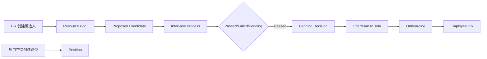
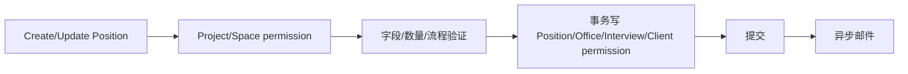
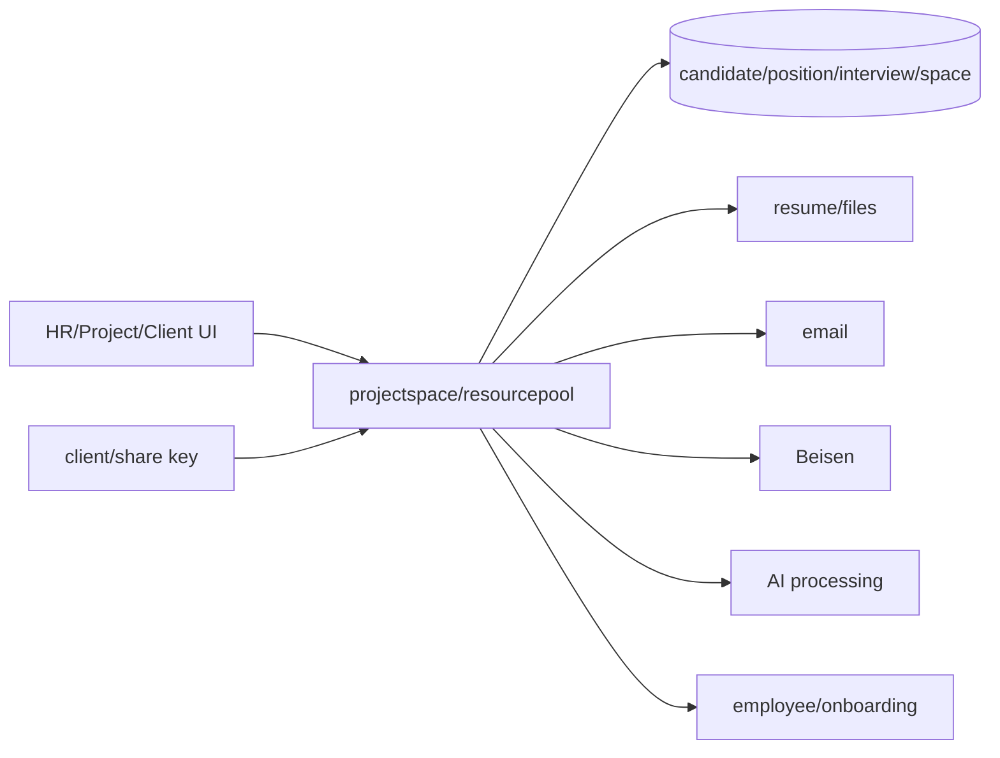

> **第一版验收快照**：`c98089ea66bfece63221`  
> 本报告来自同一份 WCP 工作树静态快照。CodeGraph 只用于导航，正文事实以当前源码复核为准。  
> 本轮一次性准备产品/工程 Overview 与六个代表功能：CodeGraph 冷准备 5.618 秒，暖准备 0.377 秒；完全源码冷准备 3.707 秒。  
> 当前 Git-aware 候选文件 2,007 个；CodeGraph 覆盖 1,639 / 1,726 个可分析源码文件（94.96%）。

## 1. 功能职责与技术边界

招聘能力主要位于 `wcp-service-v2/internal/handlers/projectspace`、`resourcepool`、`beisen`、`employee` 和 `internal/constant`，前端位于 `wcp-ui/src/human-resource`、`src/project-source`、`src/pages/hr`、`src/pages/client-space`。`事实`

| 边界 | 当前实现 |
|---|---|
| Runtime | Go/Gin 主平台 |
| UI | 内部 HR、项目空间、客户空间和 onboarding 页面 |
| Data | candidate、position、interview、proposed candidate、space/client/share、employee link |
| Files | resume/avatar/attachments through S3 |
| External | Beisen、邮件、AI、客户访问 |
| Excluded | 员工主数据和绩效的完整实现，仅追踪连接 |

Feature graph 为 500 nodes、1,260 edges、281 files，正文使用路由、状态常量、hiring service 和 UI 文件复核。`事实`

## 2. 入口与调用方

`handlers.go:262+` 注册 hiring dashboard、`/v2/prospa` 的职位、screen user、候选人推荐、面试、评论、加入计划、客户邀请和空间设置；另有公开 client login/share-key 与 ClientSpaceAuthentication group。`事实`

主平台还有 resourcepool candidate 创建/更新/状态/onboarding/share、employee link/copy resume、Beisen 同步和 hiring management 入口。工作区内调用方包括内部 HR UI、项目团队 UI、客户空间和公开分享页面。`事实`

## 3. 主要执行路径

创建职位的 transaction 写职位、办公室、面试流程和客户 permission；更新先检查 fulfilled count 与 recruiting quantity，再替换子记录。`事实`

## 4. 业务规则、状态与一致性

### 状态体系

| 对象 | 状态 |
|---|---|
| Candidate | EditingProfile、Active、Inactive、Deleted、Onboarding、Onboarded |
| AI generation | Processing、Success、Failed |
| Interview progress | Failed、Passed、Pending |
| Proposed interview | Interviewing、Passed、Failed、Closed |
| Proposed onboarding | OfferAccepted、Onboarding、Onboarded、Declined、OnboardToProject |
| Project-space candidate | AwaitingInterview、Passed、PendingDecision、Failed、Declined、Onboarding、Onboarded |
| Position | Active、Inactive |

职位还有 Web2/Web3/AI 类型、Urgent/High/Mid/Low 优先级和 Short/Mid/Long duration。`事实`

更新职位时招聘数量不能小于 fulfilled count；达到数量后部分状态改变被拒绝。多个状态体系没有一个统一转换表，转换由各 service 分支维护。`事实`

## 5. 认证、授权与数据范围

内部 `/v2/prospa` 使用普通认证；客户空间使用 `ClientSpaceAuthentication` 和 `ClientSpacePermissionMiddleware`；公开 client login/share-key 入口在普通 group 外。`事实`

对象级范围包括：项目/space 管理权限、screen user、invited client、share key、候选人本人/HR 角色和 client permission。完整矩阵分散在 projectspace permission/service 中。`事实`

## 6. 数据模型与存储

| 实体 | 关系 |
|---|---|
| Candidate | 资料、简历、状态、AI 状态，可关联员工 |
| Position | Project/Space、Office、InterviewProcess、Quantity、Priority、Status |
| InterviewProcess/Result | 职位轮次、顺序、面试人和结果 |
| ProposedCandidate | Candidate、Space/Position、状态、评论、加入计划 |
| ScreenUser / InvitedClient | 空间访问权限 |
| ClientSpace/Share | key、过期和 anyone permission |
| Onboarding | Offer/加入/入职状态 |

创建/更新职位使用 transaction；异步邮件不在事务中。简历和文件由对象存储保存，数据库保留对象引用和资料字段。`事实`

## 7. 文件、消息与外部集成

| 集成 | 数据 | 失败路径 |
|---|---|---|
| S3 | 简历、头像、候选人文件 | 上传/签名/下载错误 |
| Email | 职位、状态、邀请和 onboarding 通知 | 多处在 transaction 后异步发送 |
| Beisen | 候选人、职位、面试和评价同步 | 同步失败返回/记录，内部数据可能保持旧状态 |
| AI | 候选人资料加工 | Processing/Success/Failed |
| Client Space | 候选人和项目资料 | 认证/key/permission 控制 |

## 8. 错误、事务与恢复行为

- 权限、记录不存在、字段非法和数量冲突返回业务错误。`事实`
- Position create/update 事务失败会回滚职位及子记录。`事实`
- 事务成功后邮件失败不回滚。`事实`
- 外部同步和 AI 失败保留失败状态或上次成功数据。`事实` + `推断`
- 删除/关闭候选人和职位多为状态或业务删除，完整级联 DDL 不可得。`不可得`
- share key 和 client session 的运行时失效/撤销行为需要数据和配置验证。`不可得`

## 9. 配置、开关与后台任务

依赖 DB、S3、邮件、Web URL、Beisen 和 AI 配置。Client space expiration、anyone permission、Position Active/Inactive 是局部开关。没有观察到统一 RECRUITMENT_ENABLED。`验证`

外部同步是否由 cron、人工入口或部署任务持续运行，需要结合 Beisen router/task 与生产配置；静态报告只确认代码入口。`不可得`

## 10. 依赖与变更关联范围

候选字段和状态连接 HR 页面、项目空间、客户空间、面试、Onboarding、员工转换、邮件、文件和外部同步。`事实`

## 11. 测试、文档与当前实现问题

1. Candidate、Interview、ProposedCandidate、ProjectSpace 和 Onboarding 使用多套状态枚举。`事实`
2. 外部分享 key 与 client-space 形成独立数据访问边界。`事实`
3. 事务与邮件通知不是原子结果。`事实`
4. Beisen/AI 外部状态与内部状态可能暂时分离。`事实` + `推断`
5. 简历和个人资料由内部、客户、分享和 AI 多种路径读取。`事实`
6. route middleware 与 service permission 共同组成权限，缺少集中矩阵。`事实`
7. 当前快照没有完整招聘端到端测试证据。`验证`
8. 真实 DDL、访问日志、key 使用和外部同步成功率不可得。`不可得`

## 12. 覆盖与不可回答的问题

- 500 nodes、1,260 edges、281 files、150 unresolved candidates。
- 当前源码复核范围覆盖 route、status、space constant、hiring transaction、Beisen 和 UI。
- 全局 CodeGraph 覆盖 94.96%。

不可回答生产候选人数、职位数量、访问量、邮件/同步成功率、AI 质量和性能。

### 源码核对

- `wcp-service-v2/internal/handlers/handlers.go:262-315`
- `wcp-service-v2/internal/constant/status.go:35-167`
- `wcp-service-v2/internal/constant/space.go:16-75`
- `wcp-service-v2/internal/handlers/projectspace/hiring.go:80-220`
- `wcp-service-v2/internal/handlers/projectspace/permission.go`
- `wcp-service-v2/internal/handlers/beisen/router.go`
