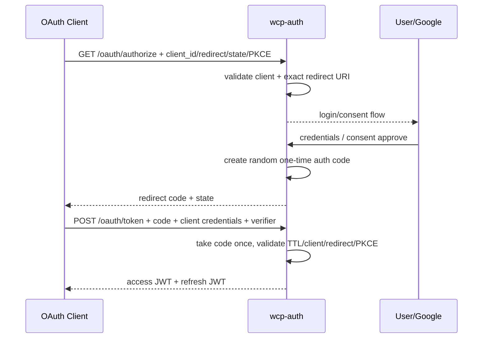
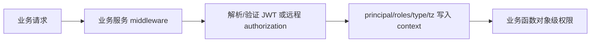

> **第一版验收快照**：`c98089ea66bfece63221`  
> 本报告来自同一份 WCP 工作树静态快照。CodeGraph 只用于导航，正文事实以当前源码复核为准。  
> 本轮一次性准备产品/工程 Overview 与六个代表功能：CodeGraph 冷准备 5.618 秒，暖准备 0.377 秒；完全源码冷准备 3.707 秒。  
> 当前 Git-aware 候选文件 2,007 个；CodeGraph 覆盖 1,639 / 1,726 个可分析源码文件（94.96%）。


## 1. 功能职责与技术边界

身份认证由独立 `wcp-auth` Go/Gin 服务承担，提供 OAuth2 authorization-code、令牌签发与刷新、Google 登录、用户信息、授权同意、激活、邀请和 RFC 元数据。业务后端各自验证或远程确认 Token/角色，因此身份边界还包括调用方 middleware。`事实`

| 边界 | 当前实现 |
|---|---|
| Runtime | wcp-auth，Go 1.16、Gin、GORM、JWT、Casbin |
| Protocol | OAuth2 authorization code、refresh、userinfo、consent、metadata |
| Identity source | Google login 与内部用户记录 |
| Token | RSA JWT access/refresh |
| Clients | 配置中的 client_id、client_secret、redirect URIs |
| Excluded | 各业务模块的完整对象级授权，仅追踪身份交接 |

本轮身份 Context 为 500 nodes、1,893 edges 和 283 files，图被通用 `auth` 词扩展得较宽；正文只使用 `wcp-auth` 与明确的业务 middleware 源码。`事实`

## 2. 入口与调用方

`internal/handlers/handler.go` 注册：

| 方法/路径 | 作用 |
|---|---|
| GET/POST `/oauth/authorize` | 授权码请求和登录提交 |
| POST `/oauth/token` | 授权码交换令牌 |
| POST `/oauth/token/refresh` | 刷新令牌 |
| POST `/oauth/token/gmail` | Gmail/Google 相关令牌路径 |
| GET `/oauth/authentication` | 身份认证检查 |
| GET `/oauth/authorization` | 角色/授权检查 |
| GET `/oauth/userinfo` | 用户信息 |
| GET `/oauth/consent` / POST approve | 授权同意 |
| activation / invitation | 激活和邀请 |
| `/.well-known/oauth-authorization-server` | 元数据 |

调用方包括 WCP 前端、主平台、绩效服务和任何配置的 OAuth2 client。工作区外 client 数量和流量不可得。`不可得`

## 3. 主要执行路径





Authorization code 保存在进程级 map 中，由 mutex 保护，取用后删除；默认 TTL 在配置缺省时为 600 秒。`事实`

## 4. 业务规则、状态与一致性

- Client ID 必须在配置 clients 中存在。`事实`
- redirect URI 使用精确匹配。`事实`
- 授权码由 32 字节随机数生成，一次性消费并受 TTL 限制。`事实`
- PKCE 支持 S256 和 plain；challenge 缺失且 verifier 也缺失时验证通过，因此 PKCE 不是所有 client 的强制条件。`事实`
- Access/refresh JWT 使用 RSA 公钥验证、校验 issuer 和 subject。`事实`
- Refresh endpoint 需要 refresh token 和 client credentials，client secret 使用 constant-time compare。`事实`
- Consent 拒绝返回 OAuth `access_denied` 重定向。`事实`

授权码状态仅存在于单个进程内，不是数据库实体。`事实`

## 5. 认证、授权与数据范围

`CustomAccessClaims` 包含 principal、roles、type 和 timezone。Token 验证后，业务服务仍需要角色和对象级判断。`事实`

身份服务使用 Casbin 配置和 authorization endpoint，但实际业务权限分散在多个服务。绩效服务 middleware 还会通过 HTTP 调 auth authorization，主平台与旧服务有各自 JWT middleware。`事实`

公开协议入口与需要 access token 的 userinfo/consent 入口具有不同边界。具体 client scope 字符串的业务解释和完整授权矩阵未集中呈现。`不可得`

## 6. 数据模型与存储

身份服务使用 MySQL/GORM 保存用户、角色、激活/邀请和相关身份数据。OAuth client 列表及 client secret 从 YAML/环境配置加载；`OAUTH2_IDP_JSON` 可以覆盖 public URL、login URL、TTL 和 clients。`事实`

Authorization code 不写数据库或共享缓存；它存储 code、client、redirect、scope、subject、PKCE challenge 和 expiry 的进程内记录。`事实`

JWT 是无状态签名令牌；代码中没有观察到集中 access-token revoke list。`验证`

## 7. 文件、消息与外部集成

| 集成 | 用途 | 数据 |
|---|---|---|
| Google | 登录/身份 | Google account/token information |
| RSA keys | JWT signing/validation | private/public key config |
| OAuth client redirect | 将 code/error 返回 client | code、state、error |
| Business authorization HTTP | 绩效等服务询问 auth | access token/authorization context |
| Swagger | API 文档 | endpoint schema |

配置中的 secret 值没有进入报告。`事实`

## 8. 错误、事务与恢复行为

- 无效 client、redirect、code、expired code、重复使用 code、PKCE mismatch 和 token invalid 返回 OAuth/业务错误。`事实`
- 授权码一旦 `take` 即从 map 删除；交换过程中后续失败是否允许重新使用取决于删除发生位置。`事实`
- 进程重启会清空未交换授权码。`事实`
- 多实例中授权请求与 token exchange 落到不同实例时，后者无法读取前者的内存 code。`事实` + `推断`
- 绩效服务远程授权使用无显式 timeout 的 `http.Client{}`，远端卡住时请求等待由系统默认行为决定。`事实`
- 没有观察到跨认证服务调用的统一重试/断路器。`验证`

## 9. 配置、开关与后台任务

配置结构包括 Server、CORS、Auth issuer/public/private keys、MySQL、Casbin、Google 和 OAuth2 IdP。OAuth2 IdP 配置含 PublicBaseURL、AuthorizationLoginURL、AuthCodeTTLSeconds 和 clients。`事实`

Viper 从配置文件和环境加载，`OAUTH2_IDP_JSON` 对部分字段进行 merge。生产 client、redirect、key 和数据库值不可得。`不可得`

身份核心流程没有定时任务；授权码过期依赖读取/消费时判断或内存管理代码。`事实`

## 10. 依赖与变更关联范围

```mermaid
flowchart LR
  UI[wcp-ui] --> AUTH[wcp-auth OAuth2]
  GOOGLE[Google] --> AUTH
  AUTH --> DB[(user/role/activation)]
  AUTH --> JWT[access/refresh JWT]
  JWT --> MAIN[wcp-service-v2]
  JWT --> LEGACY[wcp-service]
  JWT --> REVIEW[wcp_review_service]
  REVIEW --> AUTHZ[/oauth/authorization]
  CLIENTS[configured OAuth clients] --> AUTH
```

Claims 字段、issuer、client/redirect、role 和 token type 与所有业务服务 middleware 相连。`事实`

## 11. 测试、文档与当前实现问题

1. Authorization code 是实例本地内存状态，重启会丢失，多实例跨节点交换无法共享。`事实` + `推断`
2. PKCE 在 challenge 和 verifier 都缺失时不是强制条件。`事实`
3. `CustomAccessClaims.Principal` 的 JSON tag 拼写为 `pricinpal`。`事实`
4. 绩效服务调用远程 authorization 的 HTTP client 没有显式 timeout。`事实`
5. OAuth client 和 secret 由静态配置/环境提供，实际轮换和审计不可由源码确认。`事实` + `不可得`
6. 业务服务仍各自实现 middleware 和对象级授权，身份服务不形成全系统集中权限矩阵。`事实`
7. 当前快照未定位覆盖授权码、PKCE、刷新、consent、多实例和重启行为的完整自动化测试集合。`验证`

只描述当前问题，不包含建议。

## 12. 覆盖与不可回答的问题

- Feature graph：500 nodes、1,893 edges、283 files，含大量跨服务 auth 词噪声。
- 核心源码复核：handler routes、oauth2_idp、configs、token、业务 middleware。
- 全局 CodeGraph 源码覆盖：94.96%。

不可回答生产 client、redirect、key 轮换、真实 Token 数、失败率、Google 可用性、负载均衡策略、sticky session、线上延迟和安全事件。

### 源码核对

- `wcp-auth/internal/handlers/handler.go:21-47`
- `wcp-auth/internal/handlers/auth/oauth2_idp.go:28-230`
- `wcp-auth/internal/configs/configs.go:17-149`
- `wcp-auth/internal/handlers/auth/token.go:10-70`
- `wcp_review_service/internal/middleware/middleware.go:140-175`
