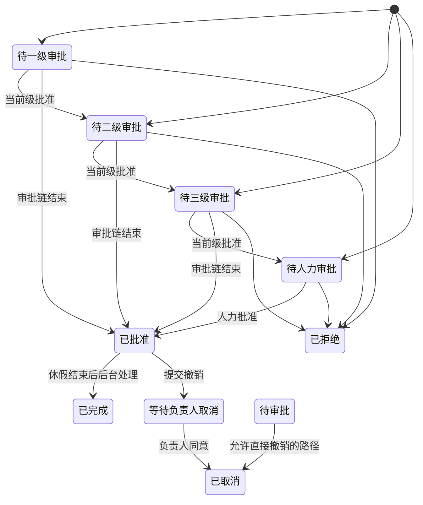

> **第一版验收快照**：`c98089ea66bfece63221`  
> 本报告来自同一份 WCP 工作树静态快照。CodeGraph 只用于导航，正文事实以当前源码复核为准。  
> 本轮一次性准备产品/工程 Overview 与六个代表功能：CodeGraph 冷准备 5.618 秒，暖准备 0.377 秒；完全源码冷准备 3.707 秒。  
> 当前 Git-aware 候选文件 2,007 个；CodeGraph 覆盖 1,639 / 1,726 个可分析源码文件（94.96%）。

## 1. 功能是什么，以及边界在哪里

请假管理让员工提交休假、查看余额和历史、补充证明、撤销申请，并让各级审批人与人力资源按流程处理；系统还维护年度假期额度和部分地区的月度累计。`推断`

**用户能做什么。** 员工可以查看本人请假、选择假期类型和时间、填写原因、上传附件、提交或撤销；审批人可以查看待办、批准或拒绝；管理人员可以查询请假、调整额度、查看变更历史并导出记录。`事实`

**主要使用者。** 普通员工是申请人；L1、L2、L3 负责人和 HR 可能成为审批人；HR 与管理角色维护额度和历史。具体一条申请经过几级审批，由员工、项目、办公室和审批配置共同决定。`事实` + `推断`

**进入位置。** 前端包含申请、本人列表、详情、历史、管理列表、余额管理和导出页面；后端主平台提供申请、审批、撤销、余额、历史和提示入口。早期服务仍保留另一组请假与假期入口。`事实`

**使用前提。** 申请人需要有效身份、办公室/地区和时区信息；系统需要能够计算工作日与节假日，并读取相应年度额度。`事实`

**本报告范围。** 纳入申请、审批、拒绝、撤销、完成、额度消耗与恢复、假期日历、通知和相关后台任务；不把一般行政申请、工时填报或账单本身视为请假功能，但会说明它们读取请假数据的位置。`推断`

## 2. 用户如何使用它

一次典型请假从选择日期和假期类型开始，系统先按员工所在地、时区、周末和节假日计算实际休假时长，再检查证明材料与可用额度，最后建立审批记录。`事实`

**申请。** 员工选择起止时间、假期类型并填写原因；部分类型允许或要求附件。系统把跨日申请拆成明细，计算每个工作日的小时数，并从可使用年份分配额度。`事实`

**提交结果。** 通过校验后，申请进入一级、二级、三级或 HR 待审批状态之一；具体审批链并非每条申请都固定经过四级。申请人可以在本人列表和详情中查看进度。`事实`

**审批。** 当前待办审批人打开详情，查看申请信息和审批提示，批准后申请可能进入下一级，也可能直接进入已批准；拒绝后进入已拒绝。`事实`

**撤销。** 对可撤销的申请，申请人提交原因。部分状态直接取消，部分已批准申请会进入“等待负责人取消”，完成撤销时恢复已消耗的额度并记录审批或变更信息。`事实`

**完成。** 已批准且休假时间结束的记录可以由后台任务标记为已完成。源码证明任务存在，不能证明生产环境每次都按时执行。`事实`

**失败提示。** 日期无有效休假时间、额度不足、假期类型无效、病假证明缺失和部分整日规则不满足时，接口返回明确业务错误；前端通过通知或表单错误展示。`事实`

## 3. 功能执行的业务规则

| 规则 | 适用时机 | 当前行为 | 例外或边界 |
|---|---|---|---|
| 日期必须形成有效休假时段 | 提交申请 | 周末、节假日和时区计算后没有休假小时则拒绝 | 不同地区使用不同节假日日历 |
| 额度必须足够 | 提交受额度控制的类型 | 汇总可用年份额度，不足时拒绝 | 少数类型在忽略表中，不走同一额度判断 |
| 特定假期创建时必须带附件 | 病假、产假、产检假和婚假 | 入口层没有附件即拒绝 | bridge 层还对超过 8 小时的病假再次检查医生证明 |
| 产检假只能是单个完整日 | 产检假 | 起止日期跨日时拒绝 | 同日的具体小时还受计算结果约束 |
| 部分类型固定为整日或 8 小时 | 提交申请 | 不符合固定时长时拒绝 | 适用类型在不同实现分支中声明 |
| 撤销不得造成负的已用额度 | 撤销并恢复额度 | 任一对应 token 低于零时事务报错 | 拉美 PTO 还会应用额度上限 |
| 拉美 PTO 按月累计并设上限 | 指定办公室和雇佣类型 | 全职与特定合同类型采用不同月额度、上限和提醒阈值 | 只适用于配置在拉美办公室集合中的人员 |

**跨年度分配。** 申请可以从不同年份额度中分配，撤销时按明细记录的来源年份恢复。`事实`

**地区与时区。** 假期日历按办公室映射国家，并按员工所在地时区转换起止时间；支持中国、美国、哥伦比亚、波兰、巴西、墨西哥和加拿大等地区常量。`事实`

**旧新实现差异。** 早期服务仍有自己的请假校验和类型接口，当前报告未证明两套实现的每条规则完全一致。`事实`

## 4. 状态与生命周期

请假记录有九个明确状态：等待一级、二级、三级或 HR 审批，已批准、已拒绝、已完成、已取消，以及等待负责人取消。`事实`

**人工流转。** 申请、批准、拒绝和撤销由用户操作触发；审批记录保留审批人、流程、状态和评论。`事实`

**自动流转。** 早期服务有任务检查已结束请假并更新完成状态；主平台还初始化节假日日历与地区额度任务。`事实`

**副作用。** 申请和撤销会改变假期额度或已用量；审批和取消会生成审批记录，并可能发送邮件或其他通知。`事实`

**可逆性。** 拒绝和完成没有观察到一般“恢复为审批中”的入口；撤销会恢复额度，但拉美 PTO 恢复后若超过上限，会把总额度裁剪到上限并写变更日志。`事实`

## 5. 谁能做什么、看到什么

**本人操作。** 员工可以查看本人列表、详情、余额和历史，提交申请，并在允许的状态下撤销。申请时的用户编号来自登录身份，而不是由前端自由指定。`事实`

**审批操作。** 审批待办通过审批记录中的审批人编号匹配当前用户；L1、L2、L3 和 HR 是审批流角色，不等同于系统的四个固定岗位名称。`事实`

**管理操作。** 管理页面提供全局请假列表、额度管理、变更历史和导出。具体哪些系统角色可访问每个管理入口，既受路由中间件影响，也受服务函数中的角色和数据范围判断影响。`事实`

**数据范围。** 员工页面按本人过滤；审批页面按当前审批人过滤；管理查询可按员工、状态、类型和日期等条件筛选。项目负责人或 HR 对他人记录的可见范围需要结合具体入口确认。`事实`

**权限可见性边界。** 路由挂有认证并不证明对象级检查全部正确；没有在路由上看到角色也不证明处理函数没有限制。本功能完整的“角色 × 操作”矩阵没有集中声明。`不可得`

**外部访问。** 没有观察到请假申请面向未登录外部用户的公开入口。邮件中的链接是否经网关或前端再次验证不可得。`事实` + `不可得`

## 6. 数据与字段

请假功能围绕请假主记录、按日明细、审批记录、年度额度和额度变更日志工作。`事实`

| 业务记录 | 主要信息 | 来源和改变者 | 敏感性 |
|---|---|---|---|
| 请假申请 | 人员、类型、起止时间、小时数、原因、状态、撤销原因 | 员工提交；审批和任务改变状态 | 中，包含健康和个人安排信息 |
| 请假明细 | 每日日期、小时、额度来源年份 | 系统计算 | 中 |
| 审批记录 | 审批人、审批流、状态、评论 | 各级审批人和撤销流程 | 中 |
| 假期额度 | 年份、各类型总额和已用量 | 初始化、累计、申请消耗、撤销恢复、HR 调整 | 中，影响员工权益 |
| 额度变更日志 | 调整前后小时、操作人、说明 | 系统任务或管理操作 | 中 |
| 附件 | 病假证明等文件引用 | 员工上传，对象存储保存 | 高，可能包含健康信息 |

**字段来源。** 时区、办公室和地区来自员工资料；工作日和节假日来自缓存的地区日历；额度来源可以跨年份；审批人来自审批链构建。`事实`

**编辑行为。** 已提交申请的更新范围取决于状态和入口。撤销不会简单删除记录，而是改变状态、恢复额度并保留相关日志。`事实`

**共享读取。** 工时和账单代码读取简化请假数据，用于识别某日不可工作时间或计算月度分布；报表和导出也读取同一批记录。`事实`

## 7. 运行时还会触发什么

**额度变化。** 提交申请会占用对应类型和年份的额度；撤销会按明细来源恢复。拉美 PTO 恢复后若超过个人上限，系统减少总额并写入变更日志。`事实`

**审批通知。** 代码包含按申请人、审批人和地区构建通知收件人的逻辑，并有请假相关邮件模板。实际收件人地址和邮件送达情况是运行时数据。`事实` + `不可得`

**后台处理。** 早期服务注册请假邮件检查、请假完结和下一年度假期额度任务；主平台有节假日日历初始化、拉美 PTO 累计/提醒和 PTO 通知相关任务。`事实`

**工时与计费。** 主平台提供“供工时使用的简化请假”查询，账单路径会把请假小时与工作日分布一起读取。因此请假记录可参与工时可用性和月度账单计算，但它是否决定最终金额还取决于费率、项目、账单状态等其他数据。`事实` + `推断`

**导出。** 管理页面和后端提供请假请求、历史或额度导出。导出的文件离开应用权限边界后的存储和访问不可得。`事实` + `不可得`

**异步动作。** 部分通知使用 goroutine 或任务执行，调用结果不一定与主事务同时返回。`事实`

## 8. 出错时会发生什么

| 情形 | 当前代码表现 | 数据状态 |
|---|---|---|
| 日期没有有效工作时间 | 返回“没有休假日”类错误 | 不创建申请 |
| 假期类型无效 | 返回参数错误 | 不创建申请 |
| 额度不足 | 返回明确错误 | 不创建或不继续提交 |
| 病假、产假、产检假或婚假未带附件 | 创建入口返回附件必填错误；病假超过 8 小时还会在 bridge 层再次检查医生证明 | 不创建申请 |
| 撤销恢复后出现负的已用额度 | 事务返回内部数据不一致错误 | 当前事务回滚 `推断` |
| 跨年度额度记录缺失 | 返回内部错误 | 撤销不继续 |
| 通知发送失败 | 依调用点返回错误或只记录日志 | 主申请是否已提交取决于通知位置 |
| 并发审批或撤销 | 依赖数据库事务和状态条件 | 完整冲突行为未从所有路径建立 |

**重复提交。** 代码通过状态、审批记录和申请数据控制流程，但本次没有建立覆盖所有入口的统一幂等键。快速重复请求在每个入口的结果不可得。`不可得`

**部分成功。** 数据库更新与通知并不总在同一事务中；数据提交成功后通知失败是可存在的执行形状。是否有运行时补发机制未建立。`推断`

**删除中的记录。** 主要流程使用状态改变和撤销，而不是硬删除。数据库层软删除或级联约束是否覆盖全部旧模型不可得。`事实` + `不可得`

**网络失败。** 文件上传、邮件或外部日历调用失败时会返回错误或记录日志；SDK、网关和基础设施的重试不可见。`事实`

## 9. 配置、开关与自动任务

**地区配置。** 办公室映射到国家和时区，节假日日历按地区与年份缓存。当前常量包含中国、美国、哥伦比亚、波兰、巴西、墨西哥和加拿大。`事实`

**额度配置。** 拉美办公室集合在代码中声明；全职与特定合同类型分别使用 10 小时/月和 4 小时/月，额度上限分别为 240 和 96，提醒阈值分别为 166 和 80。`事实`

**任务注册。** 主平台可以在启动时开启任务与 cron，并初始化节假日日历；早期服务独立注册请假完结、下一年度额度和通知类任务。任务是否在某个生产进程中启用以及实际执行频率不可得。`事实` + `不可得`

**开关。** 请假功能依赖多项环境配置，例如数据库、邮件、对象存储和任务启动参数；当前 feature scope 没有建立一个能够整体关闭请假功能的单一开关。`验证`

**环境差异。** 节假日、时区、额度累计和上限按地区及雇佣类型不同。客户级自定义请假规则没有从当前代码建立。`事实` + `不可得`

## 10. 当前问题与关联范围

### 新旧服务同时保留请假与假期实现

**事实。** 主平台和早期服务都注册请假、假期、列表、详情或报表入口，并都包含请假、额度和审批相关数据操作；早期服务还执行请假完结与年度额度任务。

**当前允许的结果。** 同一类记录可以从不同代码路径进入，共享规则需要在两处分别保持一致；两个实现当前没有一个统一的规则定义。`推断`

### 地区额度规则正在与旧日志兼容

**事实。** 拉美 PTO 常量保留 Colombia 旧累计日志前缀，用于对已有变更记录去重；撤销超过上限时另写新的裁剪日志。

**当前允许的结果。** 当前逻辑同时识别新旧日志命名，说明历史记录格式仍参与累计判断。`推断`

### 调试输出存在于申请额度分配路径

**事实。** 当前申请校验代码在额度分配后直接打印三个内部 map。

**当前允许的结果。** 运行该路径时，额度分配的内部结构可能进入进程标准输出；日志采集和可见范围不可得。`推断`

**关联范围。** 请假变化连接员工资料、办公室和时区、假期额度、审批记录、附件、通知、工时可用性、账单计算、导出和计划任务。`事实`

**拉美 PTO 提醒阈值的测试与生产常量不一致。** `事实` 生产常量把全职提醒阈值定义为 166 小时，而 `internal/tasks/latam_pto/alert_test.go` 按 200 小时断言。当前环境因 Go toolchain 需要联网下载而无法执行该测试包，因此只能确认源码矛盾，不能确认 CI 中的实际结果。

## 11. 术语表

| 源码名称 | 业务名称 | 本报告中的含义 |
|---|---|---|
| PTO | 带薪休假 | 从年度或月度累计额度中消耗的带薪假期 |
| BTO | 调休 | 以调休额度申请的休假 |
| UTO | 无薪休假 | 不使用带薪额度的休假类型 |
| Special Leave | 特殊假 | 单独记录额度的特殊休假 |
| Sick Leave | 病假 | 创建时要求附件，超过 8 小时时 bridge 层还要求医生证明的休假 |
| Maternity / Paternity | 产假 / 陪产假 | 生育相关休假类型 |
| Marriage / Funeral | 婚假 / 丧假 | 婚姻和丧亲相关休假 |
| Prenatal Leave | 产检假 | 代码要求为单个完整日的类型 |
| Holiday Hour | 假期额度 | 员工在某年度各类假期的总额与已用量 |
| Leave Detail | 请假明细 | 申请拆分到具体日期和额度来源的记录 |
| L1 / L2 / L3 / HR | 审批层级 | 当前申请链中的一级、二级、三级和人力审批 |
| Lead Cancel | 负责人撤销审批 | 已批准申请撤销时可能进入的单独流程 |
| In Progress | 审批中 | 汇总显示多个待审批状态的业务状态 |

## 12. 覆盖范围与不可回答的问题

**功能范围。** 请假 scope 包含 180 个 CodeGraph 候选节点、273 条相关边、79 个文件和 150 条 unresolved references。因为图关系不能完整表达审批语义，本功能启用了源码回退。`事实`

**读取内容。** 范围覆盖前端申请、列表、详情、历史、额度与导出页面；主平台 leave、holiday、leaveHistory、support 和部分 management；早期 leave、holiday、report 与计划任务。`事实`

**重点源码确认。** 本报告额外确认了假期类型和九个状态、审批流、病假附件、额度不足、跨年度分配、撤销事务、负额度保护和拉美 PTO 累计上限。相同窗口被产品版与技术版共享。`事实`

**测试线索。** 当前 scope 中没有观察到覆盖完整申请—审批—撤销旅程的专门自动化测试集合；存在的测试文件不能证明该流程已被执行或通过。`不可得`

**仍不可回答。** 生产中实际启用哪套请假入口、每类员工的真实额度、审批链配置、任务是否按时运行、邮件是否送达、历史数据是否满足新上限、并发提交结果和线上使用量都需要运行时或数据证据。`不可得`

**静态结论边界。** 报告确认代码当前允许和拒绝的路径，但不把“未找到某项校验”写成线上没有该规则；数据库约束、网关、依赖和工作区外服务仍不可见。`事实`

### 本轮源码核对路径

- `wcp-service-v2/internal/handlers/handlers.go`
- `wcp-service-v2/internal/constant/leave.go`
- `wcp-service-v2/internal/handlers/leave/router.go`
- `wcp-service-v2/internal/handlers/leave/service.go`
- `wcp-service-v2/internal/handlers/leave/brdg_abst.go`
- `wcp-service-v2/internal/handlers/leave/brdg_impl.go`
- `wcp-service-v2/internal/handlers/leaveHistory/service.go`
- `wcp-service-v2/internal/tasks/latam_pto/accrual.go`
- `wcp-service/common/scheduleService.js`
- `wcp-ui/src/pages/leave`
