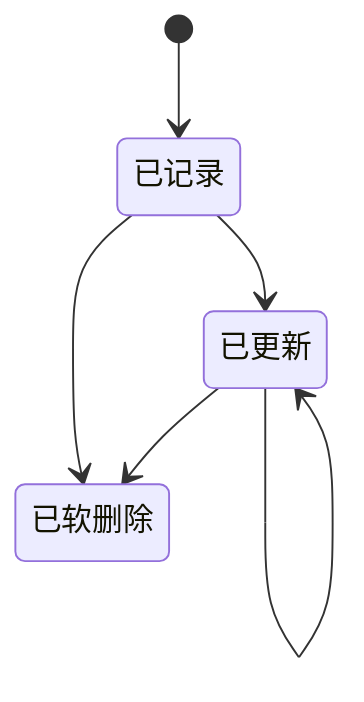
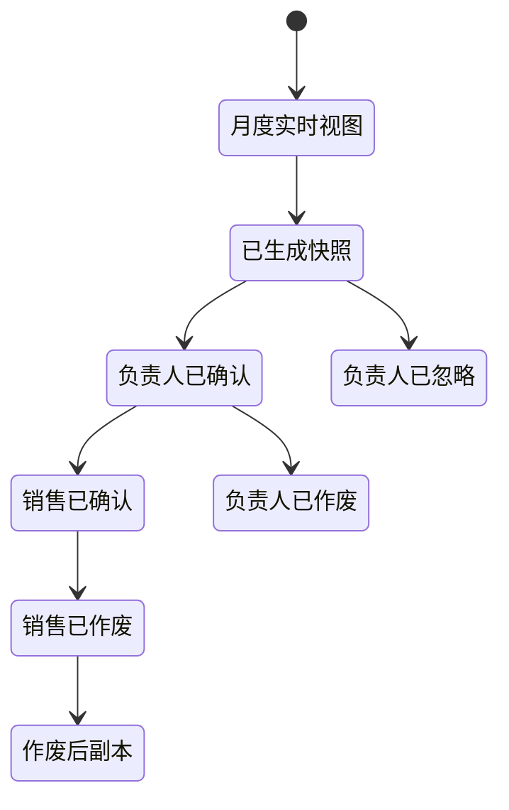

> **第一版验收快照**：`c98089ea66bfece63221`  
> 本报告来自同一份 WCP 工作树静态快照。CodeGraph 只用于导航，正文事实以当前源码复核为准。  
> 本轮一次性准备产品/工程 Overview 与六个代表功能：CodeGraph 冷准备 5.618 秒，暖准备 0.377 秒；完全源码冷准备 3.707 秒。  
> 当前 Git-aware 候选文件 2,007 个；CodeGraph 覆盖 1,639 / 1,726 个可分析源码文件（94.96%）。

## 1. 功能是什么，以及边界在哪里

工时管理让员工按日期和项目记录投入时间，并把这些记录用于个人回顾、团队审阅、月度确认、导出和客户计费。`推断`

**用户能做什么。** 员工可以按一天或连续多天填报工时，关联 Jira 任务或填写文字说明，查看本人记录，修改或删除自己的记录，并查看某段时间是否已经填报。项目负责人和管理人员可以查看团队工时；项目负责人或被指定的工时审阅人可以进行月度确认。`事实`

**主要使用者。** 普通员工负责记录本人时间；项目负责人、项目管理角色和管理员查看团队情况；被配置为工时审阅人的员工可以参与确认；销售和开票流程在后续账单阶段读取已经确认的小时数。`事实` + `推断`

**进入位置。** 前端提供个人工时日历、周/月视图、项目团队工时、月度确认、导出和日报页面。写入与个人查询主要走早期工时服务；导出、月度汇总、提醒和账单确认由主平台服务承担。`事实`

**使用前提。** 用户需要登录，并且在填报项目中具有成员关系；项目、日期、时长和说明需要通过界面或接口校验。`事实`

**本报告范围。** 纳入个人填报、修改、删除、团队查看、缺失提醒、月度确认、工时快照、导出以及工时进入账单的交接；不把 Jira 本身、项目成员维护和完整账单流程视为工时功能，但会说明它们与工时的连接。`推断`

## 2. 用户如何使用它

**填写。** 员工选择项目和日期，输入工时。界面允许单日或日期区间；项目启用 Jira 集成时可以选择任务，也可以填写手工说明。新版单条提交要求 Jira 条目或手工说明至少存在一项。`事实`

**查看。** 员工可以按时间段查看本人工时，也可以查询某个项目和日期是否已有记录。项目负责人和管理人员有团队视图，能够按项目和时间范围查看成员记录。`事实`

**修改与删除。** 员工可以修改自己的记录，也可以删除单条或按项目与日期区间批量删除。单条修改和删除会先核对记录是否存在以及是否属于当前用户；批量删除会核对当前用户是否仍是项目成员。删除采用软删除。`事实`

**团队确认。** 月度团队视图会把项目成员、工时、请假、其他项目投入、职位和节假日合并成一份月度分布，并生成带标识的快照。负责人提交确认时，系统再次检查权限、成员信息和项目计费类型。`事实`

**完成后的结果。** 确认流程把工时小时数、请假小时数、费率和日志内容写入账单确认记录；后续账单使用这些确认数据，而不是只依赖实时工时表。`事实`

**这意味着什么。** 对员工而言，这是一条“记录时间”的短流程；对管理和计费而言，它是一条按月冻结项目投入信息的长流程。个人记录与月度确认之间不是同一张状态表，而是通过快照和确认记录衔接。

## 3. 功能执行的业务规则

| 规则 | 适用时机 | 当前行为 | 边界 |
|---|---|---|---|
| 必须是项目成员 | 创建工时或按区间删除 | 非成员被拒绝 | 单条修改/删除主要按记录所有者判断 |
| 日期格式固定 | 创建、查询、修改 | 接口要求十位日期字符串 | 界面另行检查结束日期不得早于开始日期 |
| 工时必须为数值 | 创建和修改 | 后端接受浮点数 | 后端入口未声明 0.5 步进或 24 小时上限 |
| 界面按半小时填报 | 前端提交 | 最小 0.5、步进 0.5、最大 24 | 这是界面规则，不是两个写入接口的共同规则 |
| 必须有工作说明 | 新版单条提交 | Jira 条目和手工说明均为空时拒绝 | 条件对说明数组长度还有一个 60,000 的判断 |
| 只能改删本人记录 | 单条修改或删除 | 非所有者被拒绝 | 团队查看和月度确认使用另一套权限 |
| 项目月度确认需要完整成员信息 | 确认工时 | 有成员缺少类型或职位时拒绝 | 非计费和固定价项目不能走该确认路径 |
| 同项目同月份不能重复确认 | 月度确认 | 已存在有效确认状态时拒绝 | 忽略、负责人确认、销售确认和作废后副本均计入检查 |

**工作说明。** 记录可以包含普通文本，也可以拆成 Jira 条目和手工说明明细。主平台在账单视图中会把这些明细重新拼成可读内容。`事实`

**节假日和请假。** 月度分布会同时读取节假日、请假和其他项目工时，并把请假小时按项目投入比例分配到当前项目。`事实`

**这意味着什么。** 当前规则分布在界面、早期写入服务和主平台确认流程三个位置。它们共同决定最终账单中的小时数，但并非所有限制都在每个入口重复执行。

## 4. 状态与生命周期

单条工时没有“草稿、已提交、已批准”这样的业务状态。它的主要生命周期是创建、更新和软删除；说明明细另有状态和删除标记。`事实`

**月度确认生命周期。** 工时进入管理流程后，会先生成月度快照，再由项目负责人或工时审阅人确认。确认结果进入账单状态，之后还可能由销售确认、作废或形成作废后副本。`事实`

**快照与实时记录。** 月度快照保存生成时的成员分布、工时、请假和说明；确认阶段读取该快照并写入确认明细。因此快照形成后的实时工时变化与已经生成的快照是两份不同数据。`事实`

**这意味着什么。** “员工是否填了工时”和“该月工时是否被确认进账单”是两个层级。前者由工时记录表达，后者由快照、账单和确认日志表达。

## 5. 谁能做什么、看到什么

| 使用者 | 已确认的能力 | 当前限制 |
|---|---|---|
| 普通员工 | 创建、查看、修改和删除本人工时 | 创建需是项目成员；单条修改和删除需是记录所有者 |
| 管理员 | 查看跨项目工时 | 入口按管理员角色判断 |
| 项目管理角色 | 查看自己负责项目的团队工时 | 只查询其负责的项目集合 |
| 项目负责人 | 查看指定项目工时、进行月度确认 | 项目编号必须对应其负责项目 |
| 工时审阅人 | 进行指定项目的月度确认 | 必须存在项目与审阅人的配置关系 |
| 销售和开票相关角色 | 在后续账单阶段查看或处理确认后的数据 | 不等同于能修改员工原始工时 |

**本人数据范围。** 单条更新和删除先读取原记录，再比较当前用户编号；不属于本人时返回禁止访问。`事实`

**团队数据范围。** 早期服务的全量查询只允许管理员或项目管理角色；指定项目查询允许管理员或该项目负责人。主平台的确认权限允许项目负责人或指定的工时审阅人。`事实`

**开放接口。** 项目中还存在面向外部助手的工时令牌和接口。它们使用独立令牌体系；本次没有把所有令牌可访问字段逐项还原。`事实` + `不可得`

**这意味着什么。** 工时权限不是一个集中矩阵：本人写权限、团队查看权限、月度确认权限和外部令牌权限分别实现在不同位置。一个角色在团队视图中可见，不自动代表它可以更改原始记录。

## 6. 数据与字段

| 数据 | 业务含义 | 主要来源 | 后续使用 |
|---|---|---|---|
| 项目 | 时间归属的交付单元 | 员工选择，项目成员关系校验 | 团队查看、账单和项目汇总 |
| 员工 | 工时记录的填报人 | 登录身份 | 本人查询、团队汇总和提醒 |
| 日期 | 工作发生日期 | 员工选择 | 周/月视图、节假日和确认周期 |
| 小时数 | 当天对项目的投入 | 员工输入 | 月度分布、账单确认和报表 |
| 工作说明 | 工作内容的文字描述 | 手工输入或 Jira 条目 | 日报、团队查看和确认快照 |
| 明细类型 | 手工说明或 Jira 任务 | 提交内容 | 重新拼装可读日志 |
| 删除标记 | 记录是否被软删除 | 删除操作 | 常规查询排除已删除记录 `推断` |
| 月度快照 | 某项目某月的成员、工时、请假和分布 | 团队月度视图 | 负责人确认 |
| 确认明细 | 确认时的工时、请假、费率、成本和日志 | 月度确认事务 | 后续账单与追溯 |

**存储结构。** 早期服务和主平台都声明了同一工时表及工时明细表。早期模型把小时数声明为整数，主平台模型把它声明为浮点数；界面允许半小时。`事实`

**共享范围。** 早期服务负责写入和个人查询，主平台读取工时用于团队表格、导出、缺失提醒和账单确认。绩效服务也存在读取工时的代码路径。`事实`

**这意味着什么。** 工时并非只属于个人日历。相同记录会进入项目管理、提醒、报表、绩效相关读取和客户计费，因此字段含义和数值精度跨越多个服务。

## 7. 运行时还会触发什么

**项目消息更新。** 创建、修改和删除工时后，早期服务会调用带检查的 Slack 更新逻辑，使项目工作记录的消息能够随数据变化刷新。`事实`

**缺失工时提醒。** 主平台能够向缺少工时的员工发送邮件，也能向其项目负责人发送包含团队缺失日期的邮件。早期服务还注册了按时区检查的周工时提醒。`事实`

**确认提醒。** 主平台按负责人所在时区检查尚未确认的项目月份，并通过 Slack 提醒项目负责人或工时审阅人进入团队页面确认。`事实`

**报表与导出。** 前端可以请求主平台导出工时表，也可以读取日报和项目动态；导出的结果以文件地址返回。`事实`

**账单交接。** 月度确认会生成账单和确认明细，记录工时、请假、费率、成本与说明，随后进入销售确认和发票流程。`事实`

**这意味着什么。** 一条工时记录的直接保存很短，但它会参与消息、提醒、报表、团队确认和账单。通知失败并不等同于工时保存失败，二者在多处是分开的执行步骤。

## 8. 出错时会发生什么

| 情形 | 当前代码表现 | 数据状态 |
|---|---|---|
| 未登录或令牌无效 | 认证中间件拒绝 | 不进入业务处理 |
| 不是项目成员 | 创建或区间删除被拒绝 | 不写入或不删除 |
| 记录不存在 | 单条修改或删除返回未找到 | 原数据不变 |
| 修改或删除他人记录 | 返回禁止访问 | 原数据不变 |
| 日期或字段格式错误 | 参数校验失败 | 不进入写入服务 |
| Jira 与手工说明都为空 | 新版单条提交返回内容错误 | 不创建或更新 |
| 新版 JSON 结构不符合 schema | 返回参数错误，并在服务端打印校验错误 | 不创建或更新 |
| 快照过期 | 月度确认要求刷新 | 不创建确认结果 |
| 成员资料不完整 | 月度确认被拒绝 | 不创建确认结果 |
| 同月已确认 | 月度确认被拒绝 | 保留现有确认结果 |
| Slack 或邮件失败 | 调用点返回错误或记录日志 | 工时或确认数据是否已完成取决于失败发生的位置 |

**并发确认。** 主平台在数据库事务内锁定项目记录，并再次检查同项目同月份是否已有有效确认，避免两个确认同时成功。`事实`

**并发填报。** 个人工时写入路径没有发现统一的幂等键；是否由数据库唯一约束防止相同项目、日期和员工的重复记录，本次未建立。`不可得`

**恢复行为。** 工时删除是软删除；月度确认失败时事务返回错误。通知失败后的自动重试是否由 SDK 或基础设施提供不可得。`事实` + `不可得`

**这意味着什么。** 月度确认的并发和一致性保护比个人填报路径更明确。个人记录主要依赖参数、成员和所有者校验，账单交接则增加快照、事务、行锁和重复确认检查。

## 9. 配置、开关与自动任务

**项目消息时间。** 早期服务读取工作日志 Slack 发送时间，并根据项目或用户时区决定立即更新或留给计划任务处理。当前单条接口中保留了一段未被调用的旧发送函数。`事实`

**按时区更新。** 早期服务从数据库读取工作日志定时配置和时区，为每个时区注册项目日志更新任务。`事实`

**周提醒开关。** 周工时提醒由 `IS_CLOSE_WEEK_WORKLOG_REMINDER` 控制；代码直接把环境变量字符串当布尔值使用。只要该变量是非空字符串，包括文本形式的“false”，条件都会被当作已关闭。`事实` + `推断`

**周提醒时间。** 任务在周四和周五每小时检查一次，只在各时区的周五 17:00 发送提醒。`事实`

**主平台提醒。** 主平台的负责人确认任务在非调试模式注册，每小时运行检查，并在负责人当地时间 10:00、非节假日时发送提醒。缺失工时邮件还有独立任务和模板。`事实`

**运行配置。** Slack Token、Web 域名、邮件、数据库、时区和任务启用状态都来自运行配置；本次源码快照不能说明生产环境中的实际值。`不可得`

**这意味着什么。** 工时提醒横跨两套任务系统：早期服务使用 Node 调度和数据库 cron 配置，主平台使用 Go 任务类型和运行配置。实际会收到哪一类提醒取决于部署和配置状态。

## 10. 当前问题与关联范围

**界面与接口的时长规则不同。** `事实` 界面要求工时是 0.5 的倍数，范围为 0.5 至 24；早期和新版写入接口只校验为浮点数。`推断` 直接调用接口时，可以提交界面不会产生的数值。

**同一字段在两个服务中的类型不同。** `事实` 早期 Sequelize 模型把工时小时数声明为整数，主平台 GORM 模型声明为浮点数，而界面允许半小时。`推断` 三层对小数工时的表达并不一致。

**说明长度判断作用于数组数量。** `事实` 新版单条接口把 `description_section.length > 60000` 作为内容长度错误条件；该值是说明条目的数量，而不是某条文字的字符数。`推断` 一条很长的说明不会因这项判断被拒绝，而超过 60,000 条说明才会命中。

**周提醒开关采用字符串真值。** `事实` 代码直接判断环境变量。`推断` 非空的“false”文本仍会关闭周提醒。

**新旧职责交错。** `事实` 个人写入、本人查询和部分项目查询位于早期服务；导出、缺失提醒、团队月度快照和账单确认位于主平台。前端通过两个 API 基址访问这两组能力。`推断` 工时功能的现状不是一个服务内的完整模块。

**实时工时与已生成快照可分离。** `事实` 月度视图先保存快照，确认时读取快照；被审阅的个人写入路由没有读取账单状态。`推断` 快照形成后再修改实时工时，不会自动改变已经保存的那份快照。

**未使用代码标记。** `事实` 新版工时路由顶部的 Slack 函数被注释标为未使用，文件内另有旧同步代码注释和当前 cron 说明并存。

**关联范围。** 工时改动连接个人日历、项目成员、Jira 说明、Slack、邮件提醒、团队月度确认、请假分摊、工时导出、绩效相关读取以及账单确认。`事实`

## 11. 术语表

| 代码或界面名称 | 业务名称 | 本报告中的含义 |
|---|---|---|
| Worklog | 工时记录 | 某位员工在某天对某个项目投入的小时数和工作说明 |
| Timesheet | 工时表 | 按周、月、项目或成员汇总后的工时视图 |
| Jira section | Jira 工作项说明 | 与任务编号、标题和状态关联的工作内容 |
| Description section | 手工说明 | 不关联 Jira 任务的文字工作内容 |
| Project member | 项目成员 | 被允许为该项目填报工时的员工关系 |
| Project leader | 项目负责人 | 可查看项目团队工时并参与月度确认的人 |
| Timesheet reviewer | 工时审阅人 | 被单独配置为可确认某项目月度工时的人 |
| Remaining hours | 剩余工时 | 当前时间范围内仍待填报的小时提示 |
| Billing snapshot | 账单快照 | 月度确认前保存的成员、工时、请假和说明副本 |
| Confirmed log | 已确认工时明细 | 进入账单流程的小时、请假、费率、成本与说明记录 |
| Soft delete | 软删除 | 保留数据库记录，但将其标记为已删除 |
| Unfilled log | 未填工时 | 系统按日历和工作安排判断仍缺少记录的日期 |

**这意味着什么。** “工时记录”是员工输入，“工时表”是聚合视图，“已确认工时”是进入计费流程的快照结果。三者相关，但不能视为同一份可随时同步变化的数据。

## 12. 覆盖范围与不可回答的问题

**本次读取。** CodeGraph 为工时主题定位了 180 个候选节点、282 条关系和 103 个边界文件；另有 150 条未解析引用。报告随后直接读取了早期工时路由、新版单条路由、前端 API 与表单、两套工时模型、主平台确认权限、月度快照、邮件与 Slack 任务。`事实`

**源码覆盖。** 整个 WCP 工作区的 CodeGraph 源码覆盖为 94.96%（1,639/1,726）；未索引或语义不足的位置通过受预算限制的源码窗口补充。`事实`

**能够确认的范围。** 个人创建、查询、修改、删除，团队查看，月度快照，确认权限，缺失提醒，导出入口和工时进入账单的主要路径均有源码证据。`事实`

**未完整建立的范围。** `不可得`

- 生产环境中前端各 API 基址最终指向的部署地址。
- 数据库是否有防止同人、同项目、同日期重复记录的唯一约束。
- 所有 Jira 状态同步和日报生成分支。
- 生产环境中任务、提醒开关和 cron 配置的实际值。
- Slack、邮件 SDK 或基础设施层是否提供重试。
- 真实用户是否仍使用旧接口、外部助手接口和日报接口。
- 已确认月份发生后续工时修改时，业务上实际采用的人工对账流程。

**测试覆盖。** 本次在早期工时服务和前端仓库中未找到与工时写入路径直接对应的测试文件；这只说明当前快照中未找到，不证明不存在仓库外测试。`验证`

**这意味着什么。** 报告能描述源码中的当前数据路径和规则差异，但不能把注册的任务当作正在运行，也不能把未找到的数据库约束或外部调用方写成不存在。

### 本轮源码核对路径

- `wcp-service/routes/worklogs.js`
- `wcp-service/routes/v2/worklog.js`
- `wcp-service/services/worklogServices.js`
- `wcp-service/models/worklog.js`
- `wcp-service-v2/internal/model/worklog.go`
- `wcp-service-v2/internal/handlers/management/billing.go`
- `wcp-service-v2/internal/handlers/management/permission.go`
- `wcp-ui/src/pages/worklog`
- `wcp-ui/src/pages/worklog/components/LogTimeForm.tsx`
- `wcp-service/common/scheduleService.js`
