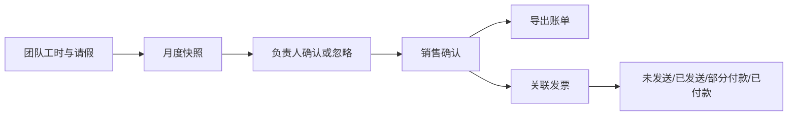
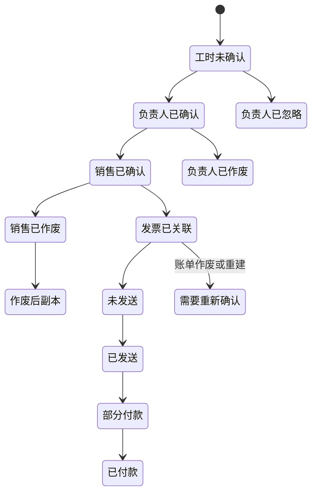

> **第一版验收快照**：`c98089ea66bfece63221`  
> 本报告来自同一份 WCP 工作树静态快照。CodeGraph 只用于导航，正文事实以当前源码复核为准。  
> 本轮一次性准备产品/工程 Overview 与六个代表功能：CodeGraph 冷准备 5.618 秒，暖准备 0.377 秒；完全源码冷准备 3.707 秒。  
> 当前 Git-aware 候选文件 2,007 个；CodeGraph 覆盖 1,639 / 1,726 个可分析源码文件（94.96%）。

## 1. 功能是什么，以及边界在哪里

账单与发票模块把项目成员的已确认工时、请假、费率、其他费用、折扣和收款方式汇总为月度客户账单，并继续管理发票关联、发送和回款状态。它既包含项目负责人确认工时的上游交接，也包含销售确认、人工账单、导出、作废、发票关联和经营分析。`事实`

**主要使用者。** 项目负责人或工时审阅人确认团队工时；销售和费率角色维护费率并确认账单；发票管理角色处理发票、付款方式和手工账单；HR、销售、费率和发票相关角色可以在不同范围内查看账单。`事实`

**产品边界。** 本报告纳入月度账单列表与详情、负责人确认、销售确认、费率、折扣、现金/股权拆分、人工账单、导出、作废、发票关联、付款状态和分析看板。不把员工填报工时、请假审批或外部 Bill.com 产品本身作为账单模块内部实现，但会说明它们的交接。`事实`

**主要入口。** 前端包含账单列表、项目详情、确认、导出、发票和分析页面；主平台 `/v2/billing` group 注册约三十个账单相关入口。`事实`

## 2. 用户如何使用它

### 月度项目账单

1. 项目负责人或工时审阅人打开团队月度工时视图。
2. 系统读取项目成员、工时、请假、费率和成员类型，并保存一份 `BillingSnapshot`。
3. 负责人确认或忽略当月工时。
4. 销售人员打开待确认账单，检查员工工时、费率、其他费用、折扣和现金/股权比例。
5. 销售确认后，账单进入可导出或关联发票的状态。
6. 发票管理人员可以关联或解除外部发票，设置付款方式并跟踪部分付款或已付款状态。`事实`

### 人工账单

费率、销售或发票管理角色可以为 EOR、Presale 或通用固定价项目创建人工账单。系统为项目生成连续编号，记录标题、金额、现金和股权组成及其他明细，并直接置为销售已确认状态。`事实`

### 作废与重新确认

负责人或销售可以在相应状态下作废账单。作废后可能生成需要重新确认的副本；发票状态也有 `NeedReConfirm`。`事实`

## 3. 功能执行的业务规则

| 规则 | 适用时机 | 当前行为 |
|---|---|---|
| 项目负责人确认权限 | 工时确认 | 项目负责人或项目工时审阅人可以确认 |
| 销售账单权限 | 费率、销售确认 | RateAdmin 或 Sales |
| 账单查看权限 | 列表和详情 | HR、RateAdmin、Sales、InvoiceManager 等组合 |
| 其他费用范围 | 销售确认 | 0 至 999,999.99 |
| 评论长度 | 销售确认 | 最多 500 字符 |
| 员工明细 | 销售确认 | 至少一名员工，且成员费率和小时数据需要满足账单类型要求 |
| 账单金额 | 销售确认或人工账单 | 最终金额必须大于零 |
| 折扣 | 销售确认 | 百分比或固定金额；固定金额不能超过月度成本 |
| 手工账单项目类型 | 人工创建 | EOR、Presale 或通用固定价项目 |
| 发票关联 | 关联外部发票 | 外部发票必须存在，不能重复关联；纯股权账单不可关联普通发票 |
| 解除发票 | 发票操作 | 仅 InvoiceManager；数据库事务清除关联和发票记录 |
| 付款方式 | 发票 | Cash、Cash + USDC、Cash + Equity 三类 |

**快照规则。** 账单确认读取的是先前保存的快照，而不是每一步都重新从实时工时表计算。`事实`

**重复确认。** 同项目同月份已有负责人忽略、负责人确认、销售确认或作废副本时，系统会在确认路径中判定已有占用状态。`事实`

## 4. 状态与生命周期

账单状态包括：负责人已确认、销售已确认、负责人已作废、销售已作废、负责人已忽略、HR 已作废和作废后副本。发票状态包括工时未确认、未确认、已确认、未发送、已发送、部分付款、已付款、已作废和需要重新确认。`事实`

账单操作另有负责人确认、负责人作废、负责人忽略、销售确认、销售作废、HR 导出、关联发票、解除发票和人工创建等操作类型，用于留痕。`事实`

## 5. 谁能做什么、看到什么

| 角色或关系 | 主要能力 | 数据范围 |
|---|---|---|
| 项目负责人 | 查看团队工时、负责人确认、忽略 | 自己负责的项目 |
| 项目工时审阅人 | 与负责人类似的确认能力 | 被配置的项目 |
| RateAdmin | 费率、销售确认、查看、作废、人工账单 | 账单管理范围 |
| Sales | 费率、销售确认、查看、作废、人工账单 | 销售相关项目与账单 |
| InvoiceManager | 查看、人工账单、发票关联/解除、付款方式 | 发票管理范围 |
| HR | 查看和部分作废/导出能力 | 由处理函数和角色判断决定 |
| OfficeManagement/Admin/SysAdmin | 客户承担费用的完整访问 | 其他用户通常限于其管理项目 |

权限并非集中在一张矩阵中：路由统一要求登录，具体角色和对象范围由 management permission helper 与各处理函数共同决定。`事实`

## 6. 数据与字段

| 记录 | 主要字段 | 用途 |
|---|---|---|
| BillingSnapshot | UUID、项目、月份、序列化数据 | 冻结负责人确认前的团队月度分布 |
| Billing | 项目、月份、状态、账单类型、标题、折扣、人工编号 | 月度账单主体 |
| BillingConfirmedEmployee | 员工类型、工时、请假、费率、职位、职级 | 确认时的员工级账单数据 |
| BillingConfirmedLog | 每日工时、请假、成本和说明 | 账单追溯与明细 |
| ProjectEmployeeRate | 员工项目费率及生效信息 | 账单金额计算 |
| BillingInvoice | 发票编号、客户、金额、日期、到期日、状态、付款方式、已付金额 | 外部发票和回款跟踪 |
| Other Expense / EOR Detail | 账单附加费用或 EOR 明细 | 销售确认和人工账单 |
| Operate Log | 操作类型、操作者和账单 | 确认、作废、发票关联等留痕 |

工时、请假、员工、项目成员、职位和费率是账单的上游数据；发票和回款状态是其下游结果。`事实`

## 7. 运行时还会触发什么

- 负责人和工时审阅人收到月度确认 Slack 提醒。`事实`
- 账单可以生成 Excel 或其他导出文件，并返回文件地址。`事实`
- 关联发票会验证外部 Bill.com 发票信息。`事实`
- 解除发票在数据库事务后异步发送通知邮件。`事实`
- 费率变更可选择同步到后续月份。`事实`
- 账单数据进入 dashboard、analytics 和 EOR analytics。`事实`
- 账单可包含现金、USDC 或股权组成。`事实`

## 8. 出错时会发生什么

| 情形 | 当前表现 | 数据结果 |
|---|---|---|
| 没有确认权限 | 返回禁止访问 | 不改变账单 |
| 快照不存在或过期 | 要求刷新月度数据 | 不创建确认结果 |
| 项目计费类型改变 | 拒绝使用旧快照 | 不创建确认结果 |
| 员工信息、费率或类型缺失 | 销售确认失败 | 事务返回 |
| 金额、评论或折扣越界 | 参数或业务错误 | 不确认账单 |
| 同月已经确认 | 重复确认被拒绝 | 保留已有状态 |
| 外部发票不存在或已被占用 | 关联失败 | 账单不关联发票 |
| 解除发票邮件失败 | 数据库关联已清除后，异步通知结果可能失败 | 数据与通知可能部分成功 |
| 并发确认 | 事务内对项目或账单记录加锁并重查状态 | 只有满足状态的一次事务继续 |

## 9. 配置、开关与自动任务

账单行为依赖数据库、Web 域名、Slack、邮件、对象存储、Bill.com、汇率和项目计费配置。源码能看到配置键和代码分支，不能看到生产值。`不可得`

负责人确认提醒按负责人时区运行，并跳过节假日。工时缺失邮件和账单相关通知使用独立任务或异步调用。`事实`

没有观察到一个整体关闭账单功能的单一开关；实际可用性由路由、角色、项目计费类型、账单状态和外部配置共同决定。`验证`

## 10. 当前风险与问题

1. **实时工时与确认快照可以分离。** 账单确认使用保存的 `BillingSnapshot`，个人工时写入路径不读取账单状态；快照之后的工时变化不会自动改变既有快照。`事实`
2. **账单状态和发票状态是两套生命周期。** 作废、重新确认、发票发送和付款状态之间存在多种组合，代码通过多个分支维护一致性。`事实`
3. **人工账单绕过负责人确认旅程。** 对允许的项目类型，人工账单直接创建为销售已确认状态，并使用独立编号和明细规则。`事实`
4. **外部通知与数据库事务并不总是同一结果。** 解除发票等操作在事务提交后异步发送邮件，数据成功而通知失败是当前可存在的状态。`事实`
5. **账单实现集中度高。** 核心 `billing.go` 同时处理快照、确认、费率、折扣、导出、发票、人工账单和分析，当前问题定位需要在大量状态分支中追踪。`事实`
6. **共享数据由多模块写入。** 工时、请假、费率、项目成员和账单分别由不同入口改变，最终月度金额依赖这些记录在快照时的组合。`事实`
7. **完整账单自动化测试证据不足。** 当前快照未建立覆盖负责人确认—销售确认—发票—回款—作废的完整测试旅程。`验证`

本章只描述当前代码状态。

## 11. 术语表

| 术语 | 含义 |
|---|---|
| Billing Snapshot | 负责人确认前保存的项目月度团队数据副本 |
| Leader Confirm | 项目负责人或工时审阅人的月度确认 |
| Sales Confirm | 销售对费率、费用、折扣和组成的最终确认 |
| Manual Billing | 不经过普通工时确认旅程创建的人工账单 |
| Other Expense | 账单中的其他附加费用 |
| Cash / Equity | 账单的现金和股权组成 |
| Invoice Link | 将 WCP 账单与外部发票记录关联 |
| Need ReConfirm | 作废或变化后需要重新确认的发票状态 |

## 12. 覆盖范围与不可回答的问题

本轮账单 feature Context 包含 500 个候选节点、1,388 条相关边和 284 个边界文件；范围较宽，因此所有保留结论都通过 `wcp-service-v2/internal/handlers/management`、`internal/model/billing.go` 和当前路由注册再次确认。`事实`

无法由静态源码确定：生产项目的真实费率和金额、当前账单数量、Bill.com 实际状态、通知送达率、汇率数据质量、并发冲突发生率、人工账单使用频率和线上响应时间。`不可得`

### 主要源码核对路径

- `wcp-service-v2/internal/handlers/handlers.go:227-260`
- `wcp-service-v2/internal/model/billing.go:10-180`
- `wcp-service-v2/internal/handlers/management/permission.go:45-125`
- `wcp-service-v2/internal/handlers/management/billing.go:1428-1640`
- `wcp-service-v2/internal/handlers/management/billing.go:3000-3185`
