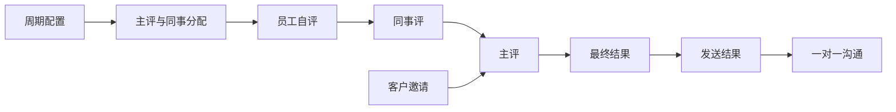
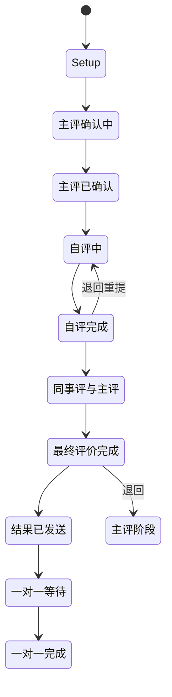

> **第一版验收快照**：`c98089ea66bfece63221`  
> 本报告来自同一份 WCP 工作树静态快照。CodeGraph 只用于导航，正文事实以当前源码复核为准。  
> 本轮一次性准备产品/工程 Overview 与六个代表功能：CodeGraph 冷准备 5.618 秒，暖准备 0.377 秒；完全源码冷准备 3.707 秒。  
> 当前 Git-aware 候选文件 2,007 个；CodeGraph 覆盖 1,639 / 1,726 个可分析源码文件（94.96%）。

## 1. 功能是什么，以及边界在哪里

绩效评价模块组织周期性的员工评价：建立评价周期、分配主评人与同事评审、员工自评、主评人综合评价、客户评价邀请、结果发送和一对一沟通。它运行在独立的绩效服务与前端页面中，并与员工、项目、客户和通知能力连接。`事实`

**主要使用者。** 被评价员工完成自评并查看结果；主评人确认范围、完成主评和一对一沟通；同事提供 peer review；绩效管理员配置周期、人员和通知；客户可通过临时邀请链接完成客户评价。`事实`

**范围。** 纳入绩效周期、评价记录、评审分配、自评、同事评、主评、客户评价、结果发送、退回重提、通知和导出。不把晋升流程作为绩效模块内部步骤，但会说明两者共享人员和评价数据。`事实`

## 2. 用户如何使用它

1. 绩效管理员建立或启用一个评价周期，配置时间和参与人员。
2. 主评人确认被评价人的评审分配，同事评审人被加入评价记录。
3. 员工在自评阶段填写评价内容。
4. 同事在 peer review 阶段提交反馈。
5. 主评人读取自评、同事评和客户反馈，完成主评。
6. 管理员或主评人生成、发送最终结果，并安排一对一沟通。
7. 被邀请客户可以通过临时 key 在公开入口查看评价项并提交客户评价。`事实`

记录可以被退回，员工或评审人重新提交；前端和服务端存在多类通知入口。`事实`

## 3. 功能执行的业务规则

| 规则 | 当前行为 |
|---|---|
| 周期状态 | Inactive、Active、Closed |
| 评价阶段 | Setup、主评确认中、主评已确认、自评中、自评完成、最终评价完成、结果已发送 |
| 评审类型 | Self、Main、Peer，另有 Client review |
| 一对一状态 | Waiting 或 Completed |
| 客户评价 | 使用临时邀请 key 的公开入口；邀请可发送、更新过期时间或删除 |
| 结果发送 | 只有进入相应最终阶段的记录才进入结果发送与一对一旅程 |
| 退回 | 记录可返回到可重新填写或重新提交的阶段，代码保留退回入口 |
| 通知 | 周期和阶段任务按配置时间发送提醒 |

阶段数字同时存在于 `review_round.go`、员工 stage 常量和不同页面映射中；报告按源码已确认名称描述，不把所有数字映射视为天然一致。`事实`

## 4. 状态与生命周期

周期本身可以处于未启用、启用或关闭；员工在周期内还有独立 stage。一个周期状态与一条员工评价记录的阶段不是同一字段。`事实`

## 5. 谁能做什么、看到什么

| 使用者 | 能力 | 边界 |
|---|---|---|
| 被评价员工 | 自评、查看本人评价、接收结果、参与一对一 | 本人记录 |
| 主评人 | 确认分配、主评、查看被评人材料、完成一对一 | 被指定为主评人的员工 |
| 同事评审人 | 提交 peer review | 被分配的评价记录 |
| 绩效管理员 | 周期配置、分配、导出、结果交付和通知 | 管理范围 |
| 客户 | 通过邀请 key 提交客户评价 | 临时邀请关联的评价内容 |

登录入口使用身份中间件；对象级权限分散在 employee、admin_main 和 handler 资源函数中。`事实`

## 6. 数据与字段

核心记录包括评价周期、员工评价记录、评价项、主评/同事分配、客户邀请、客户评价、最终结果和一对一状态。它们连接员工、项目和客户。`事实`

| 数据 | 作用 |
|---|---|
| Review Cycle | 周期名称、时间、状态和阶段配置 |
| Performance Record | 某员工在某周期的完整评价主体 |
| Reviewer Allocation | 主评人与同事评审人关系 |
| Review Item / Value | 评价问题和填写值 |
| Client Invitation | 临时 key、客户、过期信息和发送状态 |
| Final Result | 汇总后的最终评价和发送状态 |
| One-on-one | 一对一沟通状态和摘要 |

评价内容可能包含员工表现、客户反馈和主管判断，属于敏感人员评价数据。`事实`

## 7. 运行时还会触发什么

- 周期和阶段转换会触发邮件提醒。`事实`
- 客户邀请可发送邮件并通过公开 key 打开临时评价页面。`事实`
- 最终结果和一对一相关路径有独立模板和通知。`事实`
- 报告和管理页面支持导出绩效数据。`事实`
- 某些通知先批量写入邮件消息或再由任务发送。`事实`

## 8. 出错时会发生什么

| 情形 | 当前表现 |
|---|---|
| 未登录访问内部评价 | 认证中间件拒绝 |
| 不是本人、主评人或管理员 | 对象级条件决定是否拒绝；不同资源函数的条件不完全一致 |
| 临时客户 key 无效或过期 | 公开客户评价入口返回不可用 |
| 评价不在正确阶段 | 提交、结果发送或一对一操作被状态检查拒绝 |
| 通知批量写入失败 | 代码记录错误或返回失败，评价主数据是否已经改变取决于调用位置 |
| 重复提交 | 由当前记录状态和已存在的评价值控制，未观察到全局幂等键 |

## 9. 配置、开关与自动任务

绩效服务有独立配置，包含服务器、数据库、邮件、对象存储、授权服务和评价 cron spec。定时任务读取当前评价周期与阶段，在时间窗口前发送提醒，并跳过不需要通知的阶段。`事实`

源码能证明任务被注册，不能证明生产环境启用、发送成功或客户邀请实际使用量。`不可得`

## 10. 当前风险与问题

1. **一条对象级权限表达式与同仓库其他等价检查方向不一致。** 在读取他人自评和同事评价记录的路径中，`CheckIsMROfUser` 的布尔条件与其他资源函数使用的否定形式不同；特定角色组合可能不进入拒绝分支。`事实` + `推断`
2. **阶段映射存在当前矛盾。** `SelfReviewDone` 在同一常量文件的数值 round map 与名称 round map 中对应不同轮次。`事实`
3. **新旧入口并存。** 服务同时保留 `/v2/review` 体系和早期 `/performance_review` 资源入口，职责和权限判断分布在两套路径。`事实`
4. **客户评价通过公开临时 key 进入。** 公开入口的安全边界依赖 key、过期和关联记录；其真实传播和使用范围是运行时数据。`事实`
5. **通知和主业务状态并非统一事务。** 邮件消息批量写入或发送失败时，评价记录可能已经处于新的阶段。`事实`
6. **调试输出保留在服务代码。** 多个评价和管理路径直接 `fmt.Println` 时间点、映射或错误。`事实`
7. **完整自动化旅程测试不足。** 当前快照只有缓存类测试线索，没有建立覆盖周期配置—自评—同事评—主评—结果发送—一对一的测试集合。`验证`

本章只列出当前状态，不包含处理建议。

## 11. 术语表

| 术语 | 含义 |
|---|---|
| Review Cycle | 一次绩效评价周期 |
| Main Reviewer | 主评人 |
| Peer Reviewer | 同事评审人 |
| Self Review | 员工自评 |
| Client Review | 客户评价 |
| Final Result | 最终评价结果 |
| Return Record | 将评价退回前一阶段重新填写 |
| One-on-one | 结果发送后的单独沟通 |

## 12. 覆盖范围与不可回答的问题

本轮绩效 Context 包含 308 个候选节点、366 条相关边和 163 个边界文件，并使用源码回退确认路由、阶段、权限和 cron。`事实`

静态源码不能回答真实评价周期、当前参与员工、客户邀请使用率、邮件送达率、实际权限事件、评价数据质量、线上并发和响应时间。`不可得`

### 主要源码核对路径

- `wcp_review_service/internal/handler/handler.go:26-65`
- `wcp_review_service/internal/constant/review_round.go:1-65`
- `wcp_review_service/internal/constant/type&status.go:1-44`
- `wcp_review_service/internal/review/employee/employee_resource.go:82-103`
- `wcp_review_service/internal/pkg/cron/cron.go:30-90`
- `wcp_review_service/internal/middleware/middleware.go:40-55`
