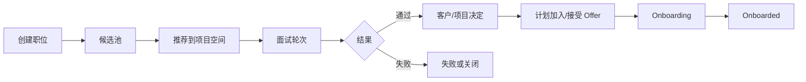
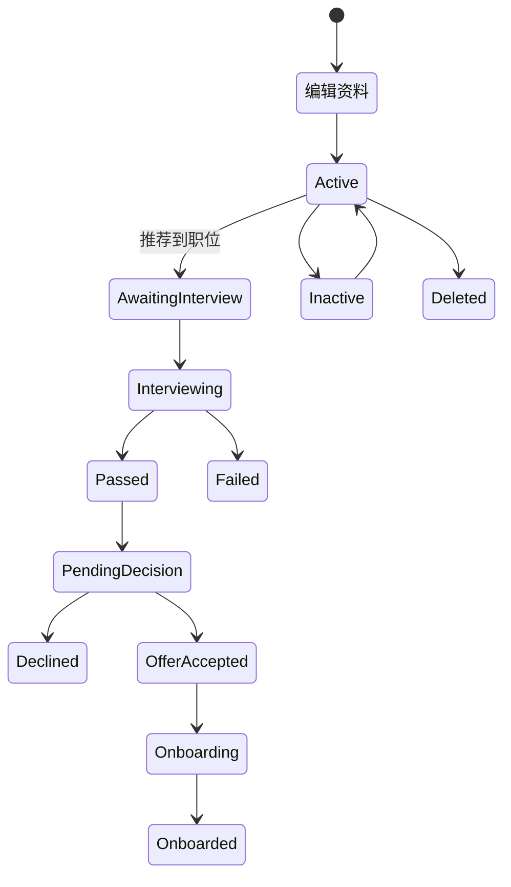

> **第一版验收快照**：`c98089ea66bfece63221`  
> 本报告来自同一份 WCP 工作树静态快照。CodeGraph 只用于导航，正文事实以当前源码复核为准。  
> 本轮一次性准备产品/工程 Overview 与六个代表功能：CodeGraph 冷准备 5.618 秒，暖准备 0.377 秒；完全源码冷准备 3.707 秒。  
> 当前 Git-aware 候选文件 2,007 个；CodeGraph 覆盖 1,639 / 1,726 个可分析源码文件（94.96%）。

## 1. 功能是什么，以及边界在哪里

招聘与候选人模块覆盖职位建立、候选人录入和资料维护、面试流程、项目候选人推荐、客户空间查看、录用与入职状态，以及与外部招聘系统的同步。它主要位于主平台和前端，也连接对象存储、邮件、项目空间、员工转化和 AI 处理。`事实`

**使用者。** HR 和招聘相关人员管理职位、候选人、面试和入职；项目成员把候选人推荐到项目空间；客户在受限空间中查看职位和候选人；候选人可通过分享入口补充资料；管理员处理 onboarding。`事实`

**边界。** 纳入内部候选池、项目空间职位、候选人推荐、面试轮次、状态、简历、分享、外部客户空间、Beisen 同步和入职。不把正式员工管理和绩效评价作为招聘内部步骤，但会说明候选人成为员工后的连接。`事实`

## 2. 用户如何使用它

### 职位与项目空间

1. 有权限的内部用户为项目空间创建职位，选择办公室、面试流程、招聘数量、类型、优先级和持续时间。
2. 职位可以排序、修改、关闭、分享，并配置可查看项目空间的客户或内部 screen user。
3. 招聘人员从候选池向项目空间推荐候选人。
4. 候选人经历一轮或多轮面试，面试结果和评论持续更新。
5. 通过后进入待决定、计划加入、Onboarding 或 Onboarded 等状态。`事实`

### 外部和客户入口

项目空间可以邀请客户，或者使用分享 key。客户通过独立认证或分享入口查看空间、职位、成员和候选人资料。候选人资料和简历可通过分享或资源池页面访问。`事实`

## 3. 功能执行的业务规则

| 规则 | 当前行为 |
|---|---|
| 职位招聘数量 | 更新时不能低于已经完成的人数 |
| 职位状态 | Active 或 Inactive；达到招聘数量后不能随意改变部分状态 |
| 职位类型 | Web2、Web3、AI |
| 优先级 | Urgent、High、Mid、Low |
| 持续时间 | Short、Mid、Long |
| 候选人主状态 | Editing Profile、Active、Inactive、Deleted、Onboarding、Onboarded |
| 面试结果 | Pending、Passed、Failed |
| 项目空间候选状态 | Awaiting Interview、Passed、Pending Decision、Failed、Declined、Onboarding、Onboarded |
| 推荐面试状态 | Interviewing、Passed、Failed、Closed |
| 推荐入职状态 | OfferAccepted、Onboarding、Onboarded、Declined、OnboardToProject |
| AI 生成状态 | Processing、Success、Failed |

创建或更新职位会验证表单、办公室和面试流程；创建、更新和状态变化通常在数据库事务后异步发送邮件。`事实`

## 4. 状态与生命周期

不同页面和数据实体使用不同状态集合：候选池状态、面试进度、项目空间候选状态和 onboarding 状态不能直接一一等同。`事实`

## 5. 谁能做什么、看到什么

| 使用者 | 能力 | 数据范围 |
|---|---|---|
| HR/招聘人员 | 候选人、职位、面试、状态、Onboarding、外部同步 | 招聘管理范围 |
| 项目空间内部用户 | 创建和管理项目职位、推荐候选人、面试和评论 | 有项目空间权限的项目 |
| Screen user | 查看被授权空间或候选人 | 配置的空间 |
| 邀请客户 | 查看客户空间职位、成员和候选人 | 邀请关联空间 |
| Share-key 使用者 | 通过分享 key 读取空间或候选人信息 | key 对应范围 |
| 候选人 | 通过分享/资料入口查看或补充自身信息 | 本人或分享记录 |

路由层有登录、客户空间认证和 permission middleware；项目与空间对象权限仍由具体 service 进一步判断。`事实`

## 6. 数据与字段

| 数据 | 主要内容 |
|---|---|
| Hiring Position | 职位名称、类型、优先级、数量、状态、持续时间、办公室和面试流程 |
| Candidate | 身份、联系方式、简历、技能、状态、AI 处理状态 |
| Interview Process | 面试轮次、面试人、顺序和结果 |
| Proposed Candidate | 候选人与项目空间/职位的推荐关系、评论和加入计划 |
| Client Space | 项目空间、邀请客户、分享 key、过期时间和权限 |
| Onboarding | Offer、计划加入、入职中和已入职状态 |
| External Sync | Beisen 等外部招聘系统的候选人和面试同步信息 |

简历和候选人资料属于敏感个人数据，并通过对象存储、分享链接和客户空间流转。`事实`

## 7. 运行时还会触发什么

- 职位创建、更新和状态变化会异步发送邮件。`事实`
- 简历、头像和候选人附件进入对象存储。`事实`
- Beisen 路径同步职位、候选人、面试或评价数据。`事实`
- AI 处理路径存在 Processing、Success、Failed 状态，可用于候选人资料加工。`事实`
- 候选人可以被复制或关联到正式员工记录。`事实`
- 客户邀请、分享 key 和空间过期配置影响外部可见性。`事实`

## 8. 出错时会发生什么

| 情形 | 当前表现 |
|---|---|
| 无空间或职位权限 | 路由中间件或 service 返回禁止访问 |
| 招聘数量低于已完成人数 | 职位更新被拒绝 |
| 职位已达到招聘数量 | 部分状态更新被拒绝 |
| 候选人、职位或面试不存在 | 返回未找到 |
| 外部同步失败 | 当次同步返回或记录错误，已有内部记录保持原状态 |
| 邮件发送失败 | 事务可能已经提交，异步邮件结果不回滚职位或状态 |
| 分享 key 无效/过期 | 外部空间或候选人信息不可访问 |
| AI 处理失败 | 状态进入 Failed，资料原记录仍存在 |

## 9. 配置、开关与自动任务

招聘功能依赖数据库、对象存储、邮件、Web 域名、客户空间配置、Beisen 外部地址和 AI 服务配置。源码只显示配置入口，不包含生产值。`不可得`

客户端空间有过期时间和 anyone permission；职位有 Active/Inactive 状态。它们是局部可用性开关，不是整个招聘模块的统一总开关。`事实`

## 10. 当前风险与问题

1. **同一候选旅程使用多套状态体系。** 候选池、项目空间、面试、推荐和 onboarding 各有独立枚举，状态间的转换由多个入口维护。`事实`
2. **外部分享和客户空间扩大了数据边界。** 简历和候选人资料可以经客户认证或 share key 暴露，实际 key 传播和客户使用是运行时信息。`事实`
3. **事务提交与邮件发送分离。** 职位创建、更新和状态变化后异步发邮件，数据库成功但通知失败是当前可存在的结果。`事实`
4. **外部招聘系统与内部记录可能短时不一致。** Beisen 同步失败时，内部数据可能保留上次成功状态。`事实` + `推断`
5. **候选人敏感数据跨多种入口。** 内部 HR、项目空间、客户空间、分享链接、对象存储和 AI 处理都可能读取候选人资料。`事实`
6. **权限分布在 route middleware 与 service。** 客户空间、screen user、内部项目权限和 share key 没有一张集中矩阵。`事实`
7. **完整招聘旅程测试证据不足。** 当前 Context 没有建立职位—推荐—多轮面试—Offer—Onboarding—员工转换的端到端自动化测试集合。`验证`

本章只描述当前代码状态。

## 11. 术语表

| 术语 | 含义 |
|---|---|
| Candidate Pool | 内部候选人资源池 |
| Hiring Position | 项目或客户空间中的招聘职位 |
| Proposed Candidate | 被推荐到具体项目空间的候选人 |
| Screen User | 被授予查看项目空间的人 |
| Client Space | 客户可访问的受限项目招聘空间 |
| Share Key | 不通过普通内部登录访问特定资料的临时/分享标识 |
| Interview Process | 面试轮次和顺序 |
| Onboarding | Offer 接受后到正式入职的过程 |
| Beisen | 当前源码中的外部招聘系统集成 |

## 12. 覆盖范围与不可回答的问题

本轮招聘 Context 包含 500 个候选节点、1,260 条相关边和 281 个边界文件。范围较宽，正文事实以主平台 projectspace、resourcepool、beisen、constant 和前端招聘页面源码复核。`事实`

静态源码无法回答当前开放职位数、候选人数量、客户空间访问量、share key 泄露情况、外部同步成功率、邮件送达率、AI 处理质量、平均招聘周期和生产性能。`不可得`

### 主要源码核对路径

- `wcp-service-v2/internal/handlers/handlers.go:262-315`
- `wcp-service-v2/internal/constant/status.go:35-167`
- `wcp-service-v2/internal/constant/space.go:16-75`
- `wcp-service-v2/internal/handlers/projectspace/hiring.go:80-220`
- `wcp-service-v2/internal/handlers/beisen/router.go`
- `wcp-ui/src/human-resource`
- `wcp-ui/src/project-source`
