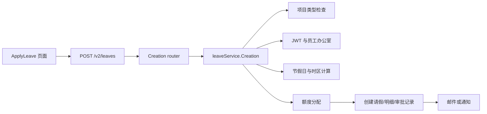
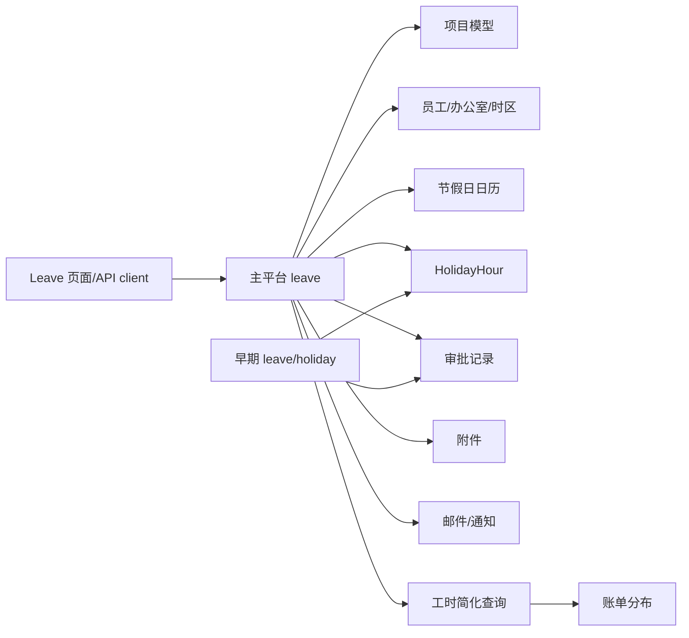

## 1. 功能职责与技术边界

请假功能跨越 `wcp-ui`、主平台 Go 服务和早期 Node 服务。当前用户主路径由前端调用主平台 `/v2/leaves`、`/v2/holidays` 和额度历史接口；早期服务仍保留 `/leaves`、`/holidays`、报表和定时任务。`事实`

**主实现边界。** 主平台的 `internal/handlers/leave` 负责申请、详情、审批、拒绝、查询、撤销、导出和工时简化查询；`holiday` 负责额度与节假日；`leaveHistory` 负责变更记录；`support` 负责日历与时间计算。`事实`

**前端边界。** `src/pages/leave` 包含个人、审批、管理、余额、历史、导出和附件组件，`leave-service.ts` 与 `holidayApi.ts` 封装 API。`事实`

**关联能力。** 项目与员工资料提供申请人、办公室、时区和项目类型；对象存储保存附件；邮件/通知推动审批；工时和账单读取简化请假数据。`事实`

**明确排除。** 一般行政申请的 WFH/出差/加班不是 `leave` 数据模型；节假日公共日历属于支撑能力，但其结果进入请假小时计算，因此只纳入相交部分。`推断`

**Scope。** CodeGraph 定位到 180 个候选节点、273 条关系和 79 个文件；150 条 unresolved references 促使本功能使用源码回退。`事实`

证据

- Feature context：`context/features/请假管理-90b9c7a713.md`。
- 主路由：`S-fdcb7140c5`。
- 前端 DTO/API：`S-13a201cbab`。

## 2. 入口与调用方

主平台在认证 group `/v2/leaves` 下注册 14 个入口，涵盖创建、详情、批准、拒绝、区间查询、全局/本人分页、撤销申请、直接撤销、工时简化查询、导出和提示。`事实`

| 方法与相对路径 | Handler | 可见调用方 |
|---|---|---|
| POST `/leaves` | `leave.Creation` | 前端申请页 |
| GET `/leaves/:leave_id` | `leave.Demand` | 详情与审批页 |
| POST `/leaves/:leave_id` | `leave.Approve` | 审批动作 |
| PUT `/leaves/:leave_id` | `leave.Reject` | 拒绝动作 |
| GET `/leaves` / `/leaves/me` | 分页查询 | 管理列表 / 本人列表 |
| POST `/leaves/:id/application` | 撤销申请 | 已批准记录的撤销路径 |
| DELETE `/leaves/:id` | 直接撤销 | 允许直接取消的状态 |
| GET `/leaves/me/simple` | 工时简化数据 | 工时与计费相关代码 |
| GET `/leaves/export` | 导出 | 管理导出页面 |

**参数绑定。** Router 使用 `ShouldBindJSON`、`ShouldBindUri` 和 `ShouldBindQuery`；分页默认 page=1、size=10；区间查询拒绝 head>tail 和跨度超过一年。`事实`

**认证。** 整个 leave group 只在注册处统一挂 `auth.Authentication()`，对象级审批/本人限制位于 service 和 approval helper。`事实`

**旧入口。** Express app 仍 mount leave 和 holiday router。工作区内前端主要指向 `appRunnerApi` 的 `/v2/leaves`，但旧入口可能仍有工作区外调用方。`事实` + `不可得`

**任务入口。** 早期 `scheduleService.js` 注册请假完成、额度初始化与邮件任务；主平台任务框架负责拉美累计和 PTO 通知。`事实`

证据

- 路由 group：`S-fdcb7140c5`。
- Router 绑定与默认值：`S-672b24e489`。
- 前端请求：`S-13a201cbab`。

## 3. 主要执行路径

**创建路径。** Handler 绑定 `LevRequestRepr`，service 从 context 取 JWT claims，验证项目存在且非 Presale/EOR，检查特定假期附件和拉美 BTO 限制，再进入 bridge 计算时区、工作日、小时和额度。`事实`

**审批路径。** `Approve`/`Reject` 取得 leave id 和评论，service 读取申请与当前审批记录，依据 flow 更新审批状态；批准可能生成下一审批记录或设置最终批准，并触发批准后的额度/通知逻辑。`事实`

**撤销路径。** `DeletionApplication` 与 `Deletion` 分别处理需负责人同意和可直接撤销的状态。撤销在 GORM transaction 内按 leave detail 的 `HolidaySource` 恢复各年度已用额度，更新状态并写审批/变更记录。`事实`

**工时连接。** `SimpleForLogTime(startDate,endDate)` 输出压缩后的请假时间；主平台工时和 billing service 调用或读取该类数据，避免在计费/工时页面展开完整审批对象。`事实`

**图中断。** CodeGraph 能定位 route、router、service 和若干 calls，但 bridge/factory、GORM chain、interface dispatch 和 notification decorator 不能完整恢复，关键连接由源码确认。`事实`

证据

- 创建接口与 service：`S-672b24e489`、`S-f4a7de08f4`。
- 计算校验：`S-a78a81c21f`。
- 撤销事务：`S-d6df91660b`。

## 4. 业务规则、状态与一致性

**状态模型。** `LvStatusC` 定义等待 L1/L2/L3/HR、Approved、Rejected、Completed、Cancelled 和 WaitingLeadCancel；UI 汇总筛选把四个待审状态映射为 `in_progress`。`事实`

**类型模型。** 当前主平台有 PTO、BTO、UTO、Special、Sick、Maternity、Paternity、Marriage、Funeral 和 Prenatal 十类。`事实`

**创建前置。** service 先检查 JWT、项目存在且项目类型不为 Presale/EOR。Sick、Maternity、Prenatal、Marriage 在入口层没有附件即拒绝；bridge 中另有 sick leave 超过 8 小时的医生证明检查。`事实`

**时间与额度。** 起止时间按员工时区转换，`CalculationAuto` 根据地区日历拆分明细；总小时为零时拒绝。除 IgnoreMap 类型外，可用额度不足时拒绝，并按年份把明细分配到额度来源。`事实`

**撤销一致性。** 恢复按年度明细执行，任一已用 token 降到负值即返回 DataMismatched。拉美 PTO 使用 capper：先完整恢复 used，再把超过 cap 的 total 裁剪并写变更日志。`事实`

**跨实现一致性。** Node legacy 对 BTO 等类型有另一套验证、模型和状态接口；当前没有共享规则包。CodeGraph 与源码确认两套实现并存，但没有逐条证明等价。`事实`

**并发。** 创建与撤销有 transaction 线索，但审批是否使用行锁、乐观版本或唯一约束来阻止并发重复审批，没有从所有路径建立。`不可得`

证据

- 类型/状态：`S-1991951652`。
- 创建前置：`S-f4a7de08f4`。
- 额度：`S-a78a81c21f`。
- 撤销与 cap：`S-d6df91660b`、`S-1b45f5e23c`。

## 5. 认证、授权与数据范围

**认证中间件。** `/v2/leaves` 和 `/v2/holidays` group 统一挂 `auth.Authentication()`；service 从 context 的 `JwtClaims` 取得当前用户 ID。`事实`

**本人范围。** `OwnPagination` 不接受任意 user id 作为主体，service 使用当前 claims；创建时申请人也来自 claims。`事实`

**审批范围。** 待审批 ID 查询把 `wcp_approve.approver_id` 与当前用户匹配，并要求审批状态为空。Approve/Reject service 还需要检查申请当前状态和审批记录。`事实`

**管理范围。** `Pagination`、Export、holiday hour update 和 history 接口的角色限制分布在认证 middleware、service 查询与通用角色 helper 中；没有集中 ACL 定义。`事实`

**数据范围字段。** 查询 repr 支持 employee、office、status、holiday type 和 date 等条件。前端 DTO 包含 approver、progress、cancel flag 和 upload files。`事实`

**授权未决。** 路由注释仍有“TODO: gRPC calling for authorization”，但当前请求实际使用本地 Authentication 和 service 内判断。是否还有网关/Casbin 层不可得。`事实` + `不可得`

**公开文件。** support group 有公开 download-file 入口，leave 附件是否全部通过带权限的对象键或预签名 URL访问，需要结合对象存储实现和运行时 URL 确认。`不可得`

证据

- Group middleware：`S-fdcb7140c5`。
- JWT claims：`S-f4a7de08f4`。
- 审批过滤：`wcp-service-v2/internal/handlers/leave/utils.go:40-49`。
- 前端字段：`S-13a201cbab`。

## 6. 数据模型与存储

主平台请假实现直接使用 GORM 访问 MySQL 表，核心实体包括 leave、leave_detail、approve、holiday_hour 和 holiday_hour_change_log。`事实`

| 实体 | 关系与用途 |
|---|---|
| Leave | 申请主体，关联 user、project、type、dates、hours、status、reason、cancel reason |
| LeaveDetail | 一条申请按日期拆分，记录 hours 与 HolidaySource 年份 |
| LeaveApprove | leave_id 下的审批人、flow、status、description |
| HolidayHour | user/year 的各类型 total/token（已用量或剩余计算字段） |
| HolidayHourChangeLog | 额度变更前后值、操作人和描述 |

**创建写入。** bridge 根据计算结果建立 leave 与 detail，并构建审批记录；具体 insert 顺序分散在 bridge implementation 和 approval builder。`事实`

**撤销写入。** `db.DBConn(c).Transaction` 包裹额度恢复、leave 状态和审批记录。`withdrawHours` 使用 Save 更新年度额度，负值时中断。`事实`

**跨年。** detail 的 HolidaySource 允许同一申请消耗多个年度额度；撤销按 map 聚合每年小时后恢复。`事实`

**多写入方。** Node legacy 也操作 leave、holiday 和 approve 类模型。不同仓库 model 字段未在本次轻量 scope 中做逐列 schema parity，因此模型差异数量不可得。`事实` + `不可得`

**删除语义。** 业务撤销是状态改变，不是删除主记录；某些表是否启用 GORM soft delete 需要逐模型确认。`事实`

证据

- 模型：`internal/handlers/leave/leave.go`、`dto.go`。
- 撤销：`S-d6df91660b`。
- 旧模型：`wcp-service/models` 与 routes/service。

## 7. 文件、消息与外部集成

**附件。** 创建 DTO 接收 attachment 数组，Sick、Maternity、Prenatal、Marriage 在 service pre-check 要求至少一个附件。文件本体经主平台 S3 封装或公共下载流程处理，请假表保存对象引用。`事实`

**导出。** `leave.Export` 使用 Excelize 生成表格并可能通过 S3/HTTP response 交付；前端有 ExportLeaveRequestModal 和 ExportLeaveHistoryModal。`事实`

**邮件。** leave notification/template 代码根据申请人、审批人和地区构建邮件。SES 在主平台启动时 setup；setup 失败会阻止服务初始化。`事实`

**其他消息。** PTO capper 的通知在额度恢复 transaction 后通过 goroutine 发起；其发送失败不会回滚已经提交的撤销 transaction。`事实` + `推断`

**日历。** 节假日不是第三方实时调用主路径，而是在启动时 `HolidayInit` 从 support service 获取并写入进程缓存。数据来源和刷新任务依赖主平台配置与 support 实现。`事实`

**跨功能输出。** `SimpleForLogTime` 向工时/计费提供请假区间；这是一条应用内 service/data 连接，不是服务间 HTTP 消息。`事实`

证据

- Attachment pre-check：`S-f4a7de08f4`。
- Export interface：`S-672b24e489` 与 `leave/service.go`。
- 初始化：`S-628176433a`。
- 异步 cap 通知：`S-d6df91660b`。

## 8. 错误、事务与恢复行为

**错误模型。** Router 的 bind error 直接返回；service 使用项目自定义 error 包区分 InvalidParam、CstmErr 和 WrapInternal。业务错误包含项目不存在、项目类型不支持、附件缺失、BTO 地区限制、无有效休假日、额度不足和类型无效。`事实`

**事务边界。** 撤销明确使用 GORM transaction，额度恢复或审批记录任一失败会使 transaction callback 返回错误。创建和批准路径也有 transaction 线索，但本报告没有逐一列出所有 SQL。`事实`

**恢复行为。** 撤销通过 leave_detail 的年度来源恢复已用额度；拉美 capper 在恢复后裁剪 total 并写 change log。它恢复业务余额，而不是应用级 retry。`事实`

**通知失败。** 初始化阶段 S3、SES、Google service setup 失败会阻止 Setup；运行阶段 goroutine 通知、邮件和任务日志的失败传播不同。异步 cap 通知不等待结果。`事实`

**部分成功。** 数据 transaction 提交后再异步通知，因此存在业务数据已改变、通知未确认的路径形状。运行时是否有补偿任务不可得。`推断`

**并发审批。** 当前源码中没有从所有 approve/reject 路径确认 `SELECT FOR UPDATE`、版本号或幂等键；数据库约束可能提供部分保护，但未建立。`不可得`

证据

- 错误与创建：`S-f4a7de08f4`、`S-a78a81c21f`。
- Transaction：`S-d6df91660b`。
- Setup 失败：`S-628176433a`。

## 9. 配置、开关与后台任务

**启动参数。** 主平台 `Setup(runServer, runTask, waitHolidayInit)` 决定是否启动 HTTP、任务及同步/异步 HolidayInit。`事实`

**缓存初始化。** HolidayInit 按国家与当前年份建立内存 map；办公室通过 constant 映射国家和时区。缓存更新频率与跨实例一致性不可得。`事实` + `不可得`

**拉美 PTO。** `LatAmPTOOfficeIDs` 固定列出 Bogota、Medellin、RioDeJaneiro 和 MexicoCity；合同类型和全职分别有月累计、cap 和 alert threshold。旧 Colombia 日志前缀仍用于去重。`事实`

**旧服务任务。** Node schedule 注册 `Check-Mail`、`Check-Leave-Done`、`Create-Next-Year-Holiday-Hour` 等；其 cron expression 来自代码或配置。多实例部署时是否有单例锁不可得。`事实` + `不可得`

**外部配置。** DB、S3、SES、时区/日历 service 依赖环境/YAML。报告不包含值。`事实`

**功能开关。** 未发现一个统一 `LEAVE_ENABLED` 开关；行为差异主要由 office、employee type、holiday type、task startup 和数据状态决定。`验证`

证据

- Setup/HolidayInit：`S-628176433a`。
- PTO constants：`S-1b45f5e23c`。
- Node tasks：`wcp-service/common/scheduleService.js`。

## 10. 依赖与变更关联范围

**调用者。** 前端个人、审批和管理页面；工时/账单 service；报表和导出；后台任务。`事实`

**被调用者。** 员工、项目、support calendar、holiday、approval、database、S3、SES、logger 和 error package。`事实`

**共享数据。** employee、project、leave、leave_detail、approve、holiday_hour 与 change log 连接多个业务域；legacy 对其中若干表也有写路径。`事实`

**相邻功能。** 请假影响工时可用时间、项目月度分布、员工权益、审批待办和通知。连接关系不证明每次请假都进入账单或绩效。`事实`

**外部依赖。** S3 和 SES 是直接外部依赖；日历数据的上游来源封装在 support service 中。`事实`

证据

- Feature relationship summary。
- `leave.SimpleForLogTime` 与 `management/billing.go`。
- `S-f4a7de08f4`、`S-d6df91660b`。

## 11. 测试、文档与当前实现问题

**测试线索。** Feature scope 中命中一个来自绩效服务 HTTP cache 的测试文件，但它与请假业务无直接关系；没有定位到覆盖申请、审批、跨年额度和撤销的完整 leave test suite。测试可能采用未被文件名匹配的形式，实际覆盖率不可得。`事实` + `不可得`

**Swagger。** 主平台 Swagger 定义 `LevRequestRepr` 和 leave endpoints，但部分 router 注释使用 `/leave` 单数，而实际 group 是 `/leaves`；生成文档与路由注册是否完全同步需以当前生成物确认。`事实`

**双实现。** Go 主平台与 Node legacy 同时保留 leave/holiday 代码、模型和任务，没有共享 schema/validation package。`事实`

**调试输出。** `brdg_abst.go` 在额度分配后执行三个 `fmt.Println`，可能把 map 结构写入标准输出。`事实`

**旧日志兼容。** PTO 累计逻辑仍识别 Colombia 旧日志前缀，当前行为依赖历史 change log 描述文本。`事实`

**异步结果。** PTO cap notification 使用 goroutine，不保留返回结果；邮件/通知路径也没有统一 outbox。`事实`

**未解析关系。** Feature scope 有 150 条 unresolved references，主要来自动态方法、GORM 和通用 helper；它们不是 150 个确定缺陷。`事实`

证据

- Router 注释与真实 group：`S-672b24e489`、`S-fdcb7140c5`。
- 调试输出：`S-a78a81c21f`。
- 旧日志：`S-1b45f5e23c`。

## 12. 覆盖与不可回答的问题

**范围指标。** 180 个候选节点、273 条边、79 个文件、150 条 unresolved references；范围包含 UI、主平台 leave/holiday/history、legacy leave/holiday/report 和相关 support/management。`事实`

**源码证据。** 除 feature builder 初始窗口外，本次加入 leave constant、route group、router、service creation、validation bridge、cancellation transaction、LatAm PTO 和前端 API DTO。产品和工程报告复用相同 evidence catalog。`事实`

**缓存。** Feature scope 只建立一次；工程版未重新运行 CodeGraph query，也未重复读取相同 path/range。新增窗口进入 snapshot source cache。`事实`

**未覆盖。** 全部 notification template、所有旧 Node service SQL、每个 approval builder 分支、数据库 migration 和工作区外客户端没有逐文件展开。`事实`

**运行时未决。** 实际启用入口、DB schema/instance、cron 单例、审批链数据、邮件送达、S3 ACL、历史额度质量、并发行为、API traffic 和测试结果不可得。`不可得`

**CodeGraph 局限。** route node 对 Gin group 前缀、handler/middleware role、interface dispatch 和 GORM query semantics 不完整，因此源码回退是本功能结论的一部分，而不是异常路径。`事实`

证据

- `context/features/请假管理-90b9c7a713.md`。
- `evidence.json` 中所有 `S-*` leave 证据。
- Snapshot：`78aed2ab4f17cd06e80a`。

