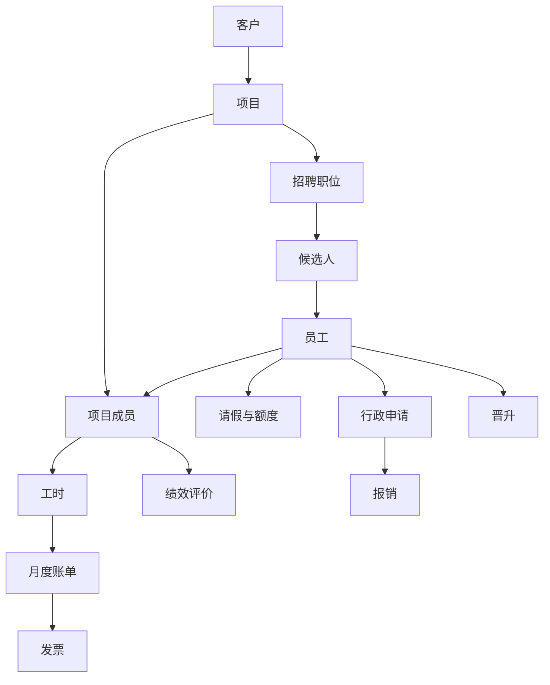
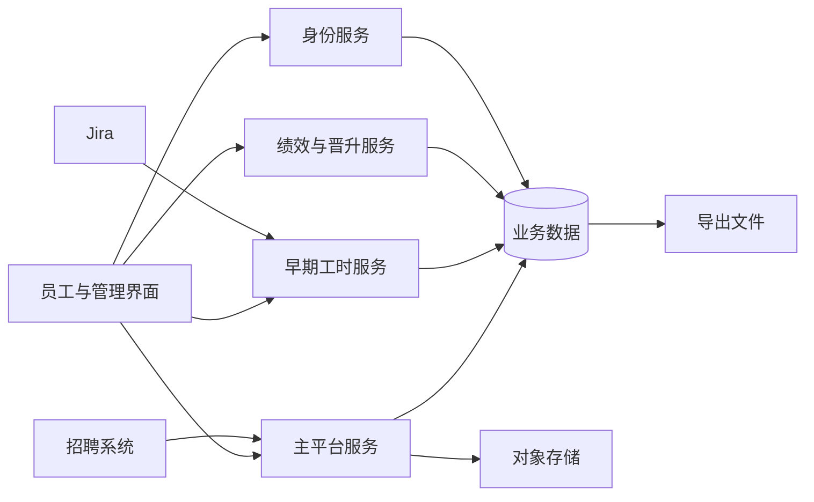

## 1. 项目定位与边界

**WCP 是 57Blocks 用来把员工、项目、工时、请假、费用、客户账单、绩效与招聘放进同一套工作流程的内部协作与经营平台。** `推断`

它不是单一的工时工具。代码所呈现的业务范围从员工日常自助延伸到项目交付、客户费用、人才招聘、绩效评价和晋升，并为客户和候选人保留了受限或公开的外部入口。五个仓库共同组成一个工作区：一个统一界面、三个业务后端和一个身份服务。`事实`

**主要使用者。** 系统定义了普通员工、管理员、项目管理、人力资源、绩效管理员、客户、销售、费率管理、办公室管理、开票管理和系统管理员等角色。普通员工处理本人事务；管理、HR、销售和财务相关角色处理审批、项目、人员与账单；客户和候选人通过受限空间或公开链接进入局部流程。`事实` + `推断`

**核心场景。** 当前代码支持员工填报工时、申请请假和行政事项、提交报销、参加绩效和晋升流程；管理人员维护员工与项目、审批业务记录、确认账单与发票；招聘人员处理职位、候选人和面试；客户查看项目空间或参与评价。`推断`

**项目内边界。** 员工档案、项目和客户、项目成员、工时、请假与额度、行政申请、报销、账单与发票、绩效与晋升、招聘和候选人、政策与通知、身份认证都在当前源码范围内。`事实`

**项目外边界。** 登录身份、任务系统、招聘系统、文件存储、邮件、即时消息、移动推送、大模型、电子表格、地图和汇率信息由外部产品提供。`事实`

**项目阶段。** 当前源码能够证明新旧两套后端能力并存，也能证明旧服务仍有路由和计划任务；它不能证明组织是否把这种状态定义为迁移、维护期或长期并行。`不可得`

**这意味着什么。** 阅读后续章节时，不能把工时、人员、项目、账单和绩效当作互不相干的功能。它们围绕同一批员工与项目数据工作，一个业务对象通常会被多个流程读取或改变。

<details>
<summary>依据</summary>

- 快照包含 `wcp-ui`、`wcp-service-v2`、`wcp-service`、`wcp_review_service`、`wcp-auth` 五个 Git 根目录，均在 `master` 分支并带有未提交改动。
- 角色声明：`wcp-service-v2/internal/constant/role.go:7-17`。
- 绩效服务 README 将自身描述为 57Blocks Collaboration Platform 的绩效评估后端；早期服务 README 将自身描述为 Worklog Service API。
- CodeGraph 在五个根目录中记录到前端页面路由、后端 HTTP 路由、函数、结构体、组件和调用关系。
- 证据：`GIT-78aed2ab4f17cd06e80a`、`CG-78aed2ab4f17cd06e80a`、`S-2058ce9e12`、`S-0104c3657b`。

</details>


## 2. 系统组成与职责

WCP 当前由一个统一界面、一个主平台服务、一个早期工时服务、一个绩效与晋升服务和一个身份认证服务组成。`事实`

| 系统部分 | 当前职责 | 主要使用者 | 当前状态 |
|---|---|---|---|
| 员工与管理界面 | 承载员工自助、管理后台、公开页和客户空间 | 员工、管理者、HR、销售、财务、客户、候选人 | 是工作区内唯一被观察到的完整前端 |
| 主平台服务 | 员工、项目、客户、请假、申请、报销、账单、招聘、政策和通知 | 前端及部分外部调用方 | 业务范围最广 |
| 早期工时服务 | 工时、Jira 配置、部分人员与项目数据、请假相关旧接口和计划任务 | 前端、开放接口调用方 | 仍有活动入口和后台任务 |
| 绩效与晋升服务 | 绩效周期、评价记录、客户评价邀请和晋升 | 前端、被邀请客户 | 独立业务边界较清晰 |
| 身份认证服务 | OAuth2 授权、令牌、用户信息、同意页和激活 | 前端及身份协议消费方 | 提供独立认证边界 |

**活动入口。** CodeGraph 观察到前端 422 个路由候选，主平台 299 个、早期服务 105 个、绩效服务 86 个、认证服务 14 个后端路由候选。这里的数量是静态注册候选，不是线上流量，也不等于最终完整 URL。`事实`

**新旧服务并存。** 早期服务仍注册工时、请假、假期、项目、Jira、报表和开放接口等入口，并注册请假完结、次年假期额度、工时提醒和绩效通知等计划任务。它不是只有历史文件存在的空仓库。`事实`

**服务之间的关系。** 当前源码没有显示四个后端彼此通过 HTTP 直接调用；更明显的连接来自前端分别调用它们，以及多个服务围绕相同员工、项目、工时、请假和审批类数据工作。它们是否在生产环境连接到同一个数据库实例，静态配置无法确认。`事实` + `不可得`

**这意味着什么。** 五个仓库不是五个彼此独立的产品。前端把它们组合成同一套用户体验，而共享业务数据又使后端之间存在不经过服务接口的间接关系。

<details>
<summary>依据</summary>

- CodeGraph 路由候选按根目录统计：`wcp-ui=422`、`wcp-service-v2=299`、`wcp-service=105`、`wcp_review_service=86`、`wcp-auth=14`。
- 早期服务入口集中注册于 `wcp-service/app.js:93-107`。
- 早期服务计划任务位于 `wcp-service/common/scheduleService.js:18-141`。
- 身份服务路由位于 `wcp-auth/internal/handlers/handler.go:22-46`。
- 证据：`CG-ROUTES-78aed2ab4f17cd06e80a`、`S-6ec3777092`。

</details>


## 3. 业务域与功能地图

当前项目把员工个人事务、审批、项目和客户、计费、人力资源、绩效与晋升、招聘和平台基础能力放在同一套产品中。`推断`

```text
WCP
├── 员工自助
│   ├── 工时填报、查询、修改、删除和 Jira 关联
│   ├── 请假、假期余额和撤销
│   ├── 用章、在家办公、出差、加班和采购申请
│   ├── 出差、加班、采购和其他报销
│   └── 个人资料、面试与评价任务
├── 审批与管理
│   ├── 请假、行政申请和报销审批
│   ├── 员工、角色、办公室、地点、职位和技能
│   ├── 项目、成员、计划、客户和客户空间
│   └── 政策、内部通讯和 AI 工具目录
├── 收入与费用
│   ├── 费率、月度账单、确认与作废
│   ├── 发票关联和回款状态
│   ├── 多币种汇率
│   └── 报表、导入与导出
├── 人才与评价
│   ├── 招聘职位、候选人、面试和入职
│   ├── 绩效周期、自评、同事评和主管评
│   ├── 客户评价邀请
│   └── 晋升申请和评审
└── 平台能力
    ├── OAuth2 身份认证与令牌
    ├── 文件、邮件、Slack 和移动推送
    ├── 开放接口
    └── 计划任务
```

**外部使用能力。** 客户评价邀请、客户项目空间、候选人分享和身份激活等入口不要求外部使用者进入完整内部后台。`事实`

**自动化能力。** 代码注册了定时检查请假完结、建立下一年度额度、发送工时提醒、处理通知以及执行主平台中的多类周期任务。源码证明任务被注册，不证明生产配置是否启用或任务是否成功运行。`事实`

**功能状态。** 部分代码明确带有 TODO、deprecated 或临时关闭说明；没有这些标记的功能不能因此被写成“已验证可用”。`事实`

**这意味着什么。** WCP 的功能地图横跨人员、交付、费用和评价。一个业务变化可能同时出现在员工自助、管理审批和后台自动化三个入口中，不能只从一个页面理解其完整边界。

<details>
<summary>依据</summary>

- 功能名称来自前端页面目录、前端路由、后端 handler/router 目录和 Swagger 路径。
- 主平台 handler 目录覆盖 employee、clientProj、leave、application、reimbursement、management、resourcepool、policy、notification、worklog 等区域。
- 绩效服务路由包含 review、performance record、client invitation 和 promotion 相关入口。
- 早期服务 `app.js` 注册 worklogs、projects、leaves、holidays、reports、jira、cronjobs 和 mcp 等入口。
- 前端 README 明确称 antd 与 ahooks 已废弃，但当前 `package.json` 仍声明这两个依赖。

</details>


## 4. 用户、角色与权限边界

系统在主平台中定义了 11 类角色，但完整的“角色 × 功能 × 操作”矩阵不能从一个集中配置中取得。`事实`

| 角色 | 从当前入口和判断中可见的主要范围 |
|---|---|
| 普通员工 | 本人工时、请假、申请、报销、个人资料、绩效与晋升参与 |
| 管理员 / 系统管理员 | 跨模块管理和多处豁免判断 |
| 项目管理 | 项目、成员、团队工时和部分账单确认 |
| 人力资源 | 员工、职位、招聘、假期额度和人员流程 |
| 绩效管理员 | 绩效周期、记录、结果和通知 |
| 客户 | 客户空间和被邀请的评价流程 |
| 销售 / 开票管理 / 费率管理 | 客户、费率、账单、发票和回款状态 |
| 办公室管理 | 办公室、地点和相关配置 |

**认证层。** 多数后端入口通过 Gin 或 Express 中间件取得用户身份和角色；身份服务负责 OAuth2 授权与令牌。`事实`

**授权层。** 细粒度权限大量写在处理函数内部，例如判断是否本人、管理员、主评人、评估负责人或项目负责人。路由上存在认证中间件，不等于对象级授权一定正确；路由上未看到角色中间件，也不等于处理函数没有检查。`事实`

**权限矩阵的边界。** 当前静态分析可以枚举角色和部分入口检查，但不能证明每个角色对每个业务对象的所有操作。未被明确确认的单元应视为“未确定”，而不是允许或禁止。`不可得`

**当前可定位的问题。** 绩效服务有一条读取他人评价记录的布尔表达式，与同仓库其他等价检查的取反方向不一致；在特定角色组合下，表达式可能不进入拒绝分支。`事实` + `推断`

**这意味着什么。** WCP 的权限不是一张集中配置表，而是认证中间件和业务函数内条件的组合。理解一个功能的访问边界，需要同时查看入口和处理过程。

<details>
<summary>依据</summary>

- 角色常量：`wcp-service-v2/internal/constant/role.go:7-17`。
- 绩效记录入口：`wcp_review_service/internal/review/employee/employee_resource.go:26`。
- 可疑检查：同文件 `:98`；同仓库可比较的否定形式位于 `internal/review/admin_main/admin_main_resource.go:490,701,993`。
- 登录身份与角色从 Gin context 读取：`employee_resource.go:88-97`。

</details>


## 5. 核心业务对象与生命周期

WCP 的核心对象围绕员工参与项目形成，并向工时、请假、费用、账单、绩效和招聘扩展。`推断`



**员工与项目成员。** 员工记录身份、职位、职级、技能、办公室和地点；项目成员关系连接员工、项目、角色、投入和费率。多个业务流程通过这条关系理解“谁为哪个项目工作”。`事实` + `推断`

**工时与计费。** 工时按员工、项目和日期记录，并可关联 Jira；主平台中的账单计算和确认路径读取工时、费率及其他费用。代码中存在账单确认日志和快照类模型，说明确认后的金额另有留痕。`事实`

**请假与额度。** 请假包含类型、总小时、审批和撤销路径；额度校验会比较申请时长与可用额度，长病假需要附件，部分假期只允许整日或固定小时。`事实`

**绩效与晋升。** 绩效记录由被评人、主评人、同事、管理员和客户邀请等关系组成；晋升包含申请、推荐、评审和结果相关代码。`事实`

**招聘。** 职位、候选人、面试结果、录用和入职信息与员工、项目发生连接。`事实`

**这意味着什么。** 项目成员关系位于人员、交付、计费和评价的交汇处。报告后续提到的共享数据和规则分歧，很多都通过员工、项目成员和工时这条主干传播。

<details>
<summary>依据</summary>

- 主平台目录：`internal/handlers/employee`、`clientProj`、`worklog`、`leave`、`management`、`resourcepool`。
- 请假额度与附件校验：`wcp-service-v2/internal/handlers/leave/brdg_abst.go:254-309,373-431`。
- 固定 8 小时规则：`wcp-service-v2/internal/handlers/leave/brdg_impl.go:1018-1019,1166-1167`。
- 工时与账单路径：`internal/handlers/worklog` 与 `internal/handlers/management/billing.go`。
- 绩效记录结构：`wcp_review_service/internal/review/employee/employee_resource.go`。

</details>


## 6. 数据全景与流转

源码显示多个服务围绕相同的员工、项目、项目成员、工时、请假、假期额度和审批类表名工作；静态源码不能确认这些配置在生产环境是否指向同一个数据库实例。`事实` + `不可得`



**数据创建和改变。** 员工与项目数据由管理和人员流程维护；工时主要通过早期服务录入；请假与额度在新旧服务均有相关代码；账单、发票、报销和多数新业务位于主平台；绩效与晋升位于独立服务。`事实`

**共享而非传输。** 后端之间没有被观察到的直接 HTTP 调用时，共同读取同名业务表不应画成“服务 A 把数据发送给服务 B”。更准确的描述是它们各自访问共享形状的数据。`事实`

**外部输入。** Jira 提供任务信息；招聘系统提供候选人和面试相关数据；Google 身份提供登录信息；表格和公开汇率来源为部分业务提供外部数据。`事实`

**外部输出。** 文件和导出物进入对象存储或下载流程；邮件、Slack 和移动推送携带业务通知；候选人相关处理存在调用大模型的代码。`事实`

**数据隔离。** 当前源码能看到按用户、项目、客户空间和角色进行的数据范围限制；没有足够证据确认生产部署的组织或租户隔离方式。`不可得`

**这意味着什么。** 名义上的服务边界没有完全隔开数据边界。某个服务对共享业务记录的写入，可能被另一个服务直接读取，而不是通过稳定的服务接口转换。

<details>
<summary>依据</summary>

- Go 服务使用 GORM；早期 Node 服务使用 Sequelize 和 MySQL 驱动。
- 多个仓库中出现相同的 `wcp_user`、项目、成员、工时、请假、额度和审批相关表名或模型。
- 早期服务 README 要求 MySQL；主平台配置常量包含 MySQL 别名。
- AWS S3 代码：`wcp-service/common/awsUtils.js`、`wcp-service-v2/internal/third_party/s3`、`wcp_review_service/internal/third_party/s3`。

</details>


## 7. 外部依赖与集成

WCP 依赖身份、任务、招聘、文件、通知、地图、表格、汇率和大模型等外部能力。`事实`

| 外部能力 | 当前用途 | 传输内容的代码线索 | 失败时源码可见的表现 |
|---|---|---|---|
| Google 身份 | 员工登录和令牌 | 账号身份与授权信息 | 登录或令牌流程返回错误 |
| Jira | 工时关联任务、项目配置 | 任务键、状态和项目关联 | Jira 相关步骤失败，工时基础记录仍有独立路径 |
| 招聘系统 | 候选人和面试同步 | 候选人、面试与评价信息 | 同步任务记录错误，数据可能停留在旧状态 `推断` |
| AWS S3 | 附件、简历、头像、缩略图和导出文件 | 文件内容与对象键 | 上传、下载或签名地址生成失败 |
| 邮件 / SMTP | 审批、提醒、绩效和运营通知 | 收件地址与业务正文 | 同步路径返回错误；部分异步发送只记录有限结果 |
| Slack | 工时、项目、政策和账单提醒 | 消息正文与链接 | 发送失败的处理因调用点不同而不同 |
| 移动推送 | 通知 | 推送正文和设备目标 | 调用错误由通知路径处理 |
| OpenAI | 候选人资料加工和 AI 相关功能 | 候选人或业务提示内容 | 生成流程返回错误或进入失败状态 |
| Google Sheets | 提案或团队数据导入 | 表格中的团队与业务数据 | 导入流程失败 |
| Google Maps | 地址补全 | 地址片段 | 地址建议不可用 |
| 汇率网页 | 多币种换算 | 公开汇率数据 | 当日汇率无法取得 |

**敏感性。** 员工和候选人资料、附件、费率、账单和评价内容可能进入外部存储或服务。源码能确认调用和字段，不能确认组织的合同、保留期、地域和合规安排。`事实` + `不可得`

**失败边界。** 当前代码中没有一套覆盖所有外部调用的统一重试或补偿机制；某些调用直接返回错误，某些后台任务只记录日志，某些异步通知不保留完整结果。依赖库和基础设施是否另有重试不可得。`验证`

**这意味着什么。** 外部依赖不仅提供附加功能，也参与登录、文件、招聘、通知和金额换算等主流程。静态代码只能说明应用层看到的失败处理，不能说明线上最终交付情况。

<details>
<summary>依据</summary>

- OpenAI：`wcp-service-v2/internal/third_party/openai/openai.go` 及 resourcepool、beisen 调用点。
- S3：`wcp-service-v2/internal/third_party/s3`、`wcp-service/common/awsUtils.js`。
- 邮件：`wcp-service-v2/internal/third_party/ses/ses.go`、`wcp_review_service/internal/third_party/ses`、`wcp-service/common/emailTool.js`。
- Slack：`wcp-service/common/scheduleService.js` 以及主平台通知任务。
- Go 模块声明包含 AWS、Slack、Google API；Node 依赖包含 aws-sdk、googleapis、nodemailer、axios。

</details>


## 8. 运营与后台能力

系统包含人员、权限、项目、审批、账单、发票、费率、政策、招聘、计划任务、导入导出和人工更正等后台能力。`事实`

| 能力 | 当前代码表现 | 留痕线索 |
|---|---|---|
| 员工与角色管理 | 创建、编辑、启停、职位和角色维护 | 部分业务通知和通用记录 |
| 项目与客户管理 | 项目、成员、客户、空间、计划和状态 | 项目及成员数据记录 |
| 审批 | 请假、申请、报销、绩效和晋升 | 审批状态、记录和日志表 |
| 计费 | 账单生成、确认、作废、发票关联和回款状态 | 账单操作、确认和快照类记录 |
| 假期额度 | 年度额度、消耗、人工调整和下一年度建立 | 额度与变更相关记录 |
| 招聘与人才 | 职位、候选人、面试、分享和入职 | 候选人和状态记录 |
| 内容治理 | 政策、阅读确认、内部通讯和 AI 工具目录 | 政策阅读和通知记录 |
| 自动任务 | 请假完结、额度初始化、工时提醒、绩效通知和主平台任务 | 任务注册与应用日志 |
| 导入导出 | 账单、请假、报销、绩效、表格和附件 | 业务文件；完整下载审计不可得 |

**当前硬性限制。** 工时界面要求 0.5 小时倍数；工时说明长度上限为 60,000 字符；长于一个工作日的病假要求医生证明；部分假期只允许 8 小时；报销总额超过 35,000 时进入不同路径；账单其他费用上限为 999,999.99，备注上限为 500 字符。`事实`

**计划任务。** 早期服务明确注册邮件检查、请假完结、下一年度假期额度、周工时检查和绩效通知等任务。主平台和绩效服务也使用 cron 库。注册频率不等于生产实际执行频率或成功率。`事实`

**审计边界。** 账单和假期类操作有明确日志或快照线索；角色变更、全部导出行为和所有批量操作是否统一留痕，当前源码不能建立完整结论。`不可得`

**这意味着什么。** WCP 不仅提供用户界面，也承担周期性业务处理和人工补偿。运营状态由页面操作、后台任务和共享数据共同形成。

<details>
<summary>依据</summary>

- 工时步长：`wcp-ui/src/pages/worklog/components/LogTimeForm.tsx:391-401`。
- 工时说明长度：`wcp-service/routes/v2/worklog.js:117-121`。
- 病假证明：`wcp-service-v2/internal/handlers/leave/brdg_abst.go:259-262,373-376`。
- 报销边界：`internal/handlers/reimbursement/service.go:397`。
- 账单限制：`internal/handlers/management/billing.go:1438-1446`。
- 计划任务：`wcp-service/common/scheduleService.js:18-141`。

</details>


## 9. 风险与当前状态

本章只描述当前源码中能够定位的问题以及代码允许发生的结果，不包含修复方案。优先级依据是否涉及资金、权限或敏感数据，以及当前是否存在有效保护。`推断`

### P0 · 一条绩效记录授权表达式的取反方向与同类检查不一致

**证据。** 读取他人自评和同事评价记录的函数中，管理员和评估负责人检查使用否定形式，而“是否为该员工主评人”的判断使用正形式；同仓库其他等价检查使用否定形式。`事实`

**代码允许发生什么。** 当登录用户不是目标员工、不是管理员、不是主评人且不是评估负责人时，该复合条件可能为假，从而不进入拒绝分支，继续查询目标员工的评价记录。`推断`

**置信度。** 已确认入口、函数和表达式可达；实际生产数据和网关附加限制不可得。

### P1 · 主平台源码中存在硬编码的对称加密密钥

**证据。** 主平台工具文件声明了固定 AES 密钥，同时同仓库又声明了从环境读取公钥和私钥的配置。报告不展示密钥内容。`事实`

**代码允许发生什么。** 能读取源码并复现该加解密函数的人可以使用同一固定密钥处理其保护的数据；该函数实际覆盖哪些生产字段不可得。`推断`

**置信度。** 密钥和加解密调用已确认，受保护数据范围需要运行路径或数据定义进一步确认。

### P1 · 新旧服务对 24 小时边界使用不同条件

**证据。** 主平台的在家办公路径在总时长大于或等于 24 小时时要求计划；早期服务的相关输入校验允许等于 24 小时，只拒绝大于 24 小时。`事实`

**代码允许发生什么。** 恰好 24 小时的输入在两个入口中会进入不同判断。两个入口是否代表完全相同的业务动作仍需业务语义确认。`推断`

### P1 · 新旧服务同时包含请假、假期、项目和人员相关写入逻辑

**证据。** 两个服务均声明和改变请假、假期额度、审批、项目成员或员工相关记录；早期服务仍有计划任务改变请假完结和下一年度额度。`事实`

**代码允许发生什么。** 同一类业务记录可以经不同代码路径写入，而这些路径的校验和边界不必天然一致。`推断`

### P2 · 前端文档与当前依赖并不一致

**证据。** README 同时称项目由 Vite 启动，又保留 Create React App 的运行说明；README 声明 antd 和 ahooks 已废弃，而当前依赖仍包含二者。`事实`

**代码允许发生什么。** 新接手者仅依据 README，可能得到与当前构建和依赖状态不一致的理解。`推断`

### P2 · 主平台和身份服务缺少仓库级 README

**证据。** 当前快照的两个仓库根目录未找到 README，而它们分别承载最广的业务服务和身份认证。`事实`

**代码允许发生什么。** 仓库职责、启动方式和边界只能从代码、配置和部署文件中拼接获得。`推断`

**这意味着什么。** 当前最明确的问题集中在权限判断、固定密钥和新旧服务规则分叉。另一些问题表现为文档与代码状态不一致，它们影响的是对当前系统的理解，而不是直接证明线上故障。

<details>
<summary>依据</summary>

- 授权表达式：`wcp_review_service/internal/review/employee/employee_resource.go:82-103`；对照 `internal/review/admin_main/admin_main_resource.go:490,701,993`。
- 固定密钥：`wcp-service-v2/internal/cmon/util.go:36,98,121`；配置键位于 `internal/configs/config.yaml:21-22`。
- 24 小时边界：`wcp-service-v2/internal/handlers/application/general/wfh.go:93`；`wcp-service/routes/mcp.js:522`。
- 前端文档和依赖：`wcp-ui/README.md`、`wcp-ui/package.json`。
- 早期计划任务：`wcp-service/common/scheduleService.js`。

</details>


## 10. 覆盖范围与源码快照

本报告描述的是一个静态源码快照，不是生产运行报告。`事实`

| 仓库 | 分支 | 提交 | 未提交改动 |
|---|---|---|---|
| 身份认证服务 | master | 76e958d51b802c0a0619d11f21984fcf6ea6c895 | 有 |
| 早期工时服务 | master | efb884f05f16e2fa5d11180e4c00f18d8495ab28 | 有 |
| 主平台服务 | master | 51cb436a98d142c8cc268b5d269945d36f6c6698 | 有 |
| 员工与管理界面 | master | 895dad43f968238cde1387cf7f68293a2d20166b | 有 |
| 绩效与晋升服务 | master | 272bbe725fe84d15973fff50b606184c88743fe6 | 有 |

**读取方式。** Excavator 扫描了 1,927 个可审阅文本文件；其中 1,646 个被归为主要源码候选。CodeGraph 覆盖 99.5%（1,637/1,646），未覆盖文件和语义不足的部分通过受限源码窗口读取。`事实`

**图数据规模。** CodeGraph 数据库记录 1,668 个文件、22,951 个节点、51,391 条边和 926 个路由候选。未解析引用数量较高，说明图适合导航，但不能单独承担所有语义判断。`事实`

**源码回退。** 本次组合准备使用 17 次图查询，并为共享项目、请假和工时范围读取或复用源码窗口。相同窗口通过快照缓存复用；产品版与技术版共享同一项目 Context，同一功能只建立一次 scope。`事实`

**未执行的事项。** 未安装依赖、未运行应用、未执行测试、未连接数据库、未访问外部服务、未读取 `.env` 值。`事实`

**不能回答的问题。** 线上流量、实际用户规模、生产配置、数据库实例关系、任务成功率、消息送达率、数据质量、合同与合规状态、当前业务负责人均不可由该快照确定。`不可得`

**这意味着什么。** 报告能够解释当前代码声明的结构、业务路径和可定位问题，但不能把注册入口写成实际使用，也不能把未发现的规则写成线上不存在。

<details>
<summary>依据</summary>

- 快照标识：`78aed2ab4f17cd06e80a`。
- Source manifest：`6f0d1721f3a5c1578df2f0b4b0b2c4e6776aabe6458e7ef8aef6163714bca458`。
- CodeGraph 版本：数据库元数据 `indexed_with_version=1.5.0`，提取版本 `24`。
- 准备阶段：约 0.44 秒；组合请求 Context 使用共享项目文件和两个功能范围文件，没有按受众重复构建。
- 证据：`GIT-78aed2ab4f17cd06e80a`、`CG-78aed2ab4f17cd06e80a`。

</details>
